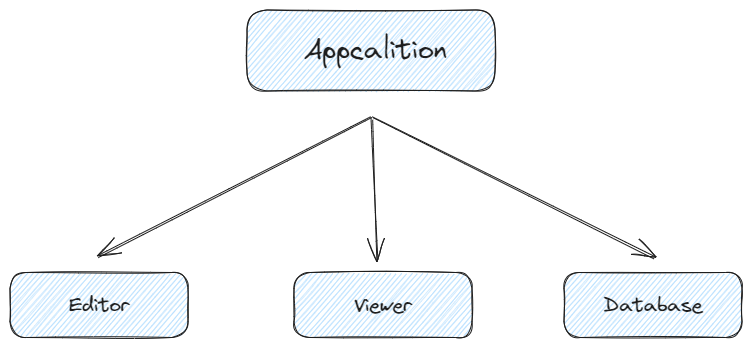

# 应用

<font style="color:rgb(28, 30, 33);">Application 是 2D 引擎的核心，一切都从创建 Application 开始。</font>

## <font style="color:rgb(28, 30, 33);">如何创建 Application</font>
```tsx
const app = new Application({
  container: document.getElementById("container"),
});
```

## <font style="color:rgb(28, 30, 33);">主要结构</font>


`<font style="color:rgb(28, 30, 33);">Application</font>`<font style="color:rgb(28, 30, 33);"> </font><font style="color:rgb(28, 30, 33);">主要由</font><font style="color:rgb(28, 30, 33);"> </font>`<font style="color:rgb(28, 30, 33);">Editor</font>`<font style="color:rgb(28, 30, 33);"> </font>`<font style="color:rgb(28, 30, 33);">Viewer</font>`<font style="color:rgb(28, 30, 33);"> </font>`<font style="color:rgb(28, 30, 33);">DataBase</font>`<font style="color:rgb(28, 30, 33);"> </font><font style="color:rgb(28, 30, 33);">三个部分组成。</font>

+ [Editor](https://www.yuque.com/iot-fast/ksh/ybbkzhzda0cek9lp)<font style="color:rgb(28, 30, 33);"> 负责了整体的编辑能力，包括对节点的选中，移动，转换等。</font>
+ [Viewer](https://www.yuque.com/iot-fast/ksh/oftw4yegqbs63rk2)<font style="color:rgb(28, 30, 33);"> 负责渲染视图，包含了创建的图层，相机和画布属性等。</font>
+ [DataBase ](https://www.yuque.com/iot-fast/ksh/qnmwfdub2z400xer)<font style="color:rgb(28, 30, 33);">存储整个应用的数据内容，包括节点，动画，操作历史等等。</font>

## <font style="color:rgb(28, 30, 33);">选项</font>
```plain
interface IAppOption {
  /**挂载画布的容器节点 */
  container: HTMLElement;
  /**是否编辑 */
  editor?: boolean;
  /**是否允许调试 */
  debug?: boolean;
  /* 编辑器模式， 1 = 编辑器模式 3 = 预览模式 */
  mode?: EAppMode;
  /** 画布是否自适应 */
  resiable?: boolean;
  /** 插件 */
  plugins?: [string, DatabasePlugin][];
}

new Application(options: IAppOption);
```

## <font style="color:rgb(28, 30, 33);">属性 & 方法</font>
| 名称 | 返回类型 | 描述 | 示例 |
| --- | --- | --- | --- |
| constructor | Application | 创建应用实体 | `const app = new Application(options);` |
| create | BaseNode | 在画布上创建一个基础节点，并添加至数据中 | `const node = app.create({type: "rect"})`<br/> [详细示例](https://www.yuque.com/iot-fast/ksh/cig7ys6oahtzga08) |
| newFile | void | 创建新的空白画布 | `app.newFile()` |
| loadFile | void | 从 json 中加载画布数据 | `app.loadFile(json)` |
| reload | void | 重新加载画布 | `app.reload()` |
| on | void | 添加事件监听 | `app.on("loadComplete", () => {})` |
| off | void | 取消监听 | `app.off("loadComplete", () => {})` |
| destory | void | 销毁应用 | `app.destory()` |
| getNodeByName | BaseNode[] | 通过名称获取所有节点 | `const nodes = app.getNodeByName("节点101")` |
| getNodeById | BaseNode | 通过 id 获取节点 | `const node = app.getNodeById(101)` |
| getObjectByName | BaseObject | 通过节点名称获取所有基础对象 | const objects = app.getObjectByName("列表节点名称"); |
| getObjectById | BaseObject | 通过 id 获取基础对象 | `const object = app.getObjectById(102)` |
| SelectNodes | BaseNode | 当前选中的所有基础节点 | `const allSelectedNodes = app.SelectNodes` |
| SelectAllObjects | BaseObject | 当前选中的所有基础对象 | `const allSelectedObjects = app.SelectAllObjects` |
| toJSON | json | 将整个应用转换为 json 格式的数据 | `const json = app.toJSON()` |
| fromJSON | void | 从 json 数据中加载应用数据 | `app.fromJSON(json)` |


> 更新: 2025-02-07 18:27:17  
> 原文: <https://www.yuque.com/iot-fast/ksh/aatt6907goca9pl4>