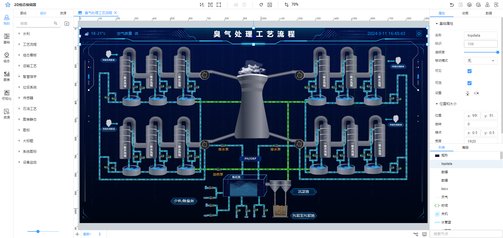
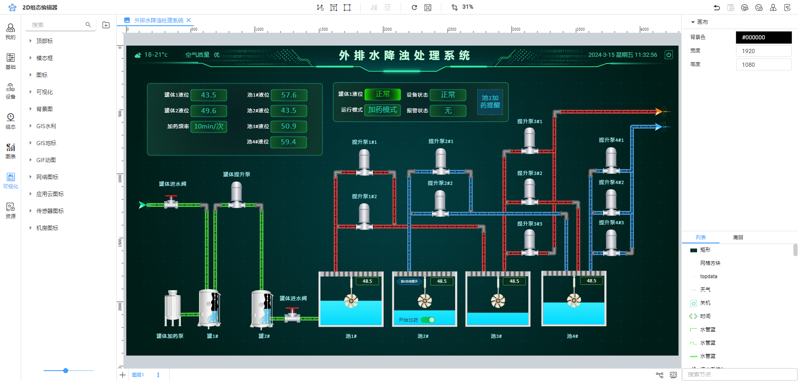
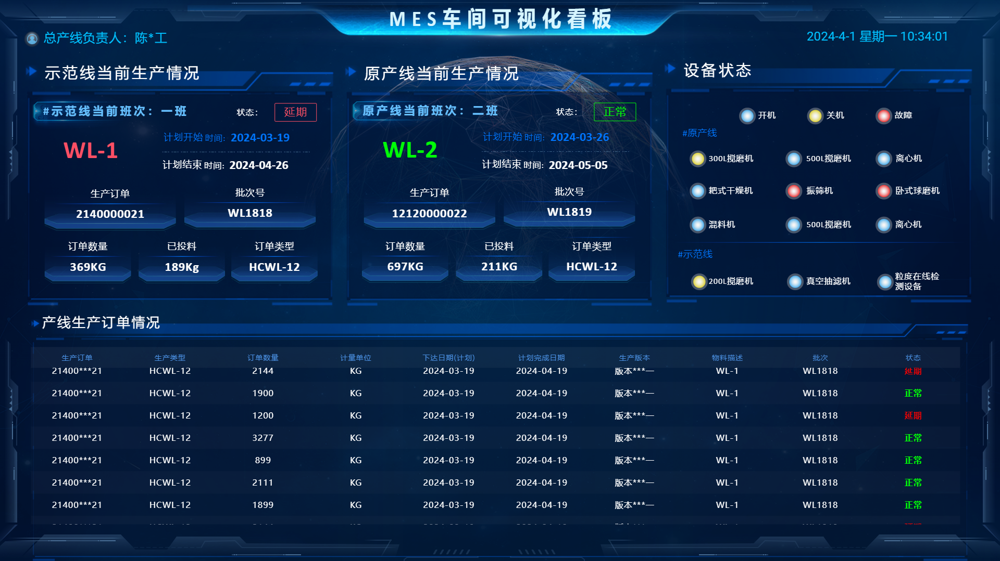
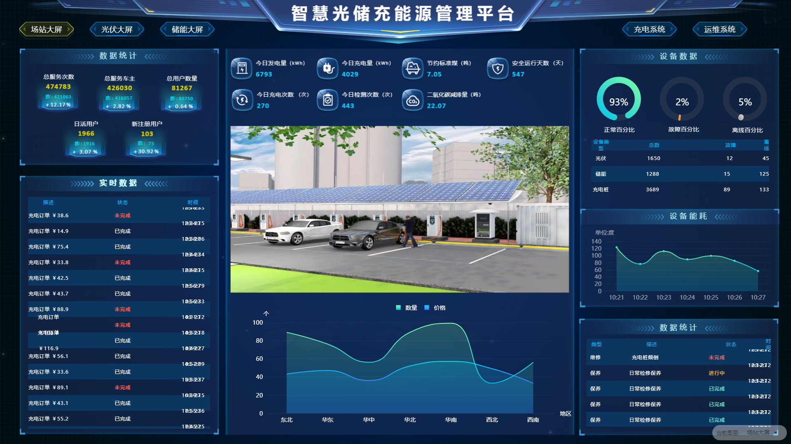
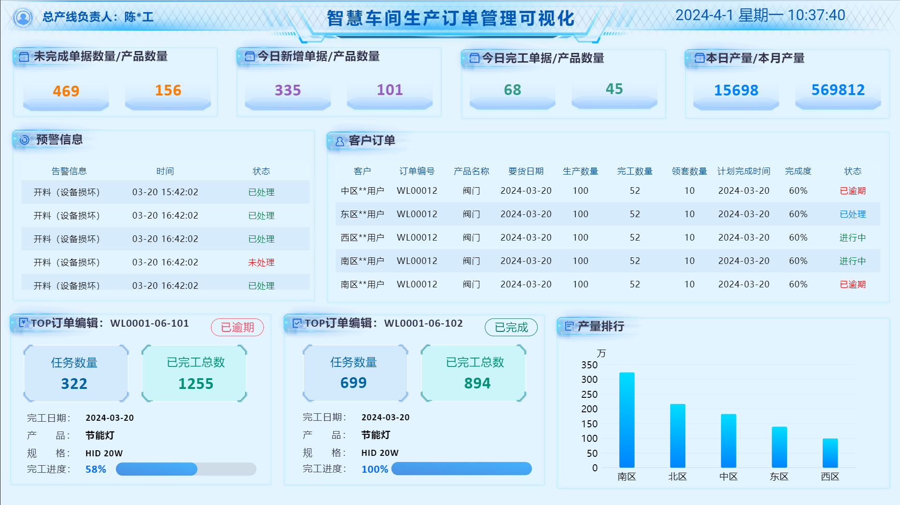
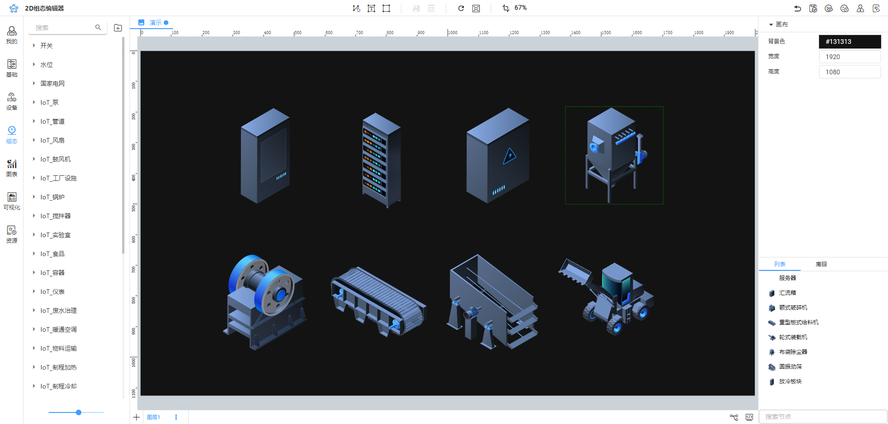

# 产品简介

# <font style="color:rgb(44, 62, 80);">简介</font>

```
   [IoT-Fast 2D 可视化组态软件](https://cloud.iot-fast.com/console/web/dashboard) <font style="color:rgb(38, 38, 38);">是完全自主研发的组态可视化平台，其核心引擎开源。具备实时监控、多样性、动态交互、高效性、可扩展性和跨平台等特点，能够显著减少研发和运维成本。该软件致力于让普通业务人员能够零代码实现</font>**<font style="color:rgb(38, 38, 38);">Web组态</font>**<font style="color:rgb(38, 38, 38);">和</font>**<font style="color:rgb(38, 38, 38);">SCADA</font>**<font style="color:rgb(38, 38, 38);">等解决方案。同时，它拥有丰富的行业图形库和可视化案例。已广泛运用于电力能源、水利水务、物联网、工业互联网、智慧工厂、智慧城市、智慧交通、智慧医疗、教育科研、航空航天和军工等领域。</font>
```

[音视频附件: 产品介绍0519.m4v](./attachments/Dt2aEg5FUvRTYV8N\产品介绍0519.m4v)

## 在线体验：

[**https://cloud.iot-fast.com/console/web/dashboard**](https://cloud.iot-fast.com/console/web/dashboard)





# <font style="color:rgb(44, 62, 80);">特点</font>

## 丰富的组态能力

* 拖拽编辑，简单易用
* 实时数据、直通云data
* 图层设计，轻松加载
* 蓝图交互，效果加倍
* 事件消息、组态联动
* 组合状态、视频监控

## 0代码数据通信

* <font style="color:rgb(44, 62, 80);">支持 mqtt 动态数据监听</font>
* <font style="color:rgb(44, 62, 80);">支持 websocket 动态数据监听</font>
* <font style="color:rgb(44, 62, 80);">支持 http 自主请求动态更新数据</font>

## 管理与应用

* <font style="color:rgb(38, 38, 38);">导入导出组态图</font>
* <font style="color:rgb(38, 38, 38);">导出 HTML、Vue、React 等离线部署包</font>
* <font style="color:rgb(38, 38, 38);">提供离线部署方式，支持云端部署</font>
* <font style="color:rgb(38, 38, 38);">支持集成到第三方平台</font>

## 多端适配能力

* <font style="color:rgb(44, 62, 80);">支持Chrome、Firefox、Edge、</font><font style="color:rgb(38, 38, 38);">Safari</font><font style="color:rgb(44, 62, 80);">等主流浏览器</font>
* <font style="color:rgb(44, 62, 80);">支持移动端webview方式访问</font>
* <font style="color:rgb(38, 38, 38);">支持手机、平板、PC、大屏等多端展示</font>

## 强大的扩展能力

* <font style="color:rgb(44, 62, 80);">资源库扩展：自定义资源，格式支持svg、jpg、png、gif、MP3、MP4</font>
* <font style="color:rgb(44, 62, 80);">数据显示扩展：条件显示、数据格式显示、自定义函数扩展等</font>
* <font style="color:rgb(44, 62, 80);">交互事件扩展：系统消息、自定义消息、生命周期hook、系统接口函数等</font>
* <font style="color:rgb(44, 62, 80);">智能算法扩展：支持自定义拖拽智能算法，自定义连线算法等</font>
* <font style="color:rgb(44, 62, 80);">动画扩展：节点自定义动画、蓝图动画</font>
* <font style="color:rgb(44, 62, 80);">排版扩展：支持自定义排版布局算法</font>

## 追求卓越性能

* <font style="color:rgb(44, 62, 80);">稳定，系统交互中断不影响系统运行</font>
* <font style="color:rgb(44, 62, 80);">可支持10000-10000节点</font>
* <font style="color:rgb(44, 62, 80);">支持绑定500-1000数据点。500数据点30ms完成刷新</font>
* <font style="color:rgb(44, 62, 80);">支持 500+动画播放</font>

## 丰富的组件库资源

* <font style="color:rgb(44, 62, 80);">电力系统，能源系统，物联网，智慧水务，智能制造，数字大屏，图表控件，视频流监控一共2000多个组件</font>
* <font style="color:rgb(44, 62, 80);">支持自定义扩展</font>

<font style="color:rgb(44, 62, 80);">图形库清单（后续补充）</font>

## 广泛的应用场景支持

* <font style="color:rgb(44, 62, 80);">电力能源、水利水务、变电站、光伏系统、火电厂、化工厂、废气治理、炼钢厂、风电、矿山、煤矿系统等</font>
* <font style="color:rgb(44, 62, 80);">物联网、工业互联网、电信机房中心、数据中心、采暖系统、制冷系统、远程监控系统等</font>
* <font style="color:rgb(44, 62, 80);">智慧工厂、智慧楼宇、智慧园区、智慧交通、智慧城市、智慧港口、智慧停车、智慧医疗、智慧农业等</font>
* <font style="color:rgb(44, 62, 80);">大屏展示、看板展示、数据报表、安防监控、IT 运维等</font>
* <font style="color:rgb(44, 62, 80);">架构图、拓扑图、UML图、脑图等</font>

## 国产开源、自主可控

* <font style="color:rgb(44, 62, 80);">IoT-Fast公司自主潜心研发三年，掌握核心技术和知识产权，能够做到完全自主可控，且产品保持持续迭代优化</font>

## 技术架构

<font style="color:rgb(38, 38, 38);">系统采用B/S结构在云端上部署，由前后端分离 + 接口服务 + 数据库组成，遵循Restful Api接口设计标准及规范进行接口开发，或者采用采购方所提供的接口服务。</font>

## 技术线路

<font style="color:rgb(38, 38, 38);">1.前端框架采用主流的React</font>

<font style="color:rgb(38, 38, 38);">2.语言规范采用TypeScript </font>

<font style="color:rgb(38, 38, 38);">3.底层绘画技术为Canvas </font>

<font style="color:rgb(38, 38, 38);">4.后端接口设计遵循Restful Api接口设计标准及规范 </font>

# 行业案例

## 1.污水处理工艺流程图


## 2.农业物联网水肥一体化平台


## 3.MES车间可视化看板



## 4.智慧光储充能源管理平台



## 5.智慧车间生产订单管理可视化



## 6.自定义图形库

# 在线使用

**<font style="color:rgb(38, 38, 38);">在线使用：</font>**<https://cloud.iot-fast.com/console/2d/editor>

# <font style="color:rgb(44, 62, 80);">技术以及商业咨询</font>


> 更新: 2024-10-22 11:46:31  
> 原文: <https://www.yuque.com/iot-fast/ksh/xxqnu3qskg9qbyfl>