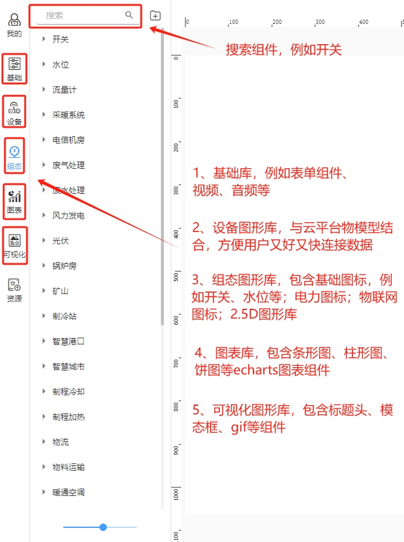
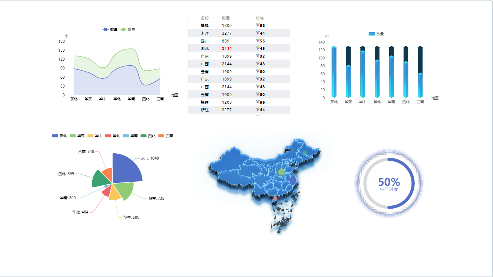
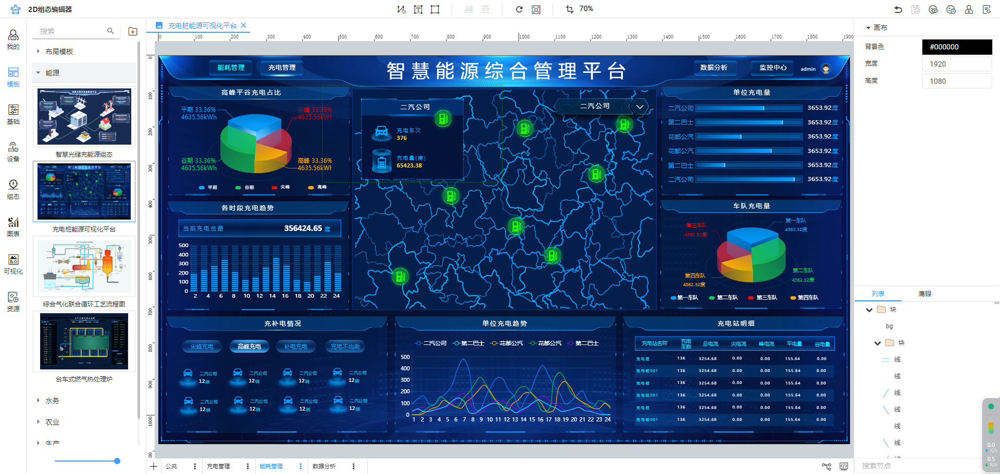
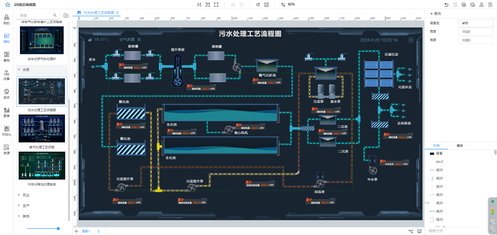
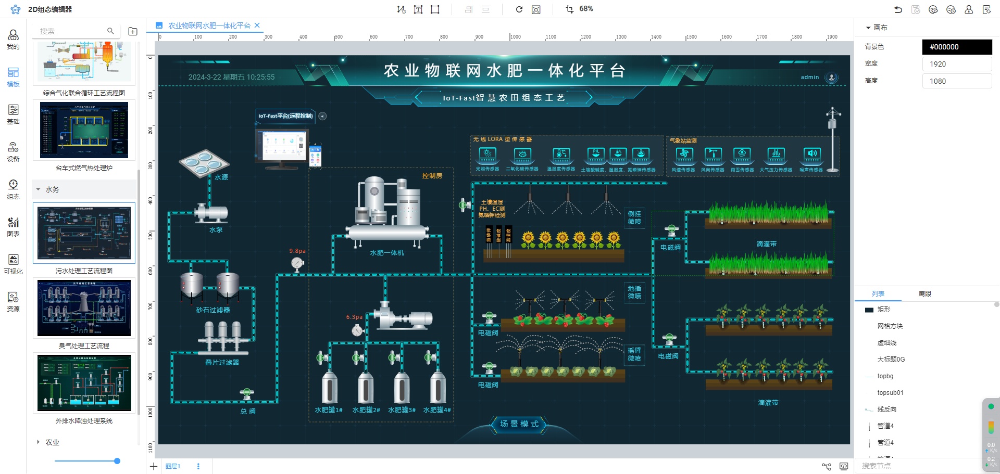
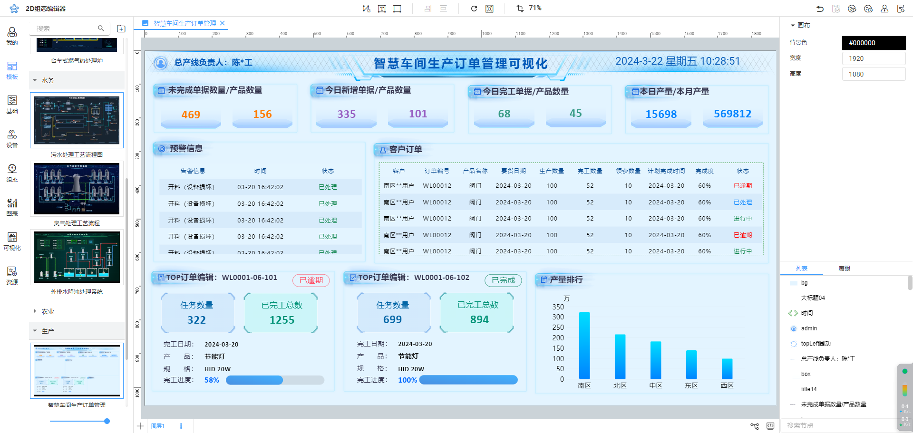

# 图形库清单

# 1.图形库说明
IoT-Fast图形库根据行业和风格分为基础图形库、电力图形库、物联网图形库、2.5D科技图形库。支持两种格式：原生代码（JS）、图片（svg/gif/png/jpg），企业版已经写好固定的逻辑，支持良好。同时IoT-Fast图形库支持自定义拓展。

# 2.图形库查询
[https://cloud.iot-fast.com/console/2d/editor](https://cloud.iot-fast.com/console/2d/editor)

# 3.图形库清单
## 3.1 基础图形库
| 序号 | 类别 | 格式 | 数量 |
| --- | --- | --- | --- |
| 1 | 音视频 | js | 3 |
| 2 | 面板 | js | 5 |
| 3 | 轮播 | js | 1 |
| 4 | 输入 | js | 9 |
| 合计 | | | 18 |

## 3.2 组态库
| 序号 | 类别 | 格式 | 数量 |
| --- | --- | --- | --- |
| 1 | 2.5D_光伏系统 |  | 6 |
| 2 | 2.5D_制冷站 |  | 4 |
| 3 | 2.5D_废气处理 |  | 16 |
| 4 | 2.5D_废水处理 |  | 23 |
| 5 | 2.5D_智慧城市 |  | 27 |
| 6 | 2.5D_智慧港口 |  | 6 |
| 7 | 2.5D_电信机房 |  | 13 |
| 8 | 2.5D_矿山 |  | 14 |
| 9 | 2.5D_采暖系统 |  | 10 |
| 10 | 2.5D_锅炉房 |  | 4 |
| 11 | 2.5D_风力发电 |  | 13 |
| 12 | IoT_仪表 |  | 13 |
| 13 | IoT_制程冷却 |  | 22 |
| 14 | IoT_制程加热 |  | 17 |
| 15 | IoT_实验室 |  | 17 |
| 16 | IoT_容器 |  | 92 |
| 17 | IoT_工厂设施 |  | 42 |
| 18 | IoT_废水治理 |  | 123 |
| 19 | IoT_搅拌器 |  | 19 |
| 20 | IoT_暖通空调 |  | 59 |
| 21 | IoT_泵 |  | 34 |
| 22 | IoT_流量计 |  | 24 |
| 23 | IoT_物料运输 |  | 52 |
| 24 | IoT_物流 |  | 32 |
| 25 | IoT_管道 |  | 21 |
| 26 | IoT_锅炉 |  | 21 |
| 27 | IoT_风扇 |  | 20 |
| 28 | IoT_食品 |  | 60 |
| 29 | IoT_鼓风机 |  | 16 |
| 30 | 国家电网 |  | 281 |
| 31 | 开关 |  | 19 |
| 32 | 水位 |  | 5 |
| 合计 | | | 1125 |

## 3.3 图表库
| 序号 | 类别 | 格式 | 数量 |
| --- | --- | --- | --- |
| 1 | 仪表盘 | js | 5 |
| 2 | 其他 | js | 3 |
| 3 | 地图 | js | 7 |
| 4 | 折线图 | js | 3 |
| 5 | 柱形图 | js | 10 |
| 6 | 进度 | js | 6 |
| 7 | 雷达图 | js | 3 |
| 8 | 饼图 | js | 5 |
| 合计 | | | 42 |

## 3.4 可视化库
| 序号 | 类别 | 格式 | 数量 |
| --- | --- | --- | --- |
| 1 | GIF动图 |  | 10 |
| 2 | GIS地标 |  | 51 |
| 3 | GIS水利 |  | 43 |
| 4 | 传感器图标 |  | 73 |
| 5 | 双色深浅图标 |  | 129 |
| 6 | 可视化 |  | 18 |
| 7 | 图标 |  | 50 |
| 8 | 应用云图标 |  | 20 |
| 9 | 机房图标 |  | 16 |
| 10 | 模态框 |  | 18 |
| 11 | 网络图标 |  | 44 |
| 12 | 背景图 |  | 3 |
| 13 | 顶部标 |  | 32 |
| 合计 | | | 507 |

## 3.5 图源
| 序号 | 类别 | 格式 | 数量 |
| --- | --- | --- | --- |
| 1 | 2.5D_光伏 |  | 6 |
| 2 | 2.5D_制冷站 |  | 8 |
| 3 | 2.5D_废气治理 |  | 19 |
| 4 | 2.5D_废水处理 |  | 32 |
| 5 | 2.5D_智慧城市 |  | 26 |
| 6 | 2.5D_智慧港口 |  | 6 |
| 7 | 2.5D_汽车制造 |  | 21 |
| 8 | 2.5D_火力发电 |  | 5 |
| 9 | 2.5D_电信机房 |  | 21 |
| 10 | 2.5D_矿山 |  | 11 |
| 11 | 2.5D_采暖系统 |  | 10 |
| 12 | 2.5D_锅炉房 |  | 5 |
| 13 | 2.5D_风力发电 |  | 15 |
| 14 | IoT_仪表 |  | 12 |
| 15 | IoT_制程冷却 |  | 21 |
| 16 | IoT_制程加热 |  | 18 |
| 17 | IoT_化学 |  | 35 |
| 18 | IoT_发动机 |  | 17 |
| 19 | IoT_安全 |  | 26 |
| 20 | IoT_实验室 |  | 19 |
| 21 | IoT_容器 |  | 12 |
| 22 | IoT_工厂设施 |  | 33 |
| 23 | IoT_废水处理 |  | 137 |
| 24 | IoT_建筑 |  | 35 |
| 25 | IoT_按钮 |  | 31 |
| 26 | IoT_搅拌器 |  | 21 |
| 27 | IoT_暖通空调 |  | 65 |
| 28 | IoT_水槽 |  | 84 |
| 29 | IoT_泵 |  | 36 |
| 30 | IoT_流量计 |  | 24 |
| 31 | IoT_灯 |  | 20 |
| 32 | IoT_物料运输 |  | 54 |
| 33 | IoT_物流 |  | 47 |
| 34 | IoT_电源 |  | 58 |
| 35 | IoT_电线电缆 |  | 13 |
| 36 | IoT_管道 |  | 21 |
| 37 | IoT_自然 |  | 17 |
| 38 | IoT_锅炉 |  | 21 |
| 39 | IoT_阀门 |  | 20 |
| 40 | IoT_阀门符号 |  | 17 |
| 41 | IoT_风扇 |  | 12 |
| 42 | IoT_食品 |  | 59 |
| 43 | IoT_鼓风机 |  | 21 |
| 44 | 素材_图标 |  | 78 |
| 45 | 素材_标题框 |  | 111 |
| 46 | 素材_模态框 |  | 103 |
| 47 | 素材_背景 |  | 12 |
| 48 | 素材_装饰 |  | 125 |
| 合计 | | | 1620 |

# 4.应用场景
## 4.1.基础图形库应用场景

## 4.2.能源应用场景  

## 4.3.水务应用场景

## 4.4.农业应用场景

## 4.5.生产应用场景

更多案例：[https://cloud.iot-fast.com/console/web/visual/scene](https://cloud.iot-fast.com/console/web/visual/scene)

> 更新: 2025-02-11 14:50:42  
> 原文: <https://www.yuque.com/iot-fast/ksh/bv4dp0i3zl5zrmbr>