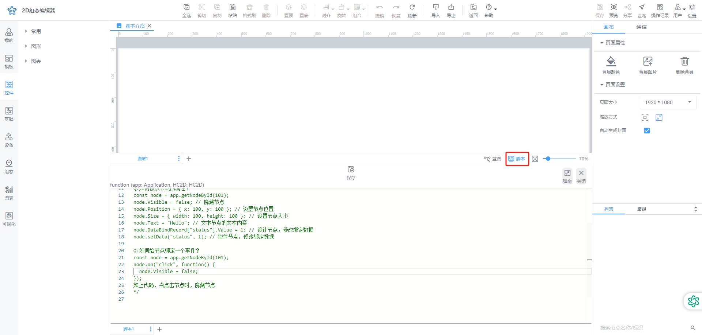
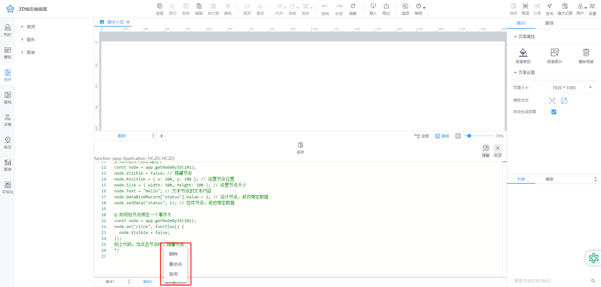

# 功能介绍

脚本旨在解决单个动画以及蓝图交互配置无法实现的特定交互动作。通过运行本脚本，可以实现这些复杂的交互效果，提升系统的功能性和用户体验。

## 1.1 新建脚本
在画布右下脚单击打开脚本，场景默认附带一个脚本

用户可通过➕新建脚本页面，修年间的脚本在最右侧展示。

## 1.2 脚本设置

1. 重命名
2. 删除：即删除当前脚本
3. 禁用：即禁用当前脚本，禁用后脚本代码将在预览或分享页面中失效。

脚本编辑使用可参考[相关文档](http://v2-doc.gkiiot.com/docs/)

> 更新: 2024-08-15 17:43:29  
> 原文: <https://www.yuque.com/iot-fast/ksh/wk6svlqw08npcwbr>