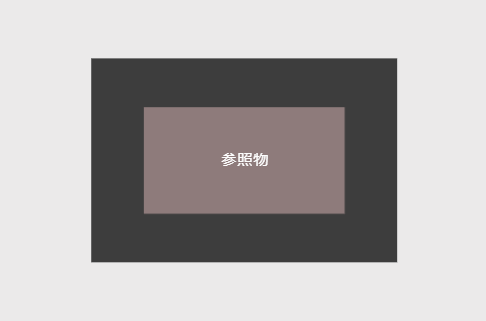

# 宽高变化

**触发类型：**默认无、自动播放（预览或分享页面直接运行动画）、数据驱动（通过节点或者设备数据触发）

**宽度、高度：**默认填充节点当前宽高

**变化中心：**默认(0.5,0.5)

**循环播放：**默认不勾选，勾选后将循环宽高变化效果

**播放次数：**即动画次数，勾选“循环播放”后自动隐藏。

**循环类型：**(默认重新开始(即执行一遍动画后从最初位置开始)、反向开始(即执行一遍动画后从结束的位置开始运行到最初位置)

**移动次数：**即动画次数，勾选“循环播放”后自动隐藏。

**结束状态：**默认初始状态（即动画结束后节点保持最原始的节点状态）、最终状态（动画结束后节点保持结束瞬间的状态）

**动画速度：**单次动画运行的时间

**运动方式：**默认匀速运动、加速运动、减速运动、缓冲运动

备注：适用于所有节点

| 动画设置 | 动画效果 |
| --- | --- |
|  |  |
|  |  |
|  |  |

> 更新: 2024-07-02 15:39:26  
> 原文: <https://www.yuque.com/iot-fast/ksh/bg11t1uoscsknoa5>