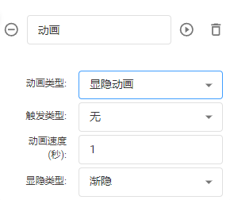
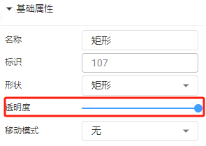
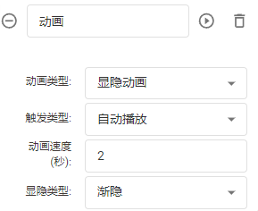
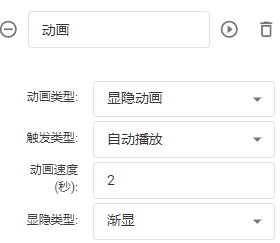

# 显隐动画

**触发类型：**默认无、自动播放（预览或分享页面直接运行动画）、数据驱动（通过节点或者设备数据触发）

**动画速度：**单次动画运行的时间（0为直接隐藏或显示）

**显隐类型：**默认渐隐、渐显

**注意：**渐显和渐隐**是通过**改变节点的**透明度**实现，**而非**可见属性，所以设置渐显时，需要先把节点的透明度调整为0。

备注：适用于所有节点

| 动画设置 | 动画效果 |
| --- | --- |
|  |  |
|  |  |

> 更新: 2024-07-02 15:38:39  
> 原文: <https://www.yuque.com/iot-fast/ksh/gz2zcpox8satl0k3>