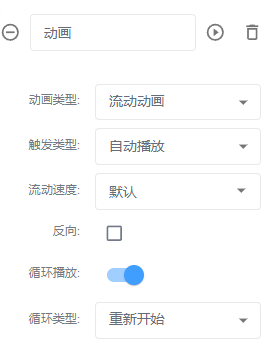
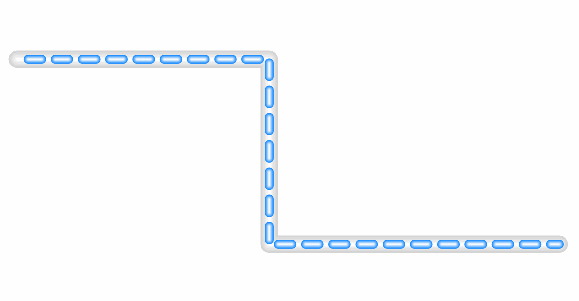
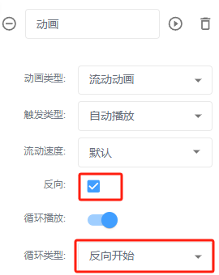
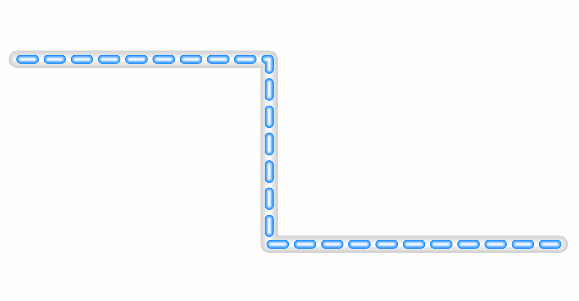

# 流动动画

**触发类型：无、**默认自动播放（预览或分享页面直接运行动画）、数据驱动（通过节点或者设备数据触发）

**流动速度：**默认、极快、快、慢

**反向：**默认正向流动，勾选后反向流动

**循环播放：**默认勾选，呈现循环流动效果；

**循环次数：**即动画次数，勾选“循环播放”后自动隐藏。

**循环类型：**(默认重新开始(即执行一遍动画后从最初位置开始)、反向开始(即执行一遍动画后从结束的位置开始运行到最初位置)

备注：只适用于管线、勾选虚线的线段。

| 动画设置 | 动画效果 |
| --- | --- |
|  |  |
|  |  |

> 更新: 2024-07-31 16:49:54  
> 原文: <https://www.yuque.com/iot-fast/ksh/scot3qtg5in3qypn>