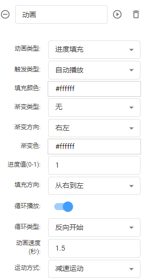
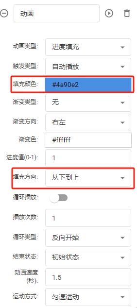
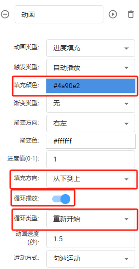

# 进度填充

**触发类型：**默认无、自动播放（预览或分享页面直接运行动画）、数据驱动（通过节点或者设备数据触发）

**填充颜色：**默认"#ffffff"

**渐变类型：**默认无、线性渐变、径向渐变、覆盖渐变

**渐变色：**默认"#ffffff"

**进度值(0-1)：**进图填充最大值设置

**填充方向：**默认从右到左、从左到右、从上到下、从下到上

**循环播放：**默认不勾选，勾选后将循环宽高变化效果

**播放次数：**即动画次数，勾选“循环播放”后自动隐藏。

**循环类型：**(默认重新开始(即执行一遍动画后从最初位置开始)、反向开始(即执行一遍动画后从结束的位置开始运行到最初位置)

**动画速度：**单次动画运行的时间

**运动方式：**默认匀速运动、加速运动、减速运动、缓缓冲运动

备注：线、基础图形特有的动画

| 动画设置 | 动画效果 |
| --- | --- |
|  |  |
|  |  |

> 更新: 2024-07-02 15:39:56  
> 原文: <https://www.yuque.com/iot-fast/ksh/yddtxyucrg61n2h9>