# 功能介绍

## 基础功能
### 打开蓝图
蓝图位于画布下方。

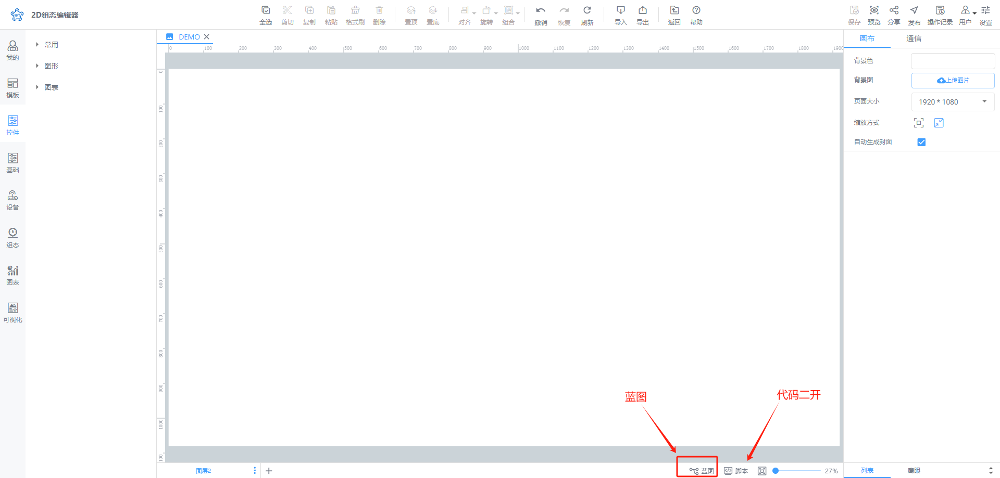

在画布右下角单击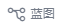图标可以打开蓝图。

### 添加节点
通过节点添加功能，您可以在蓝图中添加需要的节点，并设置节点的交互规则。

#### 添加画布节点/图层节点
**画布**节点指的是画布中所有界面资源的蓝图节点，**图层**节点指的是大屏画布中所有图层的蓝图节点。

+ 在画布中或者在列表下选中要添加到蓝图中的画布节点，单击右键选择**添加到蓝图**即可将画布中的资源添加到蓝图中。

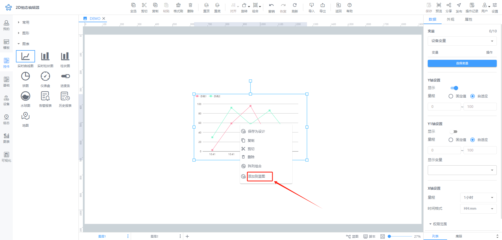

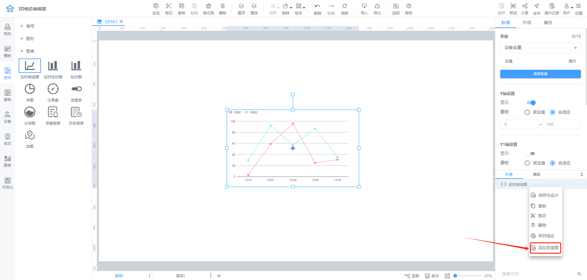

+ 在画布中选中要添加到蓝图中的图层，单击图标选择**添加到蓝图**即可将选择的图层添加到蓝图中。

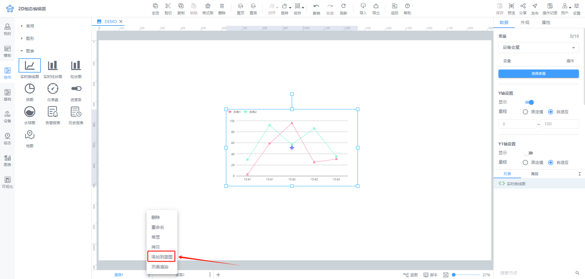

**📚****说明：**

您也可以在蓝图中单击右键，打开蓝图弹框，单击节点列表或者图层列表，选中要添加的节点或图层，单击即可将选中的**节点/图层**添加至蓝图中。

#### 添加其他节点
其他节点指除了**画布**节点**/图层**节点外的蓝图节点，包含场景（组合、开始）、动作、数据、逻辑、提示、其他类节点。

在蓝图中单击右键，打开蓝图节点弹框，单击即可将选中的节点添加至蓝图中。

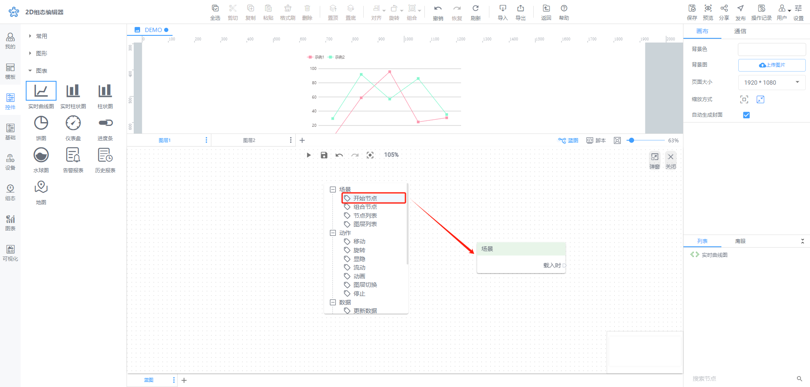

**📚****说明：**

添加蓝图节点后，选中某个节点拖动可以移动蓝图节点。

添加蓝图节点后，通过按住鼠标左键框选或通过长按ctrl键+鼠标左键点击多选

### 删除节点
通过节点删除功能，您可以及时删除不再使用的蓝图节点。

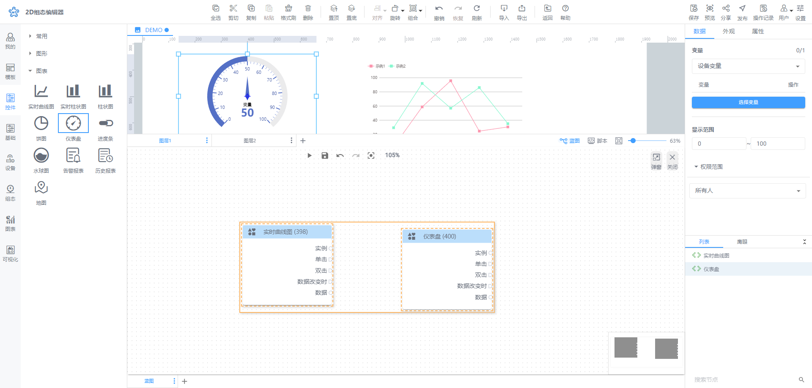

在蓝图中选中需要删除的节点，使用快捷键**Delete**或**Backspace**即可删除节点，支持删除单个节点或者选中多个节点批量删除。

### 修改节点属性
在蓝图中选中需要修改属性的节点，在右侧的属性面板即可修改节点的属性。

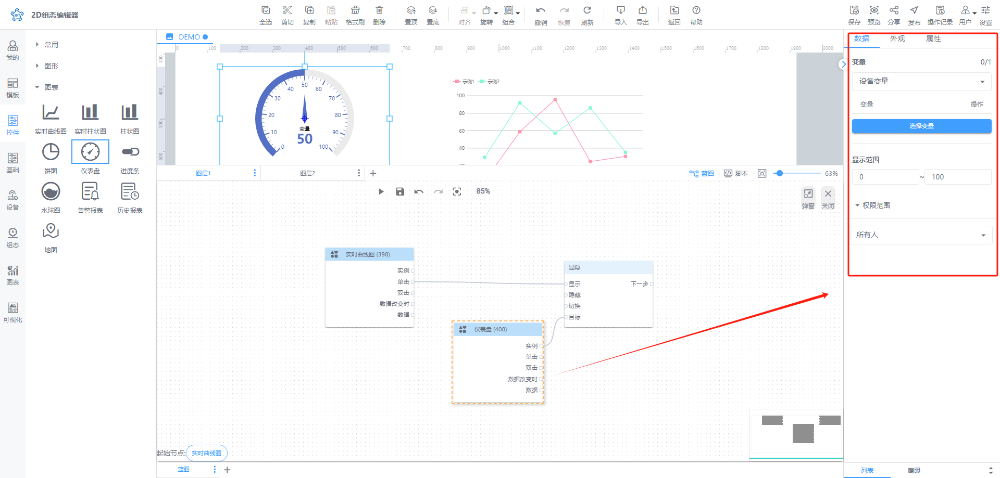

### 运行蓝图
通过运行蓝图功能，您可以在弹窗的预览页面查看设置的蓝图节点交互效果。

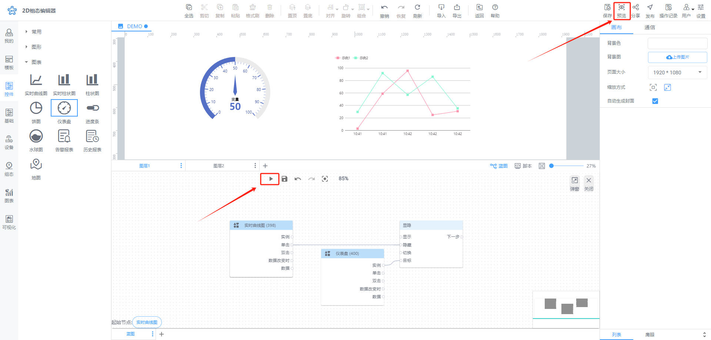

单击工具栏的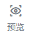图标或者蓝图区域的图标可进入预览页面查看设置的蓝图交互效果。

## 使用技巧
### 新建蓝图分页
通过蓝图分页新建功能，您可以创建多个蓝图分页，展示不同图层的交互规则。

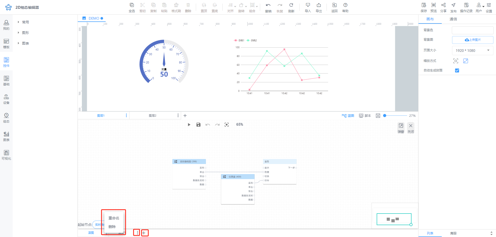

单击蓝图编辑器左下角可新建蓝图分页，新建的蓝图分页展示在已有蓝图分页后面。鼠标悬浮于新建的蓝图分页，单击选择**重命名**或者**删除**按钮，可以重命名或者删除新建的蓝图分页。

### 展开/折叠节点
蓝图部分节点带有展开折叠功能，展开节点方便您查看蓝图节点全貌，折叠功能方便您缩小蓝图节点使页面清晰简洁。

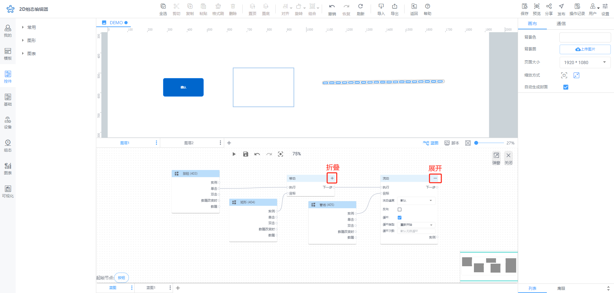

### 重命名节点
目前，蓝图上画布中节点和蓝图的组合节点支持重命名。

+ 点击节点后，右侧属性上修改名称可重命名

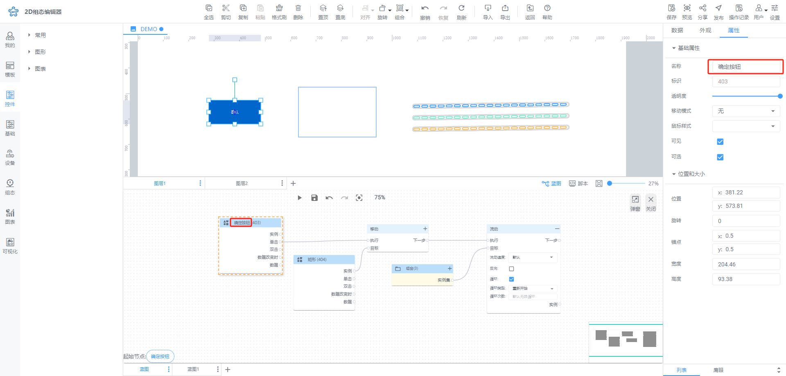

+ 点击组合名称即可重命名

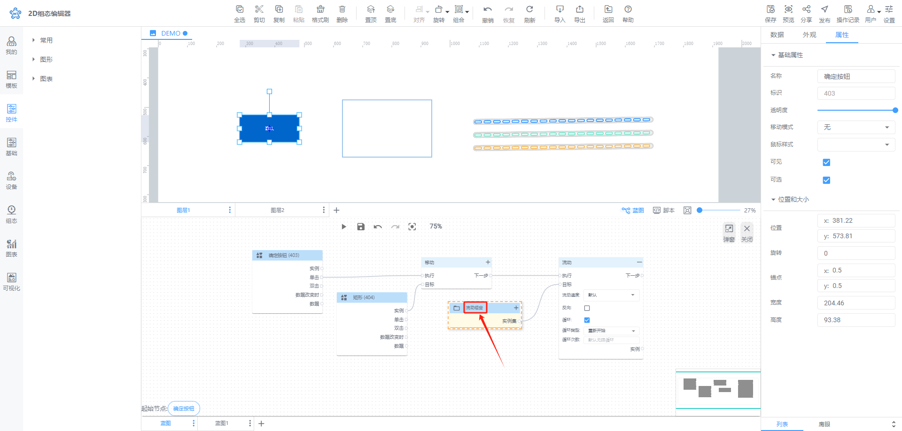

### 撤销/重做蓝图
通过撤销/重做蓝图功能，您可以撤销在蓝图编辑区的上一步操作和重做撤销的上一步操作。

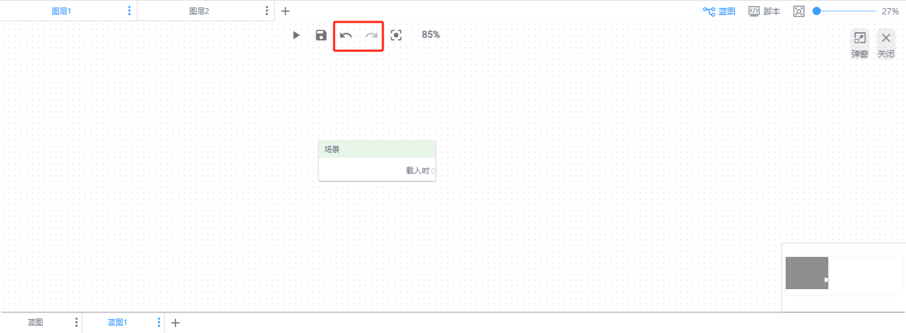

### 弹出蓝图编辑器
通过该功能，可以在蓝图编辑器中弹出一个更大的编辑窗口，方便配置。

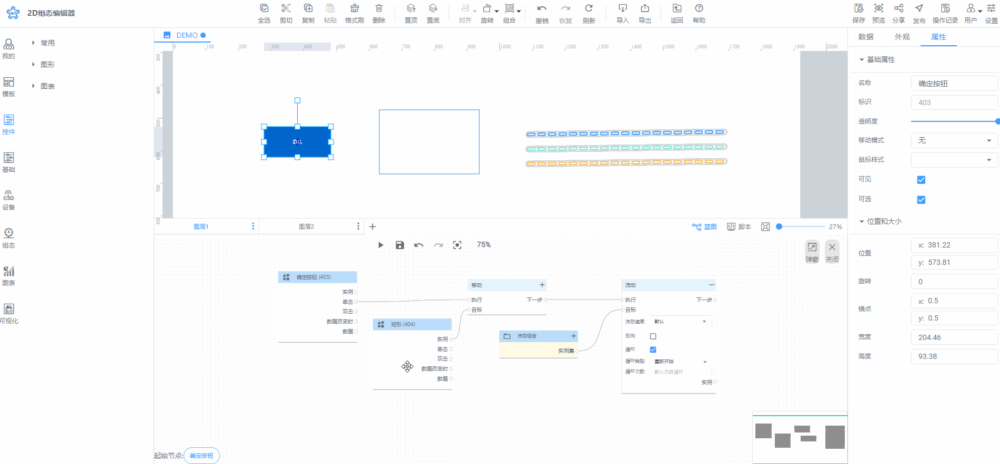

单击蓝图编辑器右上角的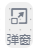，可以弹出蓝图编辑器。

### 居中蓝图节点
通过蓝图节点居中功能，可以将蓝图中所有节点居中，方便进行查看。

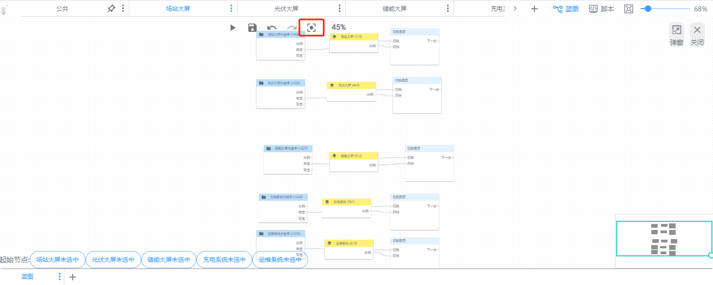

### 蓝图组合功能
利用蓝图组合功能，您可以将多个要进行相同动作的蓝图节点组合并命名，以便更轻松地管理它们。

途径一：在画布中或者列表下多选节点右击【添加到蓝图】形成组合

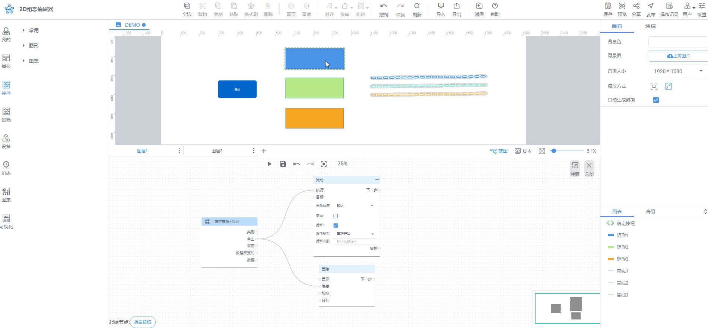

途径二：在蓝图节点列表中多选添加节点形成组合

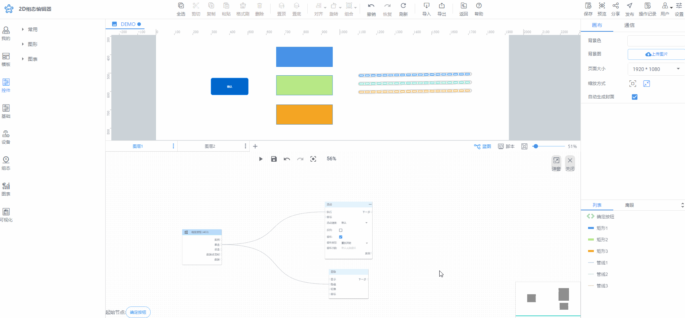

途径三：右击蓝图空白处出现弹窗，选择组合节点，拖拽蓝图节点到组合。

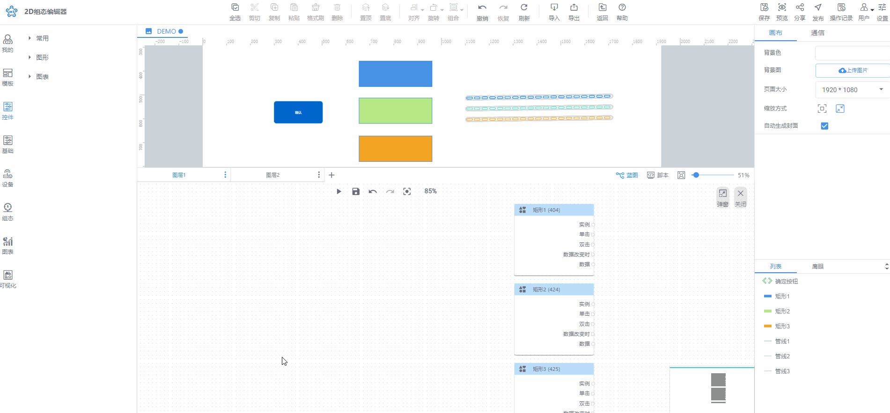

### 移动画布
鼠标中间键按住拖拽 或 shift + 左键移动 可移动画布。

也可通过鹰眼功能移动画布。

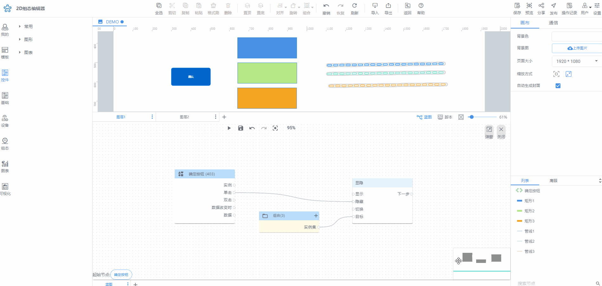

### 缩放画布
鼠标中间键滚动可缩放画布。

也可通过滚动功能缩放画布。

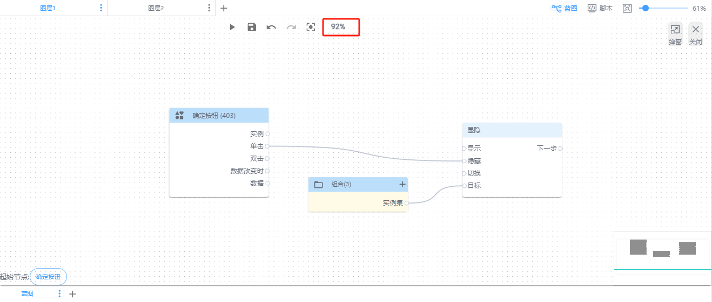

> 更新: 2024-07-31 15:56:30  
> 原文: <https://www.yuque.com/iot-fast/ksh/rbrsyxy0r7ib9pwz>