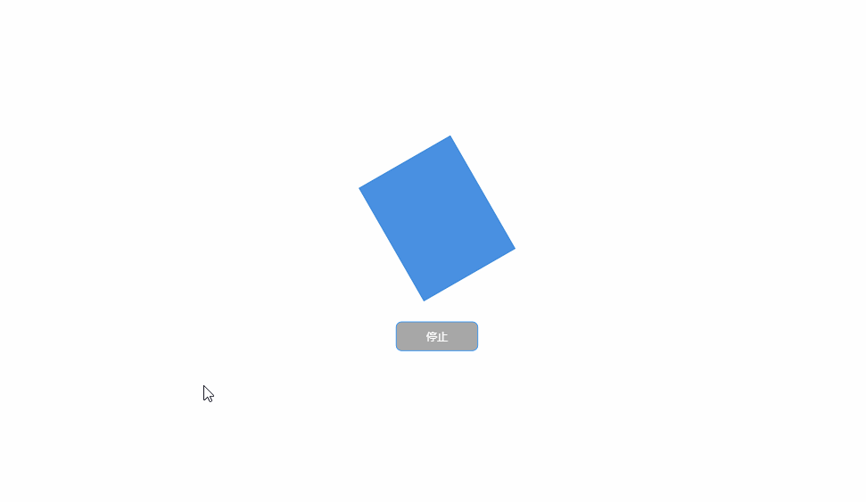

# 停止

**执行：**即停止循环动画

**下一步：**即停止循环动画后要执行的动作

**目标：**本次停止动画的对象

**📚****说明：**停止动画只适用于蓝图中的循环流动、循环旋转动画以及用于停止语音告警，其他类型的动画不受影响

| 动画设置 | 动画效果 |
| --- | --- |
|  |  |

> 更新: 2024-08-01 16:58:40  
> 原文: <https://www.yuque.com/iot-fast/ksh/cx7rxca0qt5a4mcx>