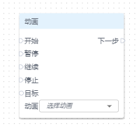
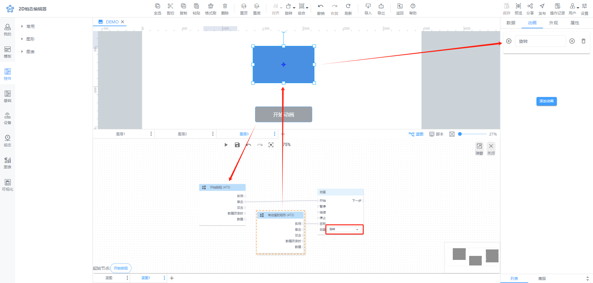
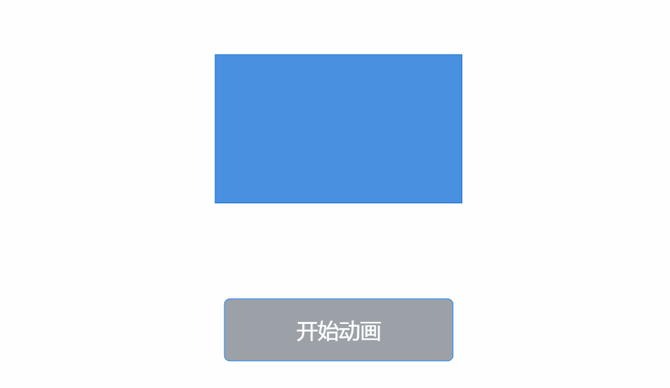

# 动画

**开始：**即开始节点的某个动画

**暂停：**即暂停节点的某个动画，动画还存在

**继续：**即继续节点的某个动画，经常和暂停动作一起配合使用

**停止：**即停止动画，动画已清空，需要通过开始重新触发动画

**下一步：**即旋转动画结束后要执行的动作

**目标：**本次移动动画的对象

**动画：**节点的动画列表

**📚****说明：**动画用于与单个节点的动画配合使用

| 动画设置 | 动画效果 |
| --- | --- |
|  |  |

> 更新: 2024-07-31 17:24:09  
> 原文: <https://www.yuque.com/iot-fast/ksh/dkg3rgho6ym9mqog>