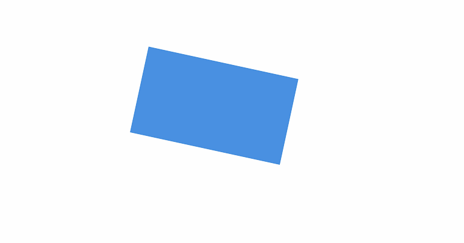

# 旋转

**执行：**即执行旋转动画

**下一步：**即旋转动画结束后要执行的动作

**目标：**本次移动动画的对象

**角度：**即要旋转的角度

**类型**：相对（默认）、绝对

+ 相对：在原来的角度x旋转到角度：x+x0
+ 绝对：在原来的角度x旋转到角度：x0

**动画速度：**单次动画运行的时间，快、中（默认）、慢

**循环：**默认不勾选，勾选后将循环移动效果

**循环类型：**(默认重新开始(即执行一遍动画后从最初位置开始)、反向开始(即执行一遍动画后从结束的位置开始运行到最初位置)

**循环次数：**即动画次数，默认无限循环。

**实例：**即当前旋转动画

**📚****说明：**适用于所有节点

| 动画设置 | 动画效果 |
| --- | --- |
|  |  |

> 更新: 2024-07-31 17:01:02  
> 原文: <https://www.yuque.com/iot-fast/ksh/shs30yxz0zs0dxq3>