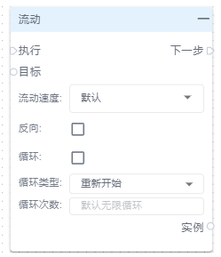
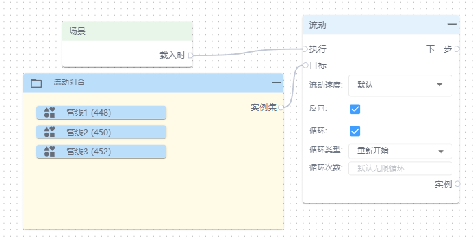
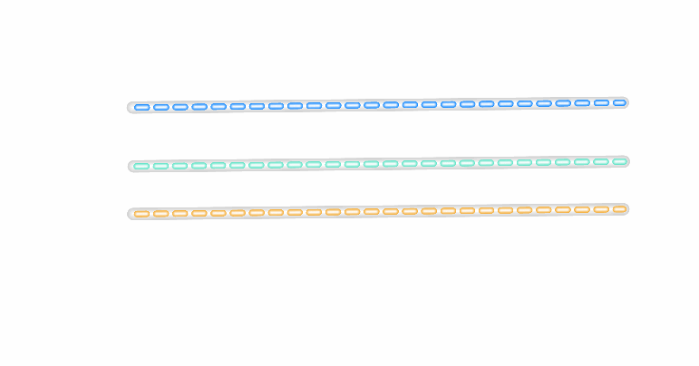

# 流动

**执行：**即执行流动动画

**下一步：**即流动动画结束后要执行的动作

**目标：**本次流动动画的对象

**流动速度：**单次动画运行的时间，极快、快、默认、慢

**反向：**即默认动画方向相反

**循环：**默认不勾选，勾选后将循环流动效果

**循环类型：**(默认重新开始(即执行一遍动画后从最初位置开始)、反向开始(即执行一遍动画后从结束的位置开始运行到最初位置)

**循环次数：**即动画次数，默认无限循环。

**实例：**即当前流动动画

**📚****说明：**只适用于管线、勾选虚线的线段。

| 动画设置 | 动画效果 |
| --- | --- |
|  |  |

> 更新: 2024-07-31 17:01:26  
> 原文: <https://www.yuque.com/iot-fast/ksh/utt896z7dduukoh6>