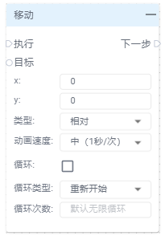
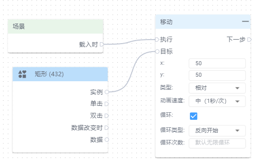

# 移动

**执行：**即执行移动动画

**下一步：**即移动动画结束后要执行的动作

**目标：**本次移动动画的对象

**x/y：**即要移动到的目标位置

**类型**：相对（默认）、绝对

+ 相对：在原来的位置(a,b)上移动到位置(a+x,b+y)上
+ 绝对：在原来的位置(a,b)上移动到位置(x,y)上

**动画速度：**单次动画运行的时间，快、中（默认）、慢

**循环：**默认不勾选，勾选后将循环移动效果

**循环类型：**(默认重新开始(即执行一遍动画后从最初位置开始)、反向开始(即执行一遍动画后从结束的位置开始运行到最初位置)

**循环次数：**即动画次数，默认无限循环。

**📚****说明：**适用于所有节点

| 动画设置 | 动画效果 |
| --- | --- |
|  |  |

> 更新: 2024-07-31 17:00:10  
> 原文: <https://www.yuque.com/iot-fast/ksh/nbg4hgvb708yxzvp>