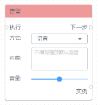
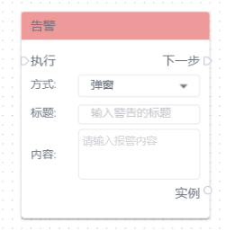
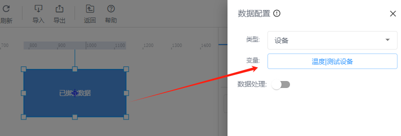
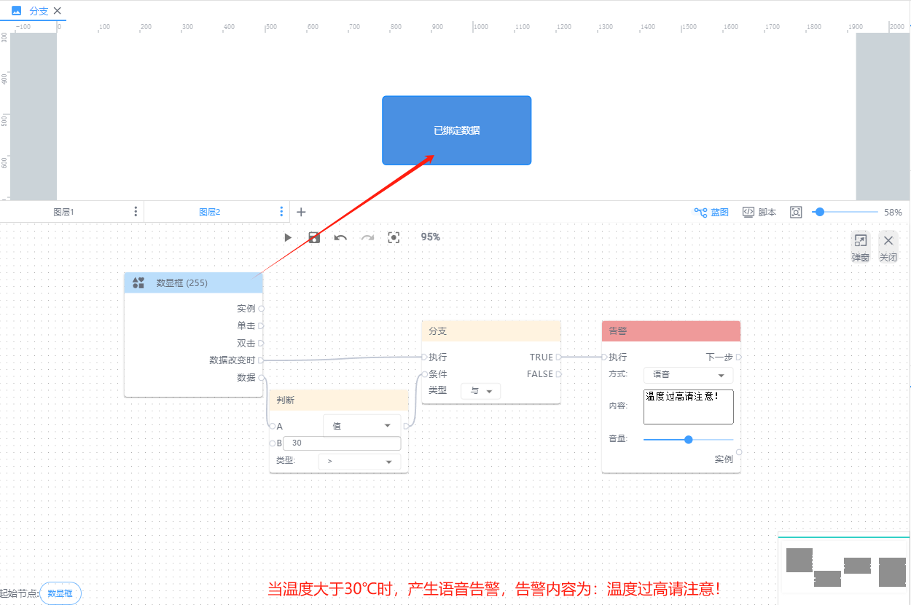
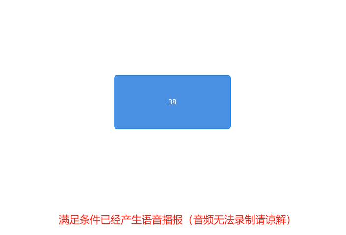
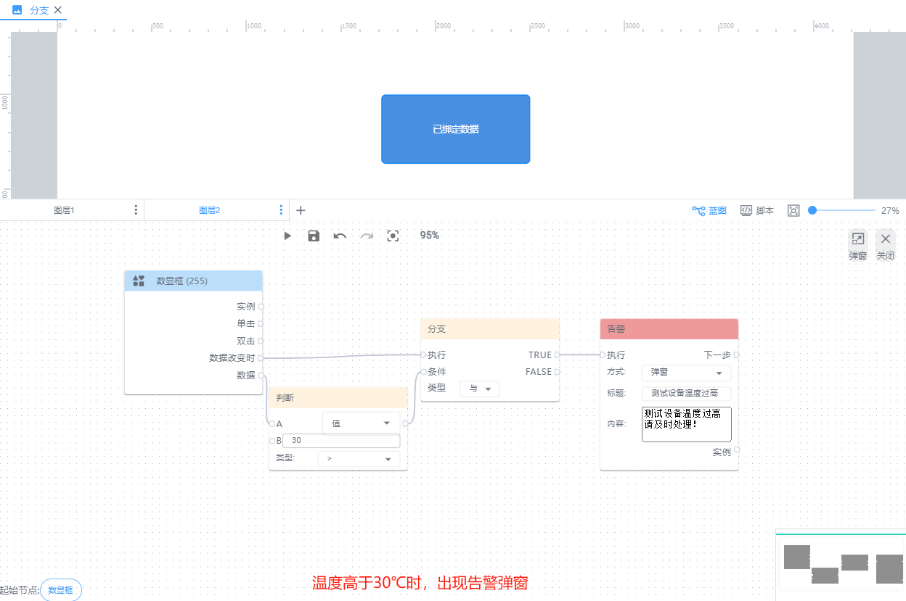
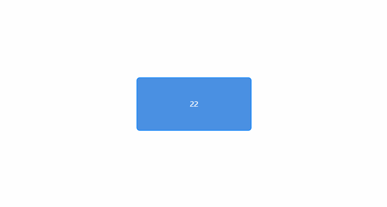

# 告警

**执行：**即执行报警动作

**方式：**语音（默认）、弹窗

+ 语音：系统默认播放警报声，用户可以编辑播报内容及音量大小。
+ 弹窗：用于可输入警告标题以及内容

**下一步：**即告警弹窗执行后要进行的动作

**实例：**即当前告警弹窗对象。如果您使用的是语音告警，可通过动作【停止】来暂停语音告警。

**举例说明：**当设备温度>30℃时，产生语音告警和弹窗告警

首先，选择组件【数显框】绑定设备数据：

其次进行以下配置：

| 蓝图设置 | 交互效果 |
| --- | --- |
|  |  |
|  |  |

> 更新: 2024-08-01 16:37:33  
> 原文: <https://www.yuque.com/iot-fast/ksh/koylm31o69dhcfng>