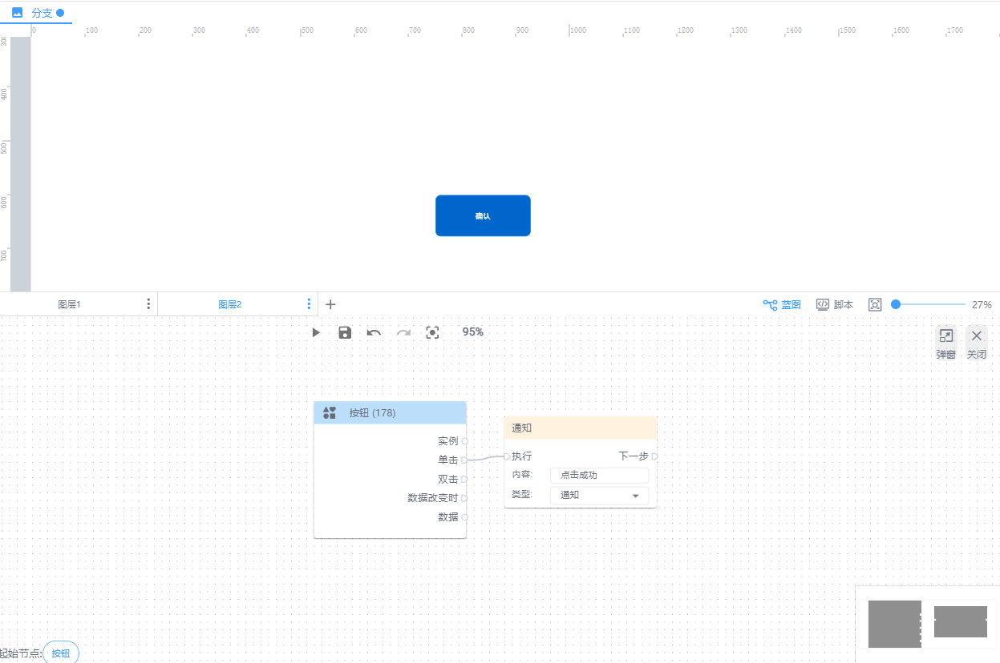
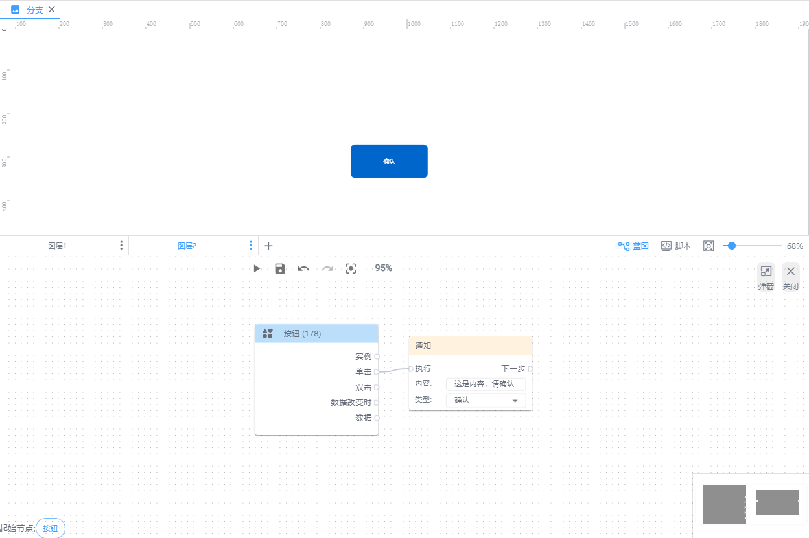

# 通知

**执行：**即执行通知弹窗

**内容：**即通知弹窗的内容展示

**类型：**通知（默认）、确认

+ 通知：系统弹窗展示内容，会自动消失
+ 确认：系统弹窗展示内容，需手动关闭弹窗才会消失

**下一步：**即通知弹窗后要执行的动作

| 蓝图设置 | 交互效果 |
| --- | --- |
|  |  |
|  |  |

> 更新: 2024-08-01 16:25:17  
> 原文: <https://www.yuque.com/iot-fast/ksh/nrzobpyzaelmtqx4>