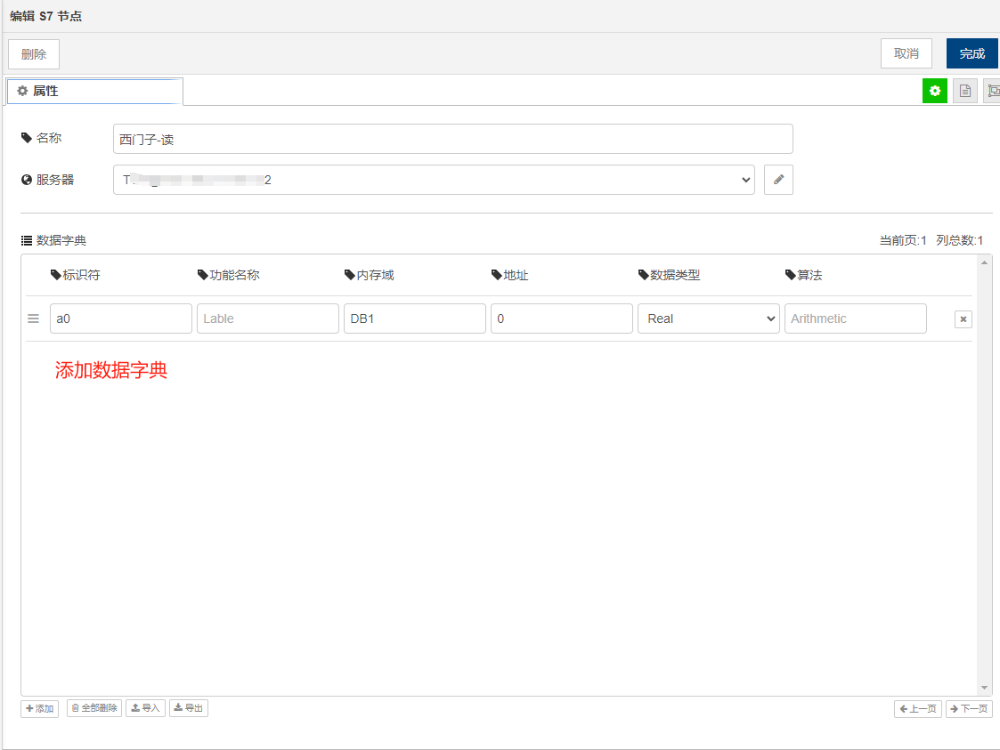
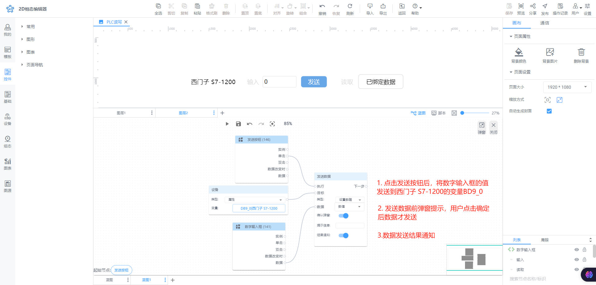

# 发送数据

**执行：**即执行发送数据操作

**下一步：**即发送数据成功后要执行的动作

**目标：**本次发送数据的对象，目前仅支持设备和通信两种

**类型：**设置数据（默认）、手动填写

+ 设置数据：类型为设置数据时，显示数据,可选择数据对象。
+ 手动填写：类型为手动填写时，隐藏数据。

**数据：**数据指的是本次发送数据的来源，目前支持五种数据来源，分别是：静态数据、节点列表、设备、通信、数据脚本

+ 静态数据：在输入框输入值即可。

+ 其他数据：通过鼠标拖拽，出现弹窗，点击选择：

**确认弹窗：**开启后，可写入提示信息，在发送数据前会弹出确认窗口，点击窗口上的“确定”按钮后才会真正发送数据。

|  |  |
| --- | --- |

**结果通知：**数据发送后进行弹窗提示

### 举例：发送数据到设备
发送数据到设备，需要进行如下步骤：

1. 以下是桌面端2.0.7版本的操作过程，请知悉
2. 在物联网云平台上创建产品和设备
3. 配置采控引擎
4. 创建组态看板并配置蓝图交互

下面以设备西门子 S7-1200为例进行说明

#### 创建产品和设备
具体操作手册可查看[《物联网》](about:blank)

新建产品【西门子 S7-1200】，添加可读写属性：DB9_0，然后发布

新建设备【西门子 S7-1200】

#### 配置采控引擎
在采控引擎可视化界面配置数据采集信息，具体操作手册可查看[《采控引擎》](https://www.yuque.com/iot-fast/ckyq?# 《采控引擎》)

##### 有设备的情况配置如下：

使用定时器定时将西门子数据发送至云平台；数据可以通过云平台下发，经转换后再传输到西门子设备，从而实现完整的设备读写功能。

|  |  |
| --- | --- |
|  |  |
|  |  |
|  |  |
|  |  |
|  |  |

##### 无设备的情况配置如下：

|  |  |
| --- | --- |
|  |  |
|  |  |

**📚****说明：**下面的页面交互效果可以通过设备或无设备的配置均能实现。

#### 创建组态看板并配置蓝图交互
| 蓝图设置 | 交互效果 |
| --- | --- |
|  |  |
|  |  |

**这里需要注意的是：**如果是同时发送多个数据到设备端，IoTFast云上行节点需要更改过滤类型为**变化上报**

| 蓝图设置 | 采控引擎配置 | 效果 |
| --- | --- | --- |
|  |  |  |

### 举例：发送数据到接口
通常我们会通过向接口发送数据来进行数据过滤查询，以下是示例说明：

1. 添加通信数据，例如添加平台系统接口：

2. 添加【基础表格】组件，更改列数据

3. 绑定数据

4. 配置看板和蓝图交互

| 蓝图设置 | 交互效果 |
| --- | --- |
|  |  |

> 更新: 2024-09-19 10:28:47  
> 原文: <https://www.yuque.com/iot-fast/ksh/ov4kahq9ukq1o7nx>