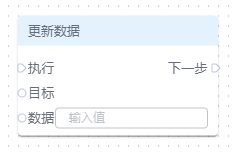
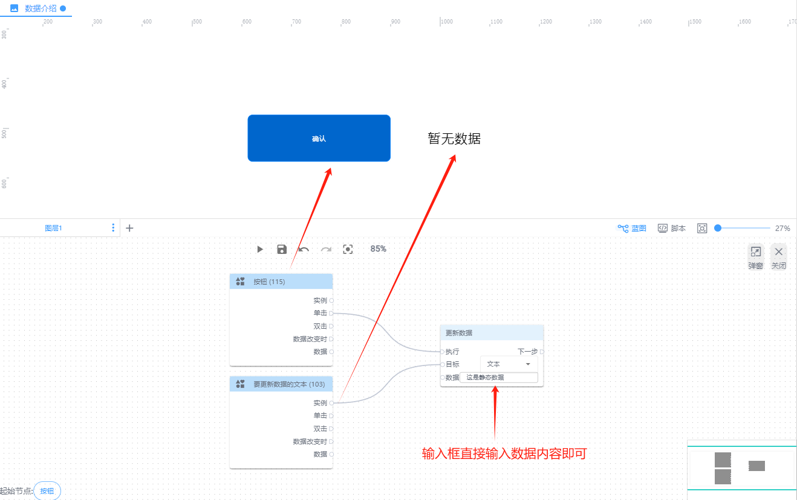
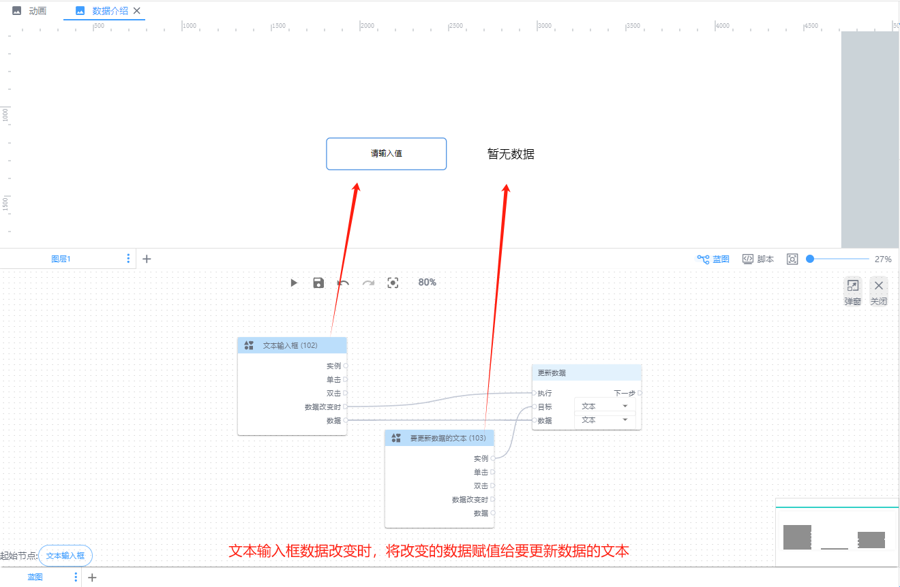
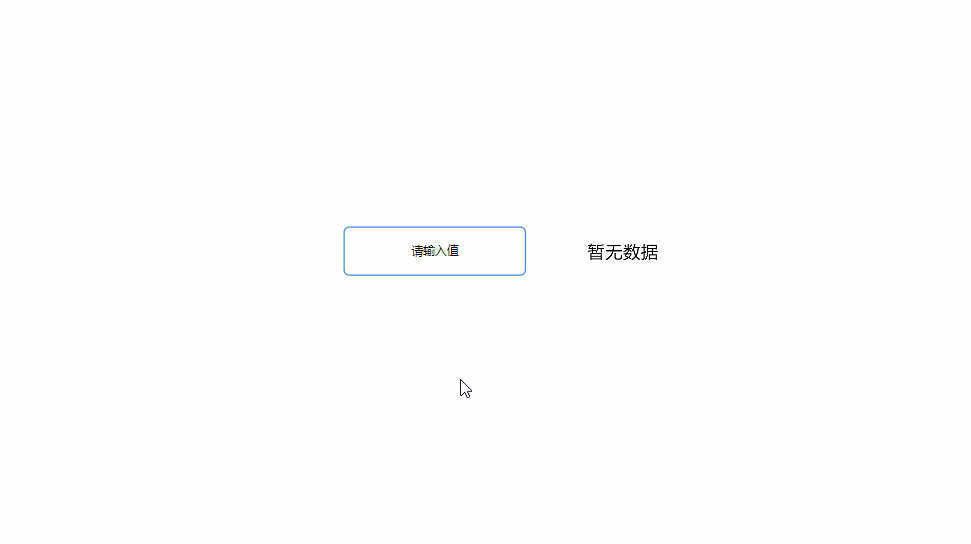
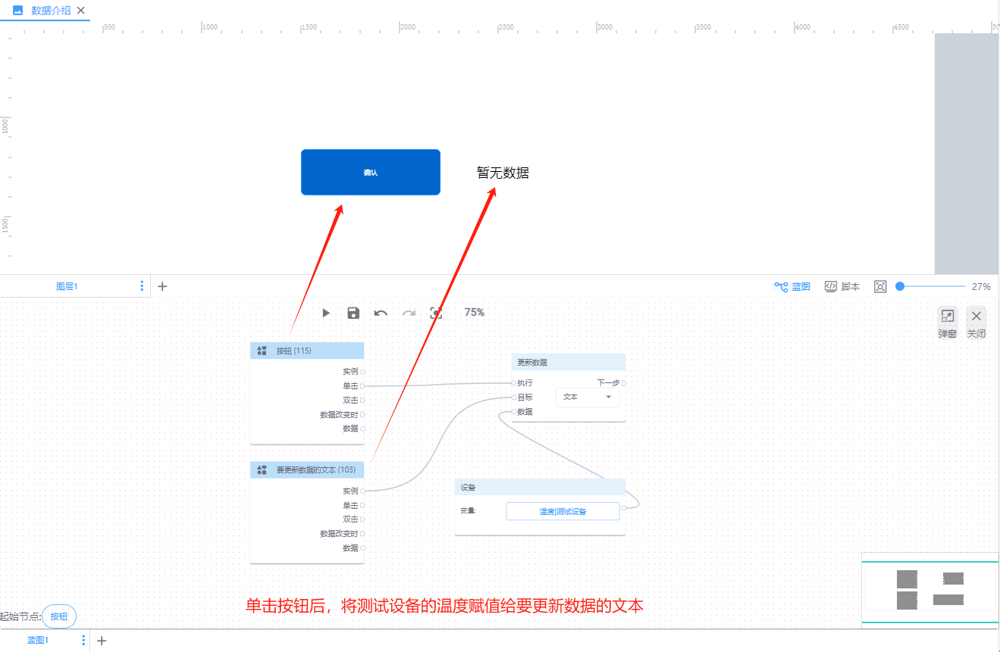
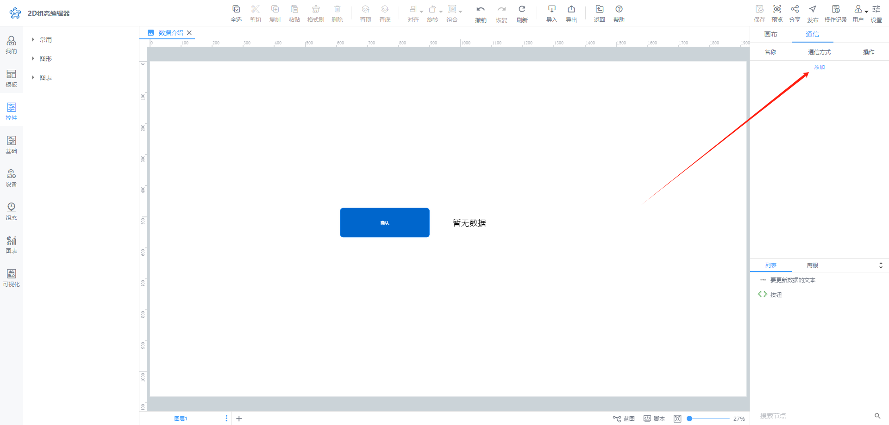
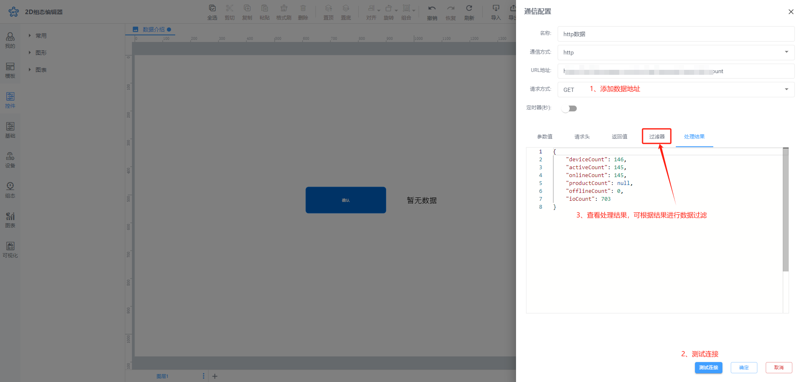
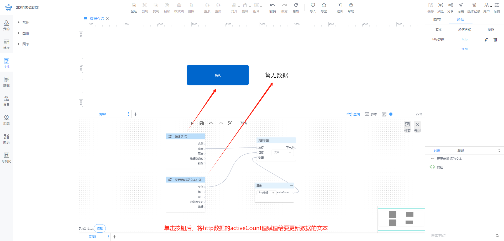
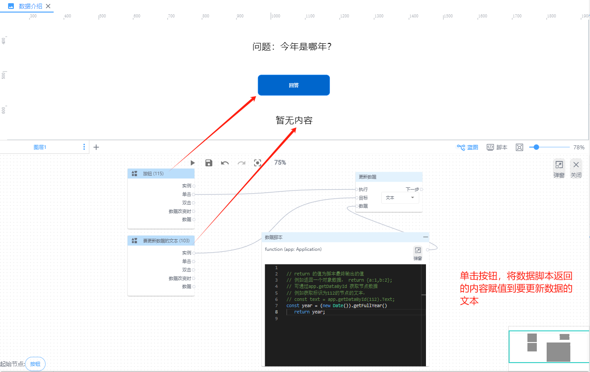

# 更新数据

**执行：**即执行更新数据操作

**下一步：**即停更新数据成功后要执行的动作

**目标：**本次更新数据的对象，目前仅支持更新画布节点的数据

**数据：**即本次更新数据的来源，目前支持五种数据来源，分别是：静态数据、节点列表、设备、通信、数据脚本

**下面举例说明：**

1. 当数据来源时静态数据时

| 蓝图设置 | 交互效果 |
| --- | --- |
|  |  |

2. 当选择数据来源是节点列表时

| 蓝图设置 | 交互效果 |
| --- | --- |
|  |  |

2. 当选择数据来源是设备数据时

| 蓝图设置 | 交互效果 |
| --- | --- |
|  |  |

3. 当数据来源是通信时

首先，创建通信数据连接：

其次，进行数据连接和过滤，保存数据：

最后，进行蓝图配合和效果查看，如下：

| 蓝图设置 | 交互效果 |
| --- | --- |
|  |  |

4. 当数据来源是数据脚本时

| 蓝图设置 | 交互效果 |
| --- | --- |
|  |  |

> 更新: 2024-08-01 11:48:07  
> 原文: <https://www.yuque.com/iot-fast/ksh/pxsi56mz5zam1sof>