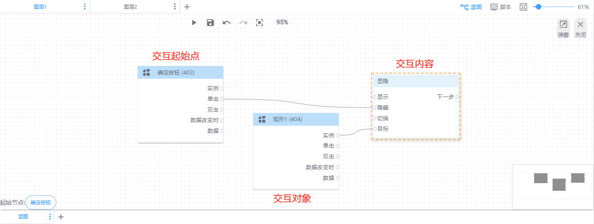
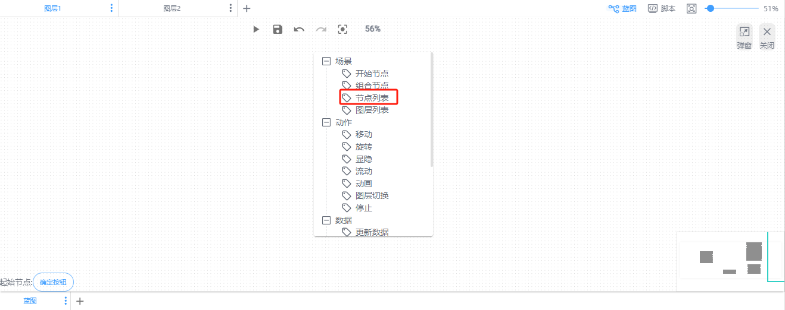
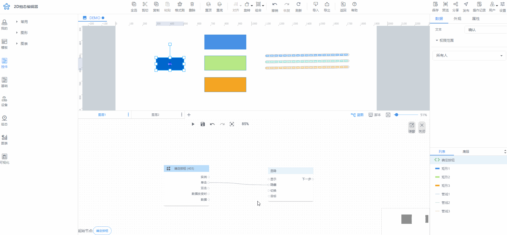
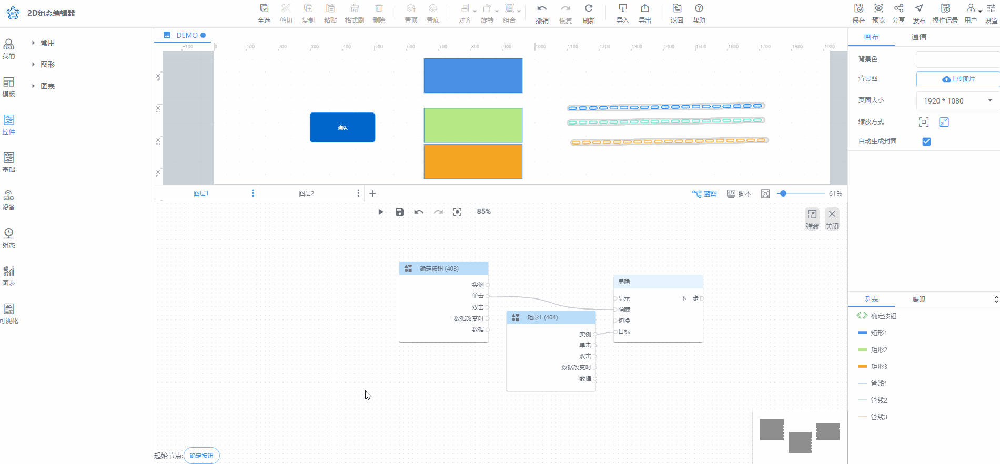

# 节点列表

节点列表显示场景中所有图层的所有资源。用户可通过选择节点列表中的节点作为交互起始点或者是交互对象。

节点列表可通过以下方式出现：

1、右击蓝图空白处出现弹窗，选择节点列表

2、动作节点或数据节点目标拖拽产生的节点列表弹窗

鼠标放在处，按住鼠标左键拖拽，出现线后放开，便出现蓝图节点弹窗

3、双击蓝图的画布节点或组合节点出现节点列表弹窗

> 更新: 2024-07-31 15:54:27  
> 原文: <https://www.yuque.com/iot-fast/ksh/xems81o30ozc0xcq>