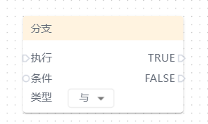
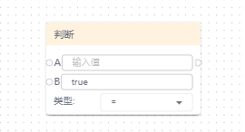
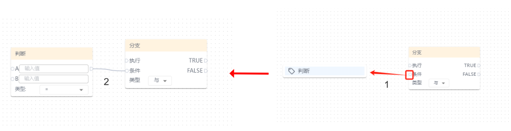
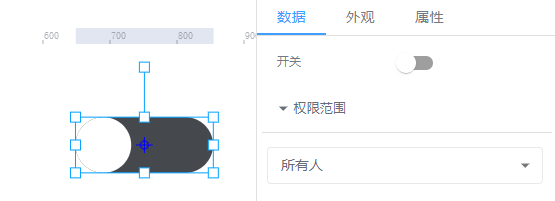
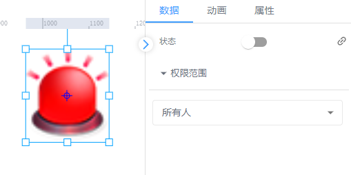
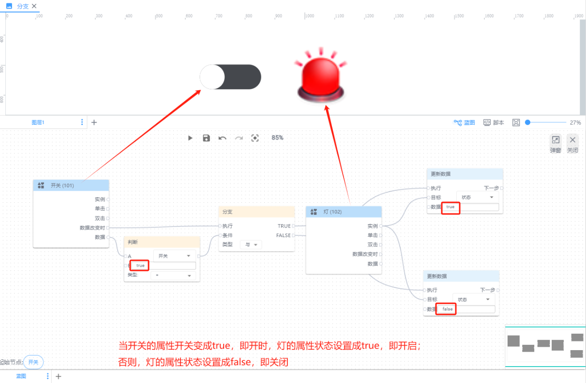

# 分支

**执行：**即执行条件判断操作

**TRUE：**即条件判断为true后要执行的动作

**FALSE：**即条件判断为false后要执行的动作

**类型：**与（默认）、或

+ 与：表示逻辑上的并且关系，用于连接两个或多个条件，表示这些条件需要同时满足
+ 或：表示逻辑上的或关系，表示只要其中一个条件成立即可

**A：**即执行条件判断的数据来源之一，目前支持五种类型，分别是静态数据、节点列表、设备、通信、数据脚本

**B：**即执行条件判断的数据来源之一，目前支持五种类型，分别是静态数据、节点列表、设备、通信、数据脚本

**类型：**即AB数据判断关系，=(默认)、!=、>、>=、<、<=

**📚****说明：**只有存在分支窗口时才会有判断窗口，两者结合用于条件判断，缺一不可。

**举例说明：灯的开关控制**

如下所示，举例的控件开关的开关状态为布尔值；灯的状态也是布尔值

|  |  |
| --- | --- |

| 蓝图设置 | 交互效果 |
| --- | --- |
|  |  |

**📚****说明：**当属性的值类型为布尔时，进行判断或赋值时需填写 true 或 false 才能生效。

> 更新: 2024-08-01 15:25:07  
> 原文: <https://www.yuque.com/iot-fast/ksh/yigos6ralpf7wzkp>