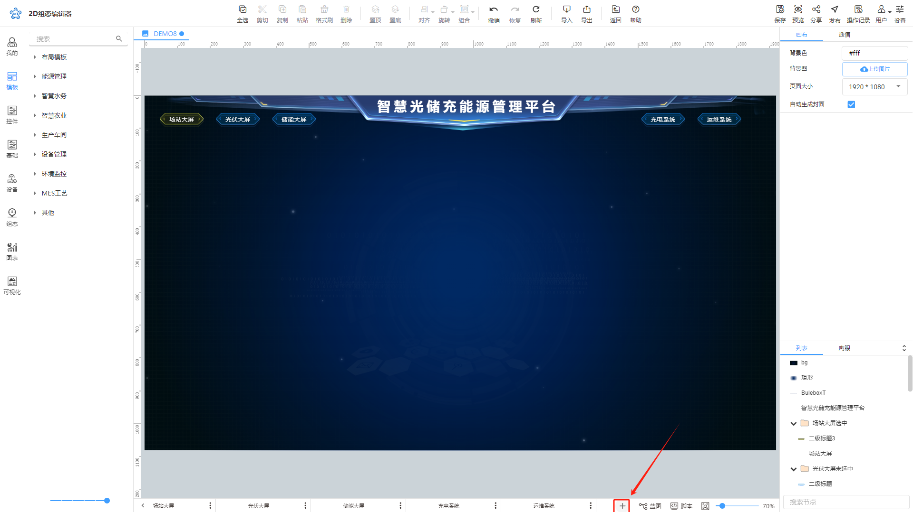
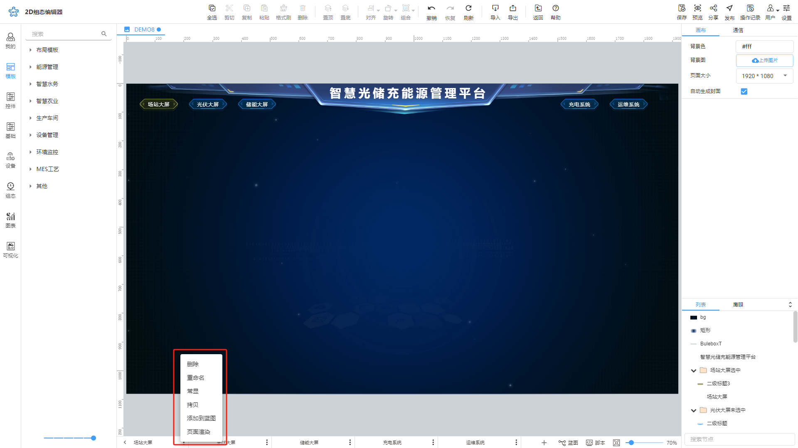

# 图层介绍和使用

"图层"是指在设计和组织大屏布局时，用于管理和控制不同元素叠放顺序和显示状态的层级结构。图层允许用户对大屏中不同元素进行分层管理，以便灵活地控制它们的位置、可见性。

在2D组态编辑器中，从左往右图层层级是递增的，也可以理解为层级高的图层节点会覆盖层级低的图层节点。图层有助于用户根据业务（或主题）去管理大屏元素，便捷地组织较复杂的大屏布局或切换页面。

常见的“图层标签页”划分方法为：“大屏背景”、“多个主题分页”、“公共图层”（存放每个主题中都可以用到的菜单、工具按钮等）等。

## 1.1 新建图层
在画布下方单击➕创建图层，新建的图层将在最右侧展示。

## 1.2 图层设置

1. 重命名
2. 拷贝：即复制，复制出来的图层位于最右侧，层级最高
3. 删除：即删除当前图层
4. 常显：选择要设置为**常显**的图层，即可将当前图层标签页中的元素全部设置为常显状态，此时即使您切换到其他图层标签页，您也是可以看到常显图层的元素的。
5. 添加到蓝图：即将图层添加到蓝图，用于交互设置，例如图层切换。
6. 页面渲染：当前编辑器无法直接设置DOM节点和canvas节点之间的层级关系。因此，通过渲染功能统一管理这些节点，实现页面间节点的正确层级关系。

> 更新: 2024-07-03 15:01:45  
> 原文: <https://www.yuque.com/iot-fast/ksh/apmnz1xaixglf5vm>