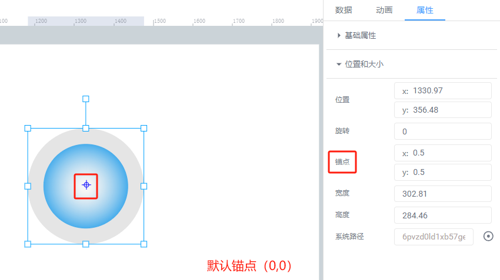
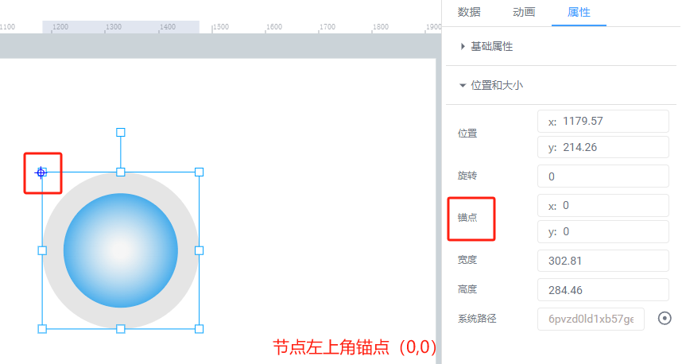
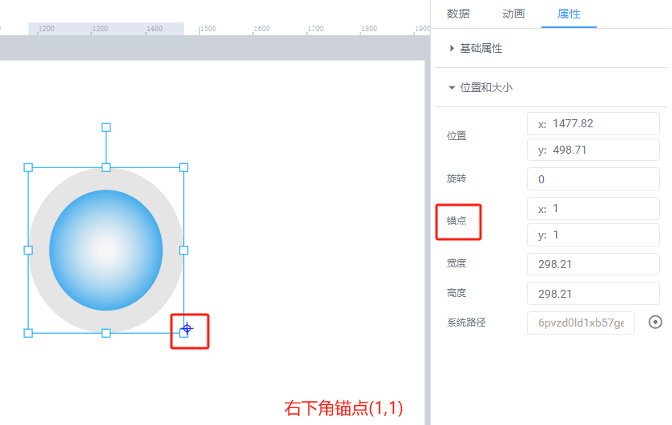
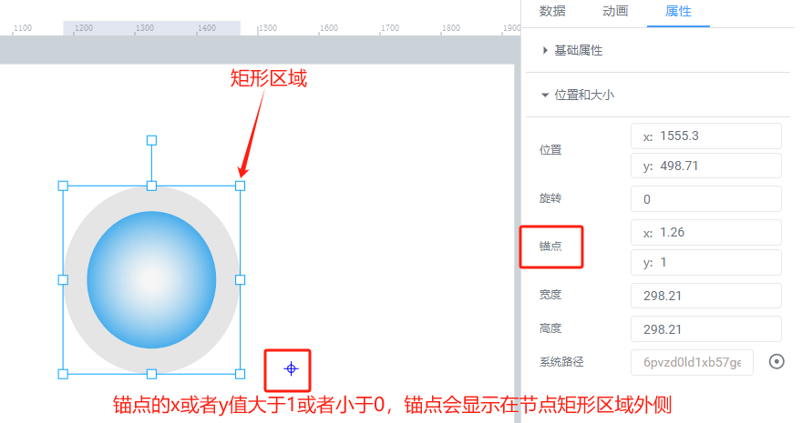
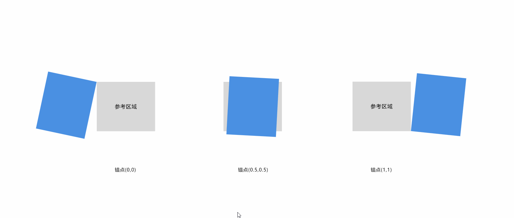
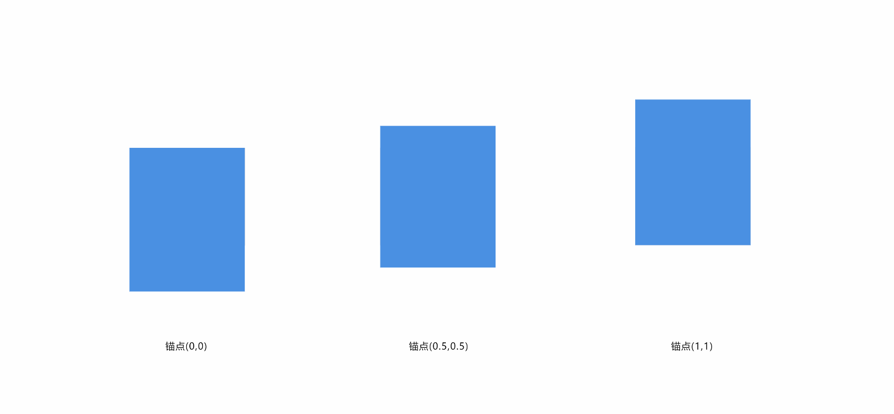

# 锚点介绍和使用

画布中，节点绘制的是一个矩形区域，而锚点是决定了矩形区域中哪个位置是节点的坐标点位置，锚点值是一个百分比数值，{x:0,y:0}是在区域左上角，{x:1,y:1}是在区域右下角，默认是以{x:0.5,y:0.5}为锚点，也就是图元中心点，如果大于1或者小于0则锚点会在节点矩形区域之外。

|  |  |  |  |
| --- | --- | --- | --- |

通过调整锚点位置，即使是同一个节点，它对应的例如旋转、缩放等相同动画也能展现不同的效果。

|  |  |
| --- | --- |

以上案例中可以看出，每行节点的纵坐标是一致的，但是由于锚点的不同导致旋转、宽高变化上的差异。

同时，在系统组态中，锚点经常被应用与诸如机械臂运动，旋转等方面。

> 更新: 2024-08-02 15:03:48  
> 原文: <https://www.yuque.com/iot-fast/ksh/qzvk2aeqggvd6535>