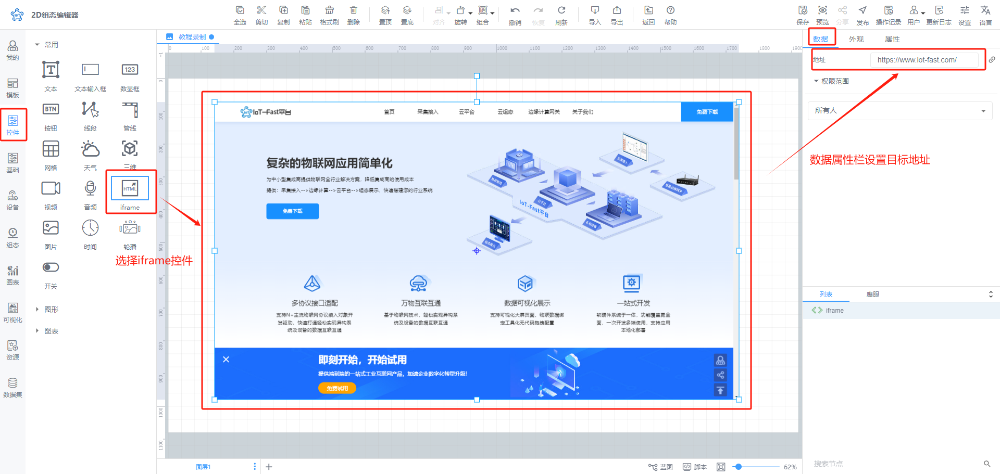
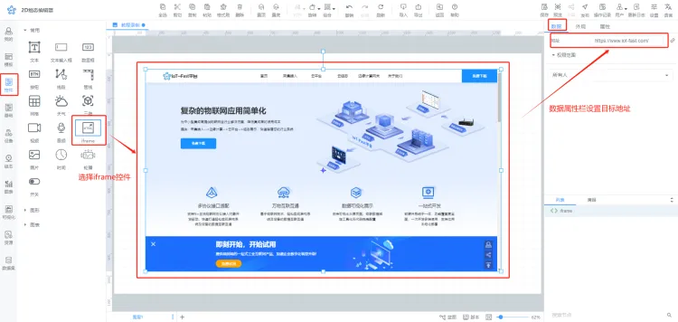
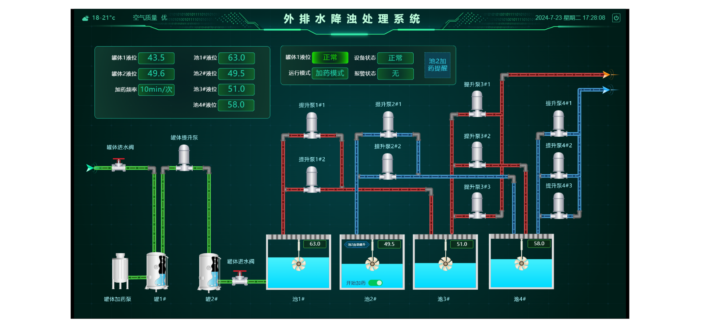
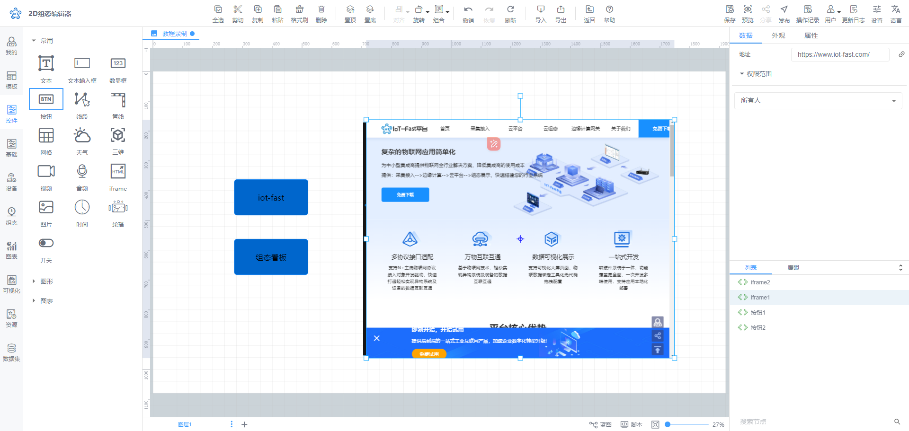
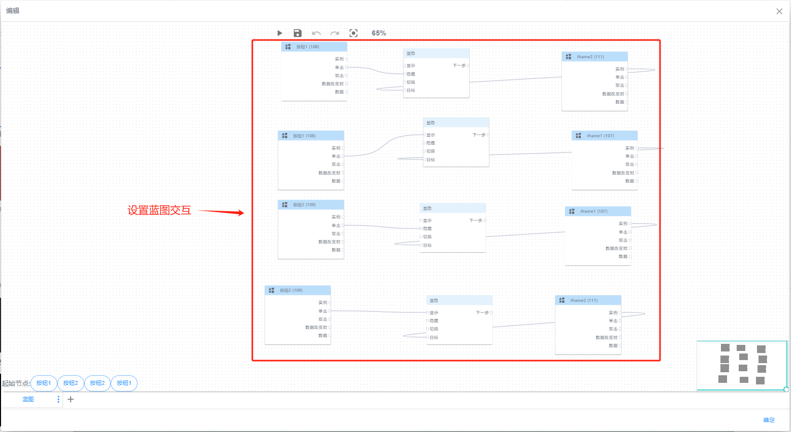
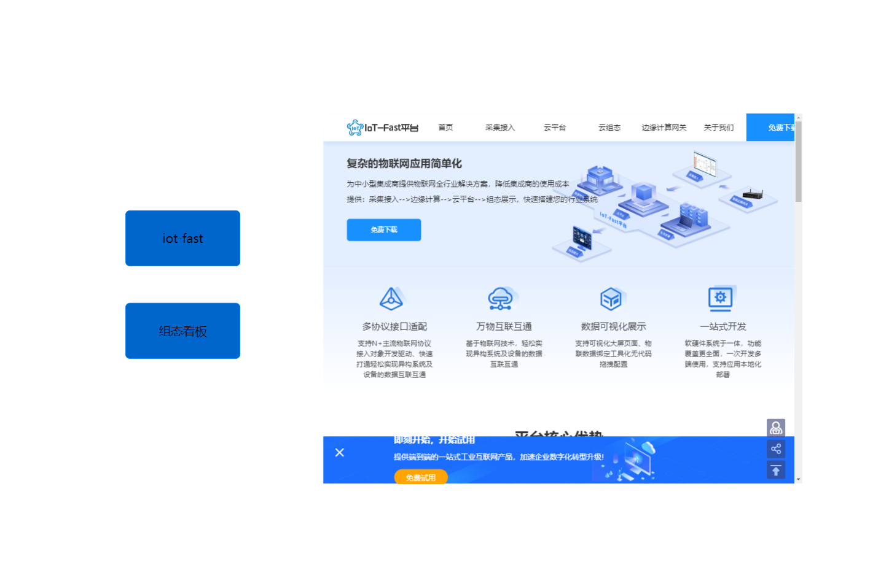

# iframe

iframe控件介绍

## 1.iframe控件是什么
iframe控件适用于实现系统定制化功能的一个重要控件，可以被理解为一个在组态页面内嵌的"小窗口"或"盒子"。当你在浏览组态页面时，可以通过iframe这个控件展示另一个不同的网页内容。一个比较简单的比喻就是：这就像在你家的窗户里看到外面的风景，虽然这个风景和你家的其余部分是不同的，但是他们共享一个空间。

## 2.iframe控件有什么用？
+ 用途1：其最常见的用途之一是在云组态页面中嵌入另一个网页或其他来源的内容，比如插入视频、第三方系统页面等，使用iframe可以让组态页面更加灵活地组合不同的内容，并提供更丰富的用户体验。
+ 用途2：iframe控件还支持一个云组态页面中显示其他云组态页面，而不需要跳转到另一个页面，比如菜单控件配合iframe控件，可以实现在一个页面内查看多个组态详情，而不需要跳转页面

## 3.iframe控件如何使用
### 3.1 单独使用iframe控件
1. 选择iframe控件：在左侧控件栏，选择页面导航选项，选择iframe控件，拖拽控件到组态画布中，可任意调整iframe控件的大小和位置，用于决定展示内容的位置和大小

2.设置目标地址：点击右侧“数据”，输入目标地址，可设置目标页面

3. 设置iframe控件的目标页面，可设置设备组态、以及外部链接

设备组态：可设置当前设备的哪一个组态页面，比如数据报表，或历史报表等页面，可以直接设置组态分享地址；

外部链接：支持设置其他系统的第三方连接，比如视频、天气等。

4. 保存组态页面后，点击预览按钮，可以在组态页面中查看到当前页面显示的页面，无需手动切换页面

### 3.2 结合其他控件一起使用
iframe控件还支持配合其他控件共同使用，实现一个iframe控件在不同的场景或触发条件下展示不同的页面

#### 举例： 按钮控件结合iframe控件实现iframe显示不同内容
步骤1：规划控件：在页面中，拖动两个按钮控件，和两个iframe控件，可根据实际情况调整位置和大小，

步骤2：设置蓝图交互

步骤3：保存组态页面，点击预览按钮，查看结果，可以看到在一个页面中，点击不同按钮，查看不同的展示内容

## 4. 常见问题
问题1：为什么iframe设置外部链接后，在iframe控件里无法正常显示

回答：请按照如下步骤排查原因

1）请检查iframe链接是否正确，能够正常访问

2）请检查iframe链接是否以：http://、HTTPS:// 等开头，否则可能无法正常连接

3）如果目标页面不支持跨域显示，（即外部链接的域名和您的云平台系统的域名不同），比如：您的外部链接无法在其他系统内正常访问，则在iframe控件内也无法展示，请更换链接或

问题2：为什么iframe控件不显示内容，显示404内容

回答：请检查您已设置目标页面否已或外部链接已被删除，如果被删除，请您更换目标页面或外部链接

问题3：为什么iframe控件中，嵌套其他的iframe页面会打不开

回答：iframe控件中，建议不要设置目标页面也包含iframe控件，多层嵌套iframe可能会引起页面崩溃或无响应的情况

  
 

> 更新: 2024-07-23 18:11:13  
> 原文: <https://www.yuque.com/iot-fast/ksh/ydx8fia935xdk4gd>