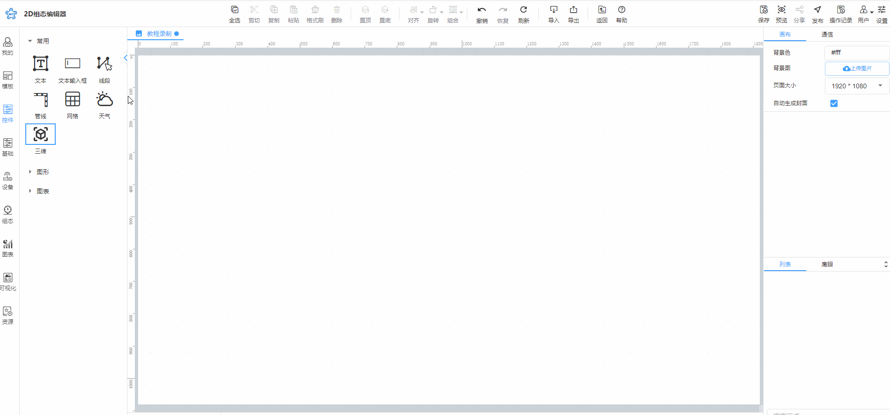
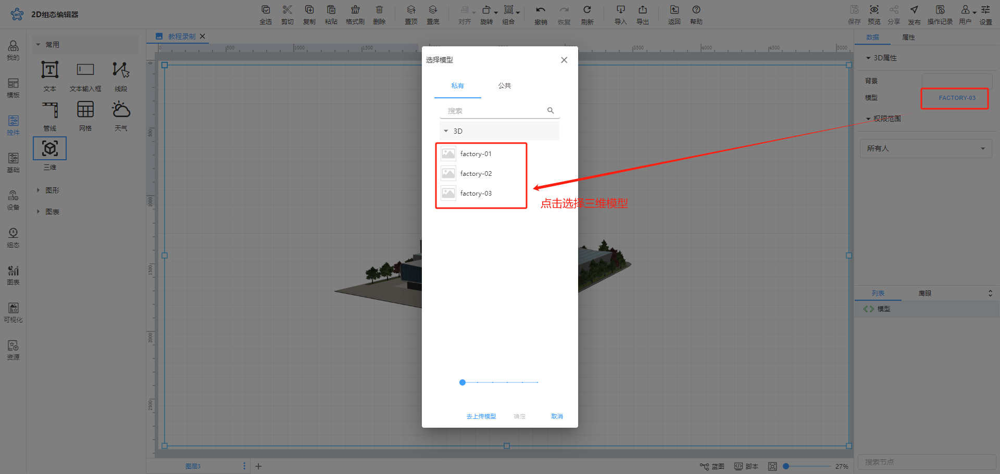
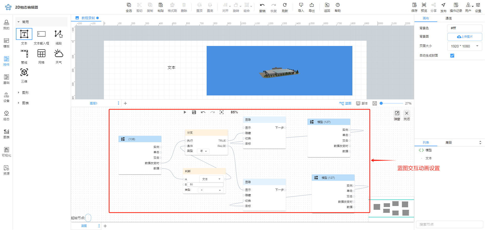
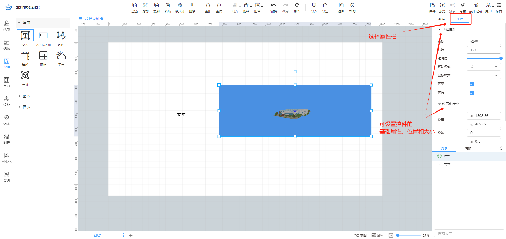
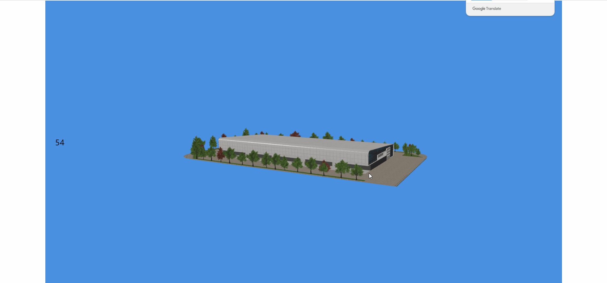

# 三维

# 1、应用场景
三维控件可以建立在平面和二维的基础上，让组态目标更立体化，更形象化，观看者可以对其结构了解更加真实，更准确更全面。例如构建一个工厂的三维场景，可以全方位的查看工厂结构，以及每个工厂设定变量的实时数据。

# 2、控件使用说明
## 2.1 添加三维控件
在左侧控件栏中找到三维控件，点击三维控件，然后在画布中选中的位置按住鼠标左键不放向右拖动，可将控件添加到画布中，如图

添加完成后，点击控件中的“体验三维控件”按钮，可跳转页面进行体验。

## 2.2 选择场景
三维控件需要关联具体场景进行使用，如果您业务方面有三维场景方面的需求，请联系您的商务或售后人员进行咨询，此处提供了3个试用场景，在数据属性栏场景中选择想要绑定的场景，这里我们选择factory场景，如图

## 2.3 设置动画效果
控件动画效果是控件对于一个或多个数据条件的动画响应功能，当指定数据满足设置的指定条件时，控件可进行相应的动画效果。

比如设置三维控件显隐动画，当设置动画效果后，变量达到某个条件，控件可进行显示或隐藏。动画效果的设置如下图

## 2.4权限范围
权限范围的设置可参考<u>权限范围</u>。

## 2.5 样式设置
在为控件做完数据设置后，可以在属性栏中设置控件的外观样式，三维控件可设置控件的基础属性、位置和大小，如图

# 3、效果展示

> 更新: 2024-07-11 10:53:42  
> 原文: <https://www.yuque.com/iot-fast/ksh/kuzanto04x8o17m2>