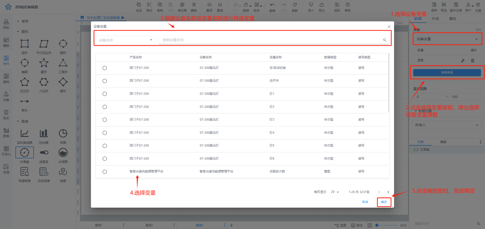
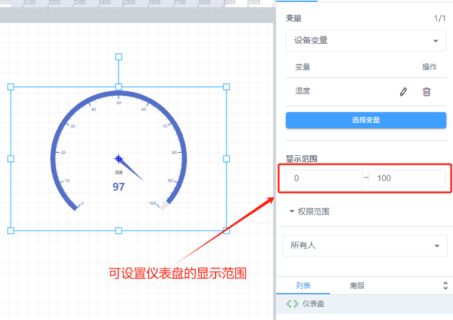
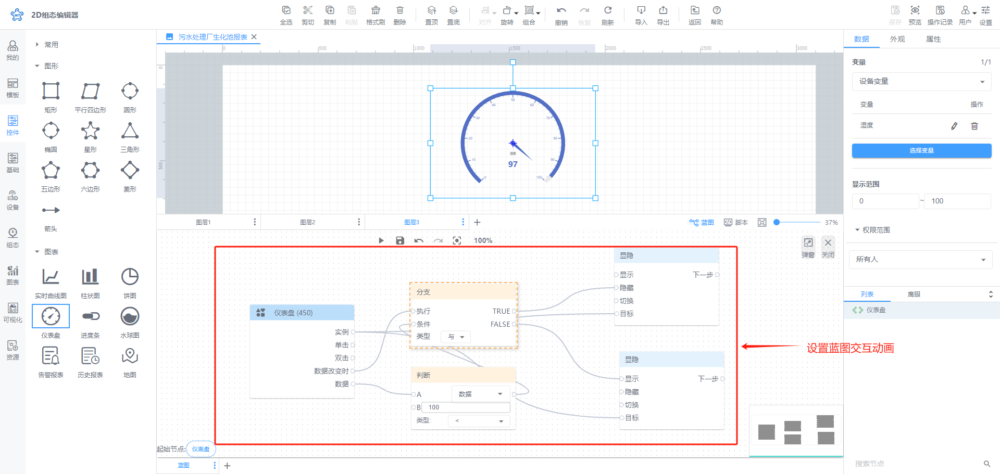
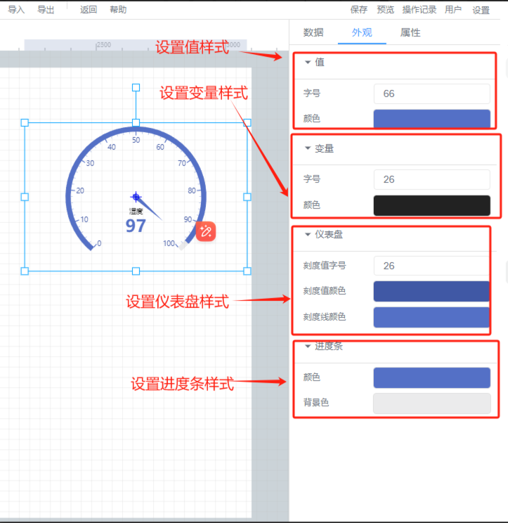
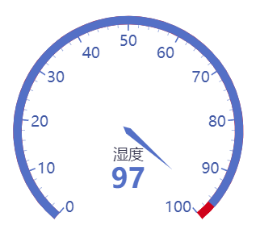

# 仪表盘

# 1、应用场景
仪表盘控件可以直观地表现出某个变量的进度或实际情况，提供最直观的视觉效果，帮助快速的理解数据指标，例如可使用仪表盘查看当前湿度

# 2、操作示例
## 2.1 绑定数据
仪表盘可绑定设备变量，点击【选择】按钮，选择要绑定的变量

**绑定设备变量**

## 2.2 设置显示范围
选择仪表盘的显示范围，可根据绑定变量的实际数值进行设置范围

## 2.3 设置动画效果
控件动画效果是控件对于一个或多个数据条件的动画响应功能，当指定数据满足设置的指定条件时，仪表盘控件可进行显隐，旋转，移动

例如为仪表盘控件设置显隐动画效果，当变量达到判断条件时，仪表盘控件进行隐藏

其他动画使用方法和显隐类似

## 2.4 样式设置
在为控件做完数据设置之后，为了适应组态画面，以达到展示的美观性，可为控件进行一些样式设置，可在外观属性栏中选择仪表盘的样式，设置仪表盘值、变量、表盘、进度条等颜色以及仪表盘透明度，刻度和变量的文字样式大小等

## 2.5 效果展示

> 更新: 2024-07-12 10:13:47  
> 原文: <https://www.yuque.com/iot-fast/ksh/gg4g0kc0dhk9u0ir>