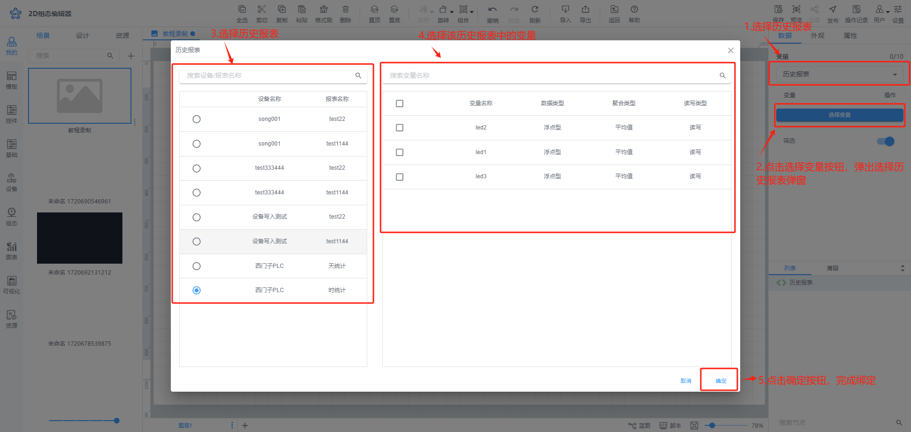
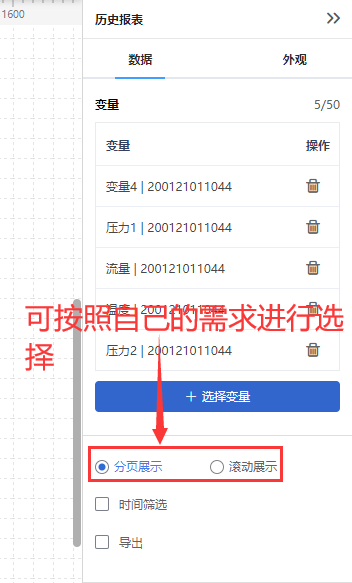
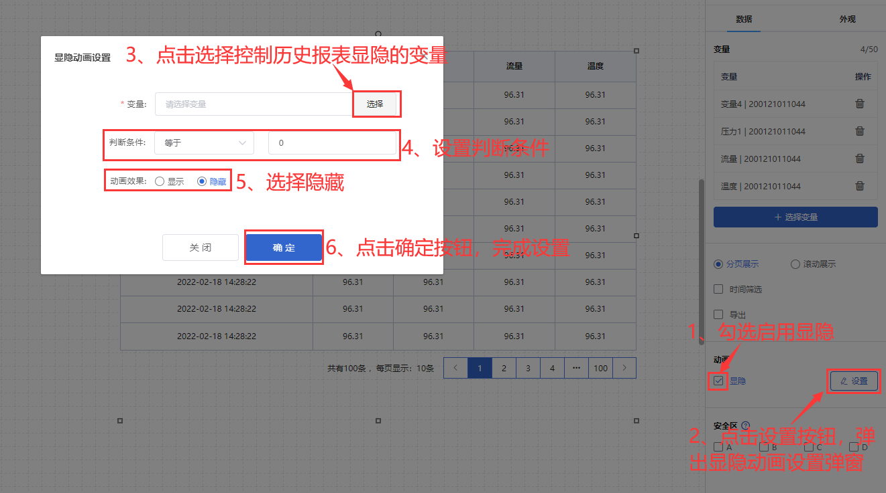
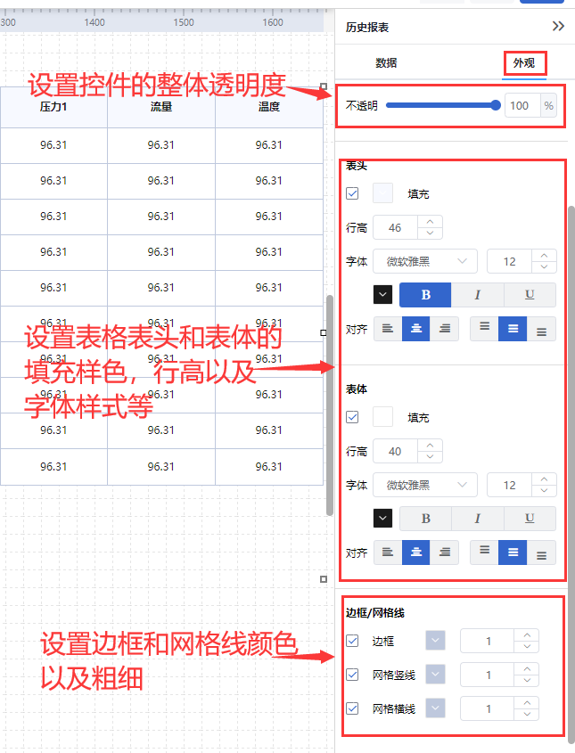
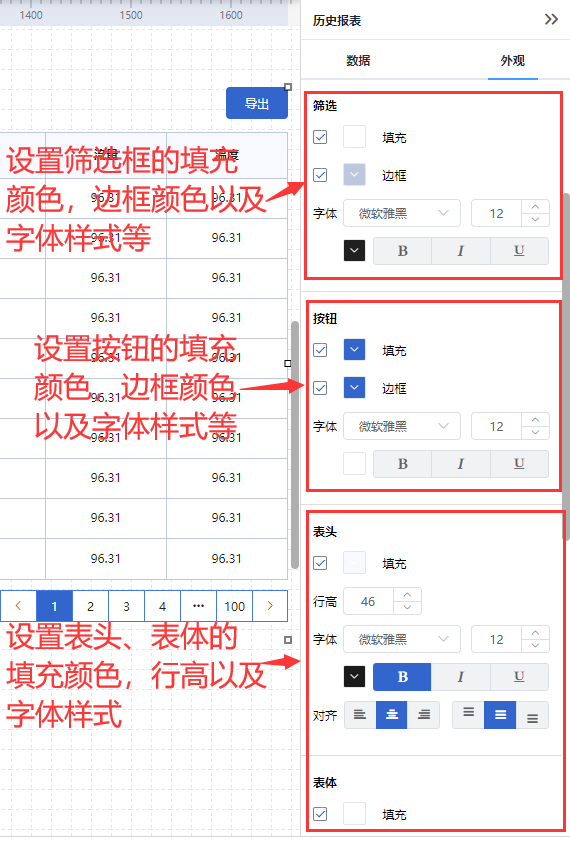
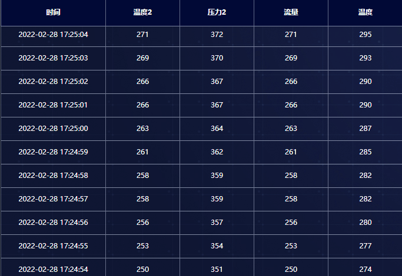

# 历史报表操作指南

# 1、应用场景
历史报表用于展示所选的历史报表的所有历史数据

# 2、操作示例
## 2.1绑定变量
历史报表控件可绑定历史报表，历史报表控件只能绑定一个历史报表，点击选择变量按钮，可进行绑定变量，控件可绑定一个历史报表中的变量数，最多可绑定10个变量

**绑定历史报表**

## 2.2选择展示方式
绑定变量后可根据自己需求来选择控件的展示方式，分页展示或滚动展示，

分页展示：可选择是否进行时间筛选和导出数据操作，勾选时间筛选后在展示页面可以选择自己想要查看的时间内的数据，勾选导出后可在展示时，对查看到的数据进行导出操作

滚动展示：需要设置想要展示数据的时间范围以及滚动速度，选择时间范围后，展示时只可以看到该时间范围内的数据，设置滚动速度后展示的数据会按照选择的速度大小进行滚动

## 2.3设置动画效果
控件动画效果是控件对于一个或多个数据条件的动画响应功能，当指定数据满足设置的指定条件时，历史报表控件可进行显隐

例如为历史报表控件设置显隐动画效果，当变量达到判断条件时，历史报表控件进行隐藏

## 2.4样式设置
在为控件做完数据设置之后，为了适应组态画面，以达到展示的美观性，可为控件进行一些样式设置，

当选择滚动展示时，在样式设置时可设置报表的整体透明度，表头、表体的填充颜色，行高和字体的对齐样式，以及边框和网格线是否显示以及线的颜色和宽度

当选择分页设置并且勾选了时间筛选和导出时，在样式设置时不仅可以设置以上样式，还可以设置筛选框、按钮的边框颜色，填充颜色和字体，以及分页的填充、边框颜色和分页选中时的样式

以下分别为滚动展示和分页展示勾选时间筛选和导出时样式设置

## 2.5效果展示

> 更新: 2024-08-19 18:09:56  
> 原文: <https://www.yuque.com/iot-fast/ksh/qmcgysa8m8vshqri>