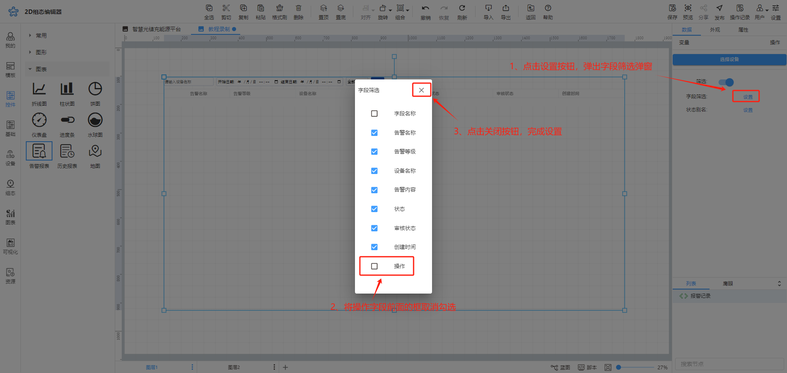

# 告警报表

# 1、应用场景
告警报表用于展示绑定设备的报警详情记录

# 2、操作示例
## 2.1绑定变量
告警报表控件绑定设备数不限

## 2.2选择展示方式
绑定设备后可根据自己需求来选择控件的展示方式，分页展示或滚动展示，

分页展示：可选择是否进行筛选操作，勾选筛选后在展示页面可以选择自己想要查看的时间内的数据

滚动展示：需要设置想要展示数据的时间范围以及滚动速度，选择时间范围后，展示时只可以看到该时间范围内的数据，设置滚动速度后展示的数据会按照选择的速度快慢进行滚动

## 2.3报表字段筛选
可对告警报表中显示的字段进行筛选，选择是否展示该字段，比如在展示时不希望别人对报警记录进行操作，可将操作字段进行隐藏

## 2.4设置动画效果
控件动画效果是控件对于一个或多个数据条件的动画响应功能，当指定数据满足设置的指定条件时，告警报表控件可进行显隐

例如为告警报表控件设置显隐动画效果，当变量达到判断条件时，告警报表控件进行隐藏

## 2.5样式设置
在为控件做完数据设置之后，为了适应组态画面，以达到展示的美观性，可为控件进行一些样式设置，

在样式设置时可设置报表的整体透明度，表头、表体的填充颜色，行高和字体的对齐样式，以及边框和网格线是否显示以及线的颜色和宽度，还可以设置分页的文字、边框颜色和分页选中时的样式

## 2.6效果展示
  

> 更新: 2024-07-11 18:03:49  
> 原文: <https://www.yuque.com/iot-fast/ksh/gq5gnu7ncqverpgh>