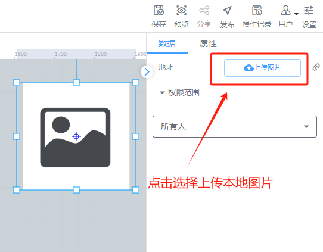

# 图片

# 1、应用场景
图片控件可以用来将本地现场图片或者绘制图片插入组态中，使组态更美观贴切，例如可以使用本地现场图片和其他控件结合模拟现场工作情况

# 2、操作示例
## 2.1 绑定图片
在组态中拉入图片控件后，在数据属性栏中选择在本地选择图片

## 2.2 设置单击事件
为图片控件设置点击事件，可以在点击图片时进行写入数据或者跳转到其他功能页面，最常用的是，点击图片跳转到其他组态功能页面，可实现组态页面之间的互通

## 2.3 设置动画效果
控件动画效果是控件对于一个或多个数据条件的动画响应功能，当指定数据满足设置的指定条件时，图片控件进行显隐，旋转，移动等动画效果

例如为图片控件设置显隐动画效果，当变量达到判断条件时，图片控件进行隐藏

其他动画使用方法和显隐类似

## 2.4 样式设置
在为控件做完数据设置之后，为了适应组态画面，以达到展示的美观性，可为控件进行一些样式设置，可设置图片的透明度

> 更新: 2024-07-24 17:18:54  
> 原文: <https://www.yuque.com/iot-fast/ksh/oki7s6iq2a9kepyh>