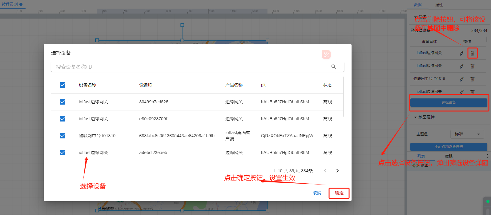
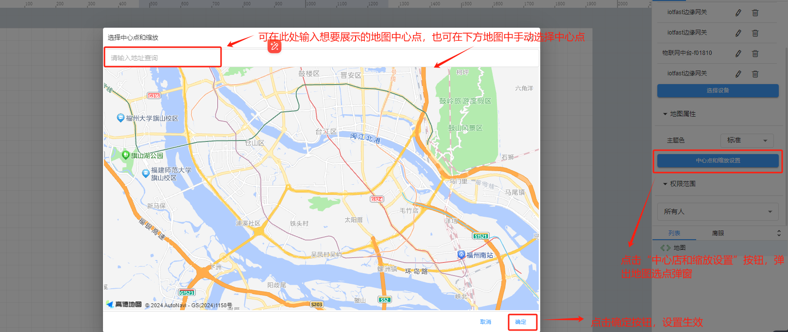
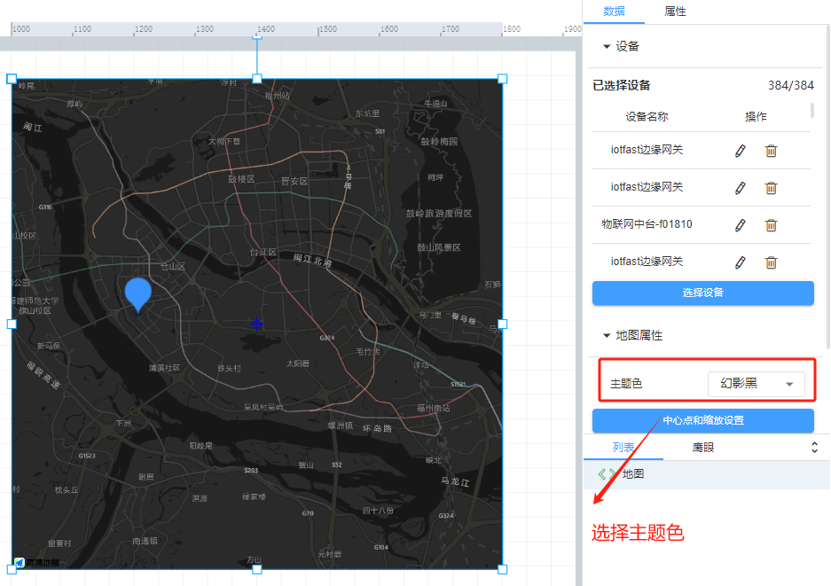
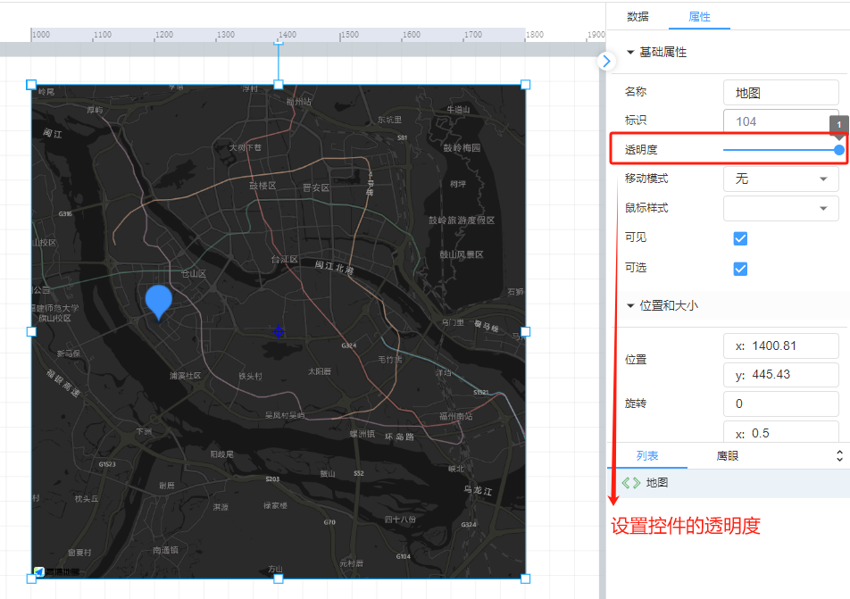
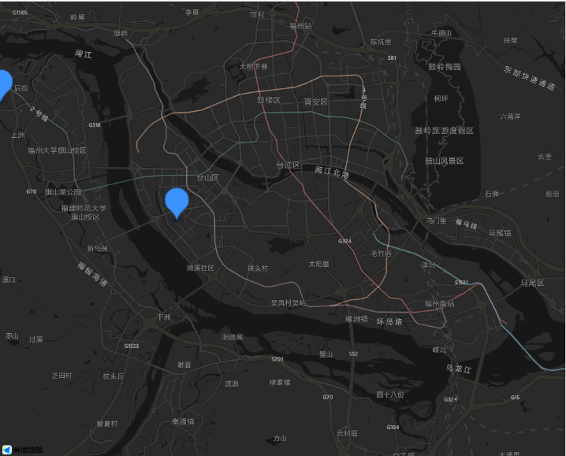

# 地图

# 1、应用场景
地图控件可显示出多个设备的具体位置，方便查看设备分布

# 2、操作示例
## 2.1选择设备
地图控件默认选中项目中绑定的全部设备，点击选择设备按钮可进行选择绑定其他设备，点击绑定设备后面的删除按钮可将当前设备从地图中删除，如果地图中没有显示设备请去物联网中台/设备管理中检查该设备是否在地图中添加位置信息

## 2.2地图设置
地图设置中可设置地图中心点和缩放，设置的中心点为地图控件中显示的中心点

## 2.3样式设置
在为控件做完数据设置之后，为了适应组态画面，以达到展示的美观性，可为控件进行一些样式设置，对地图控件可进行选择主题色以及透明度等设置

## 2.4效果展示

> 更新: 2024-07-03 17:13:39  
> 原文: <https://www.yuque.com/iot-fast/ksh/htcmrz87a0ng7khv>