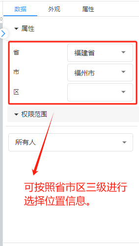
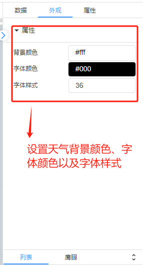

# 天气

# 1、应用场景
天气控件为展示天气的控件，可直接显示出所选位置的天气，可以更方便的进行查看设备所处地区的天气，以更好的管理设备。

# 2、操作示例
## 2.1 选择地址
在数据属性栏中选择想要展示天气的地址，按照省，市，区县进行三级选择

## 
## 2.2 样式设置
在为控件做完数据设置之后，为了适应组态画面，以达到展示的美观性，可为控件进行一些样式设置，对控件进行选进行背景颜色填充、字体颜色设置、字体样式设置等

## 2.3效果展示

> 更新: 2024-07-03 16:38:51  
> 原文: <https://www.yuque.com/iot-fast/ksh/qiax8ydnddatv7go>