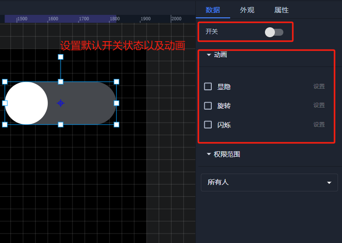
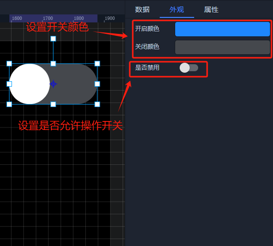

# 开关

# 1、应用场景
开关控件是 2D 组态界面中常用的元素之一，用于控制设备或系统的开启和关闭状态；外观是以一个矩形与圆形相结合的按钮形式呈现，有两种状态：开启（ON）和关闭（OFF）；开启状态用蓝色图标表示，关闭状态用暗色图标表示。

# 2、操作示例
## 2.1 设置开关状态
为开关控件设置默认开关状态以及是否允许操作开关

设置完成后，在前台点击该按钮控件，即可切换其状态。例如，从关闭状态切换到开启状态，或从开启状态切换到关闭状态。在触摸屏设备上，使用手指轻点开关控件同样可以实现状态切换。

## 2.2 样式设置
在为控件做完数据设置之后，为了适应组态画面，以达到展示的美观性，可为控件进行一些样式设置，可设置开关颜色的样式效果，也可以设置是否允许操作开关。

## 2.3 效果展示

> 更新: 2024-08-13 11:01:54  
> 原文: <https://www.yuque.com/iot-fast/ksh/pxpuslnzr5ggvxo4>