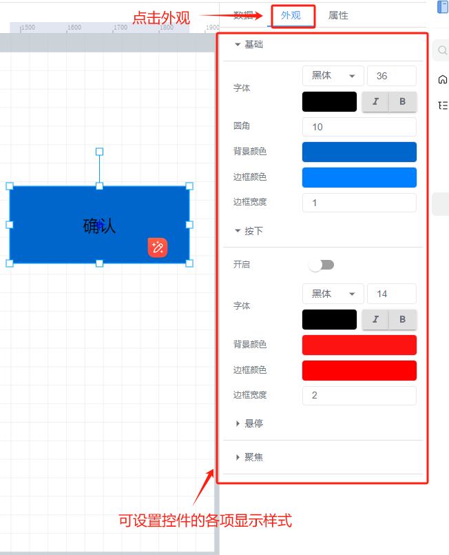

# 按钮

# 1、应用场景
按钮控件为可点击进行操作的控件，可点击按钮进行控制写入变量或跳转其他页面，例如点击按钮控制写入湿度数值，进行远程控制大棚湿度变化

# 2、操作示例
## 2.1 设置点击事件
为按钮控件设置单击事件，可以在点击按钮时进行写入数据或者跳转到其他功能页面，最常用的可以是，点击按钮跳转到其他组态功能页面，可实现组态页面之间的互通

设置完成后，在前台点击该按钮控件，可跳转到选择的组态页面中

## 2.2 设置动画效果
控件动画效果是控件对于一个或多个数据条件的动画响应功能，当指定数据满足设置的指定条件时，按钮控件进行显隐，旋转，移动

例如为按钮控件设置显隐动画效果，当变量达到判断条件时，按钮控件进行隐藏

其他动画使用方法和显隐类似

## 2.3 样式设置
在为控件做完数据设置之后，为了适应组态画面，以达到展示的美观性，可为控件进行一些样式设置，可设置按钮按下、悬停、聚焦的样式效果，也可以更改按钮控件上的文本，设置文本的字体大小样式等

## 2.4 效果展示

> 更新: 2024-07-12 11:33:17  
> 原文: <https://www.yuque.com/iot-fast/ksh/qwyvbegvazxoxhhq>