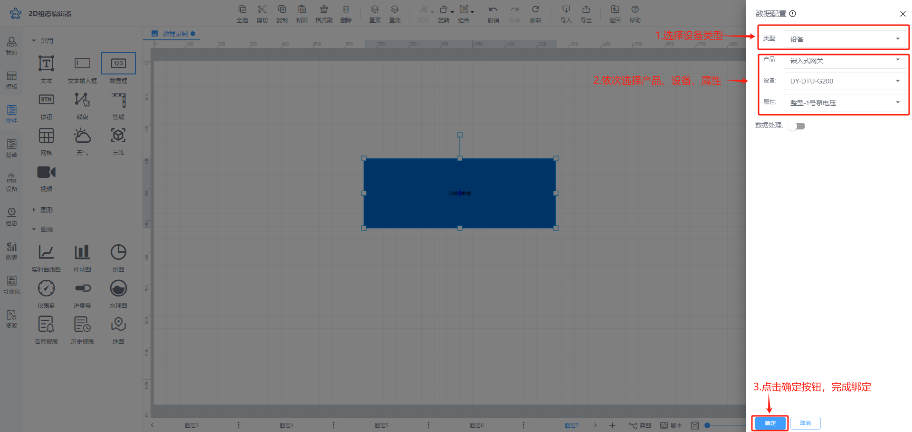
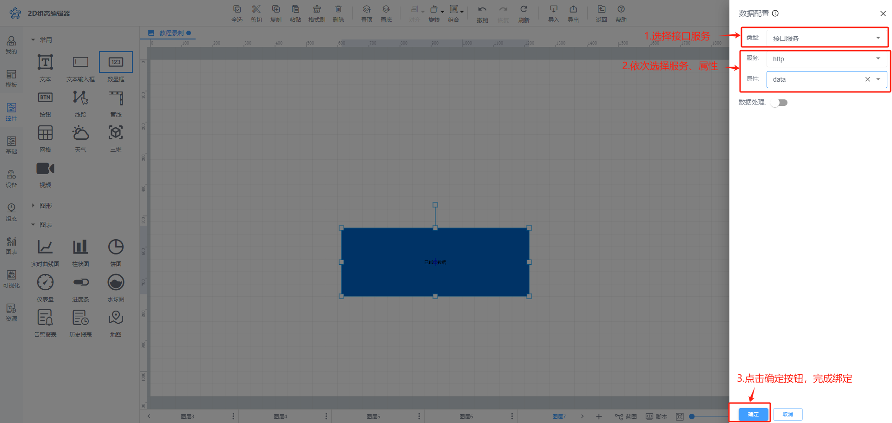
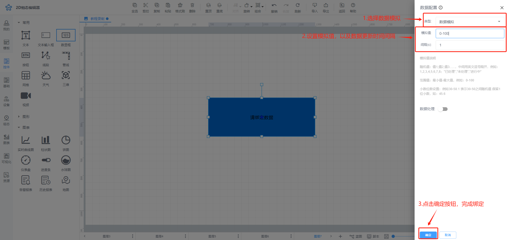
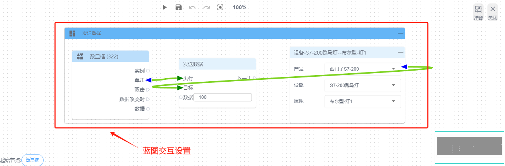
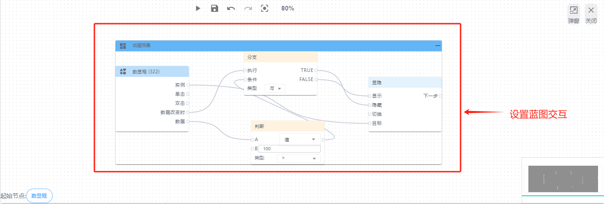
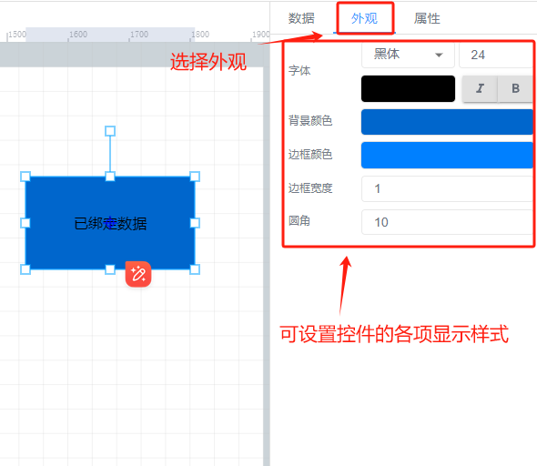
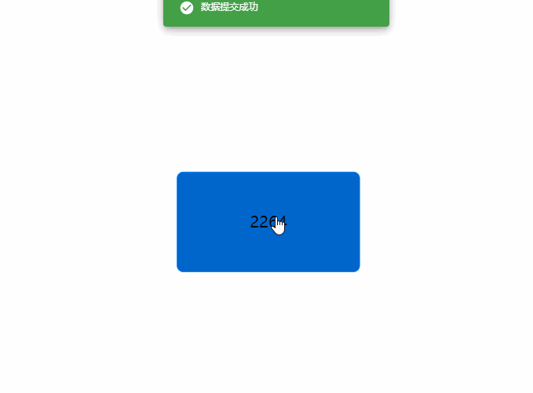

# 数显框

# 1、应用场景
数显框控件为直观的展示数值的控件，可直接显示所绑定变量的数值并且可以远程控制变量数值写入，例如某设备的实时温度、设备总数、离线设备数等。

# 2、操作示例
## 2.1 绑定数据
在数据属性栏中选择绑定设备变量，点击【选择】按钮，选择要绑定的变量，或可双击数显框控件，弹出绑定变量弹窗进行绑定变量

绑定设备变量

绑定接口服务

绑定数据模拟

## 2.2 设置单击事件
为数显框控件设置单击事件，可以使数显框控件既可以看到变量数值，也可以进行点击远程控制变量数值写入或者跳转其他功能页面，其中最为常见的点击数显框可以远程控制写入数据，如图

设置完成后，在前台查看时，该数显框既可以显示数值，也可以点击为变量写入数据

## 2.3 设置动画效果
控件动画效果是控件对于一个或多个数据条件的动画响应功能，当指定数据满足设置的指定条件时，数显框控件进行显隐，旋转，移动

例如为数显框控件设置显隐动画效果，当变量达到判断条件时，数显框控件进行隐藏

其他动画使用方法和显隐类似

## 2.4 样式设置
在为控件做完数据设置之后，为了适应组态画面，以达到展示的美观性，可为控件进行一些样式设置，对控件进行颜色填充、边框设置、透明度设置、圆角设置以及数显框中显示的文字字体大小等样式

## 2.5 效果展示

> 更新: 2024-08-13 18:05:19  
> 原文: <https://www.yuque.com/iot-fast/ksh/ztzirbocfvsgqxfx>