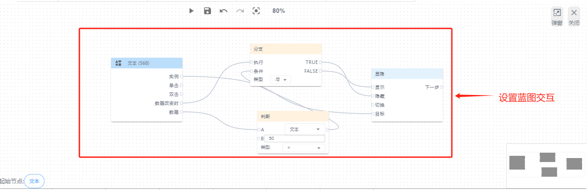
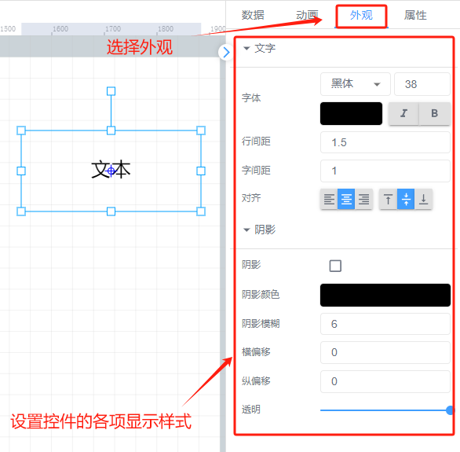

# 文本

# 1、应用场景
文本控件用来表达和展示所指定的内容，在页面画布上双击元件便可以直接输入文本，例如可在使用该控件写入组态标题，写入一些注意事项等

# 2、操作示例
## 2.1 输入文本
双击文本控件，可在文本控件中直接输入文字内容，或者在右侧数据属性栏中，文本框中进行输入，文本最多可输入100个字符

## 2.2 设置点击事件
为文本控件设置点击事件，可以在点击文本时进行写入数据或者跳转到其他功能页面，最常用的可以是，点击文本跳转到其他组态功能页面，可实现组态页面之间的互通

## 2.3 设置动画效果
控件动画效果是控件对于一个或多个数据条件的动画响应功能，当指定数据满足设置的指定条件时，文本控件进行显隐，旋转，闪烁，坐标，宽高，进度

例如为文字控件设置显隐动画效果，当变量达到判断条件时，文字控件进行隐藏

其他动画使用方法和显隐类似

## 2.4 样式设置
在为控件做完数据设置之后，为了适应组态画面，以达到展示的美观性，可为控件进行一些样式设置，对控件进行阴影设置、透明度设置以及文字中显示的文字字体大小等样式

> 更新: 2024-07-24 10:20:25  
> 原文: <https://www.yuque.com/iot-fast/ksh/ag9i1rqt3phm2hgz>