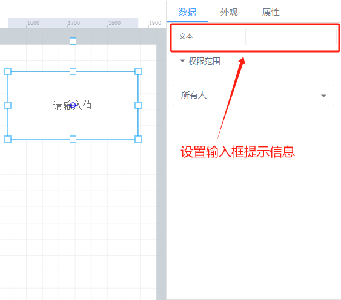
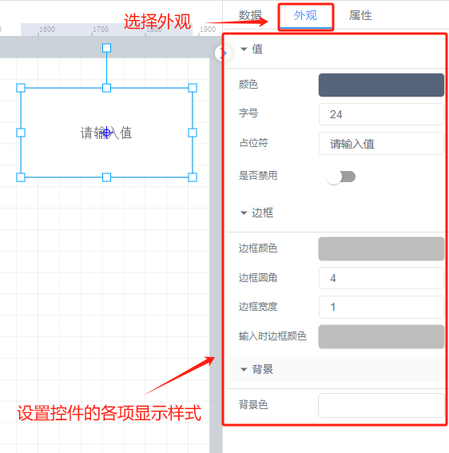

# 文本输入框

# 1、应用场景
文本输入框控件主要用于接收用户的动态输入和交互操作，以实现个性化的配置和数据处理。例如，在一个智能仓储的 2D 组态中，“货架区 A”这样的文字是静态的文本，用于标识区域；而“货物数量”后面跟着的可输入框，则用于工作人员实时输入当前的货物数量。

说明：文本主要用于提供固定的信息说明，而文本输入框则侧重于与用户进行动态的交互，接收用户输入以实现个性化的配置和数据处理。

# 2、操作示例
## 2.1 输入提示信息
选择文本输入框，在右侧数据属性栏中，文本框中进行输入提示信息或设定初始值，当输入信息为空时，提示信息默认为“请输入值”

## 2.2 样式设置
在为控件做完数据设置之后，为了适应组态画面，以达到展示的美观性，可为控件进行一些样式设置，对控件进行阴影设置、透明度设置以及文字中显示的文字字体大小等样式

> 更新: 2024-07-24 10:55:00  
> 原文: <https://www.yuque.com/iot-fast/ksh/ehoapd42lvqtr8r4>