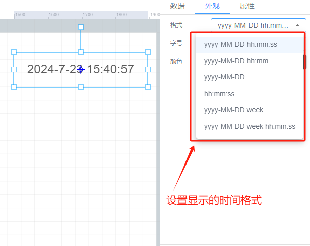
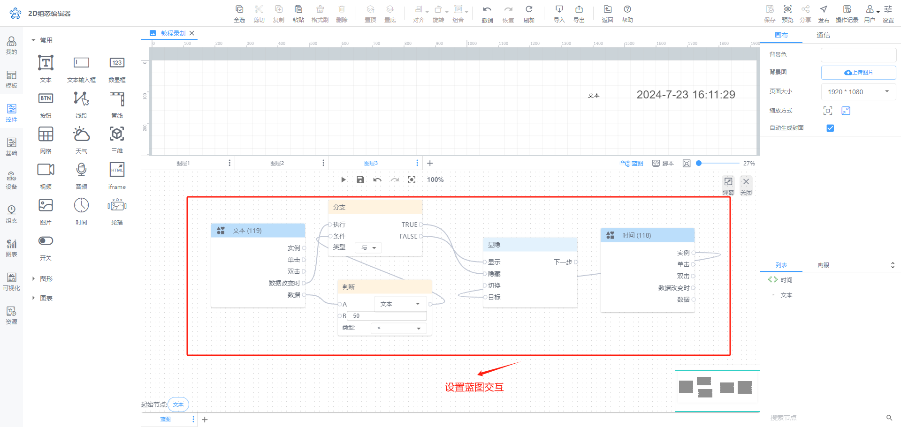
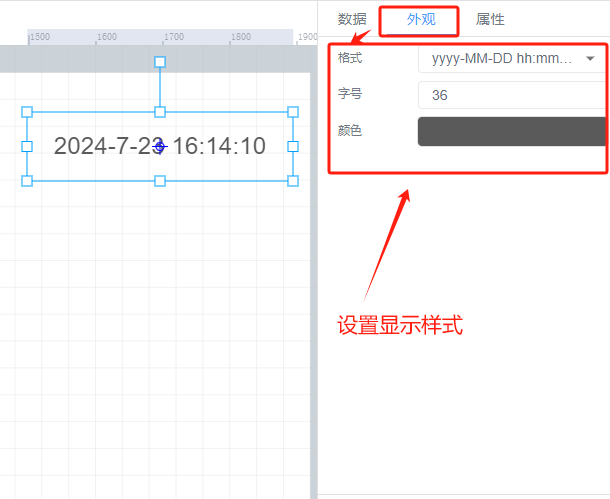

# 时间

# 1、应用场景
时间控件可显示出当前的系统时间或者设备运转过程中发生特定事件的时间。

# 2、操作示例
## 2.1 选择当前时间
时间控件默认显示当前时间，设置显示的时间格式，例如YYYY-MM-DD可表示年-月-日

## 2.2 设置动画效果
控件动画效果是控件对于一个或多个数据条件的动画响应功能，当指定数据满足设置的指定条件时，时间控件进行显隐，旋转，移动等变化，例如为时间控件设置显隐动画效果，当变量达到判断条件时，时间控件进行隐藏

其他动画使用方法和显隐类似

## 2.3 样式设置
在为控件做完数据设置之后，为了适应组态画面，以达到展示的美观性，可为控件进行一些样式设置，对时间控件进行字号大小、字体颜色、透明度设置等样式

> 更新: 2024-07-23 16:16:10  
> 原文: <https://www.yuque.com/iot-fast/ksh/mi669d64xhieecz1>