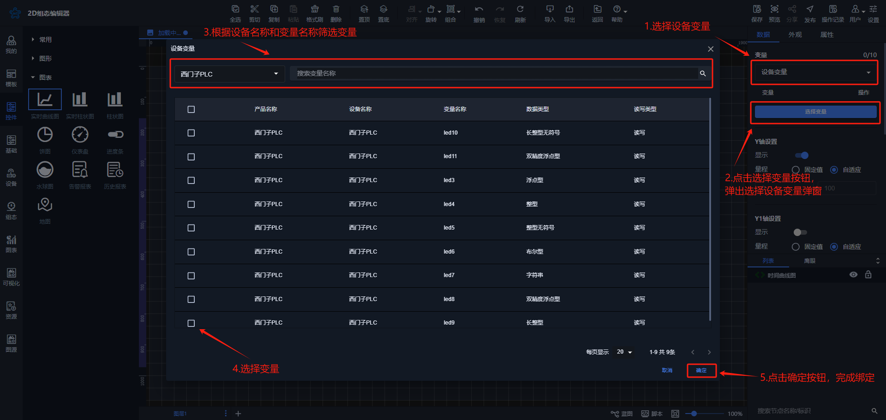
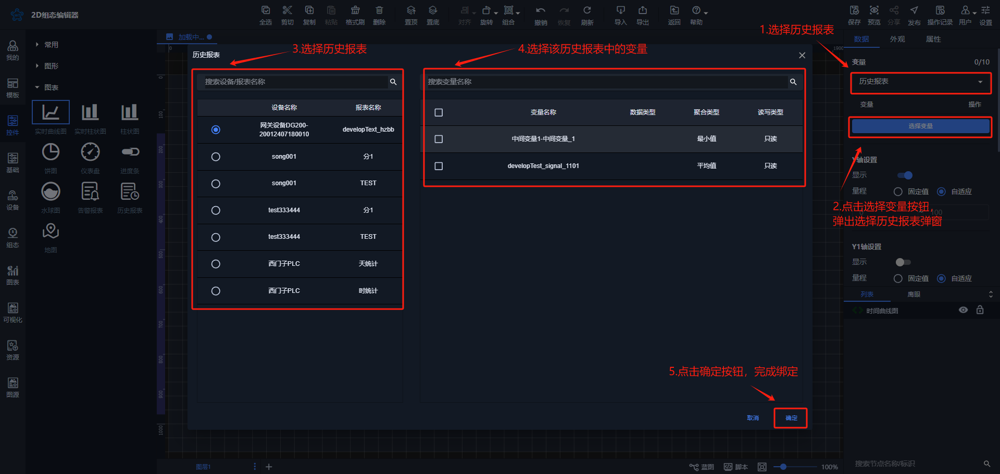
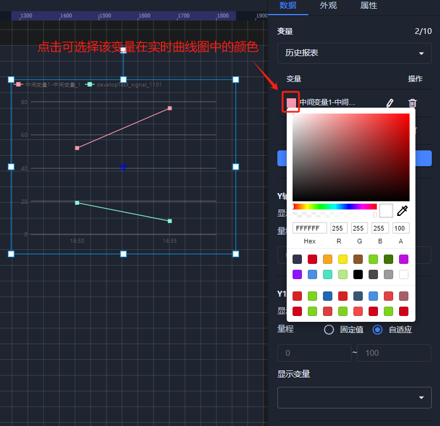
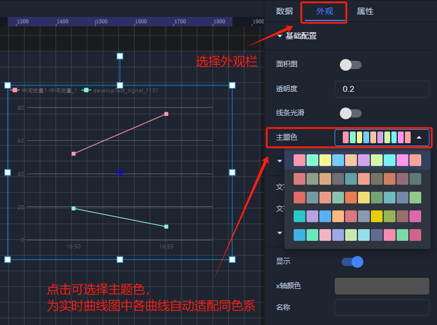
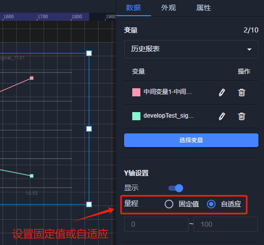
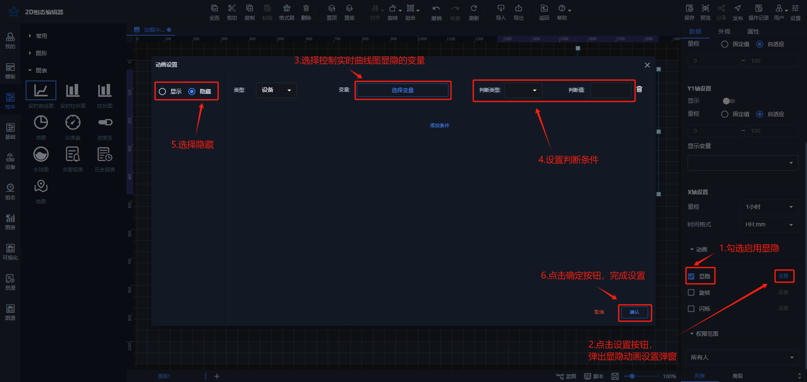
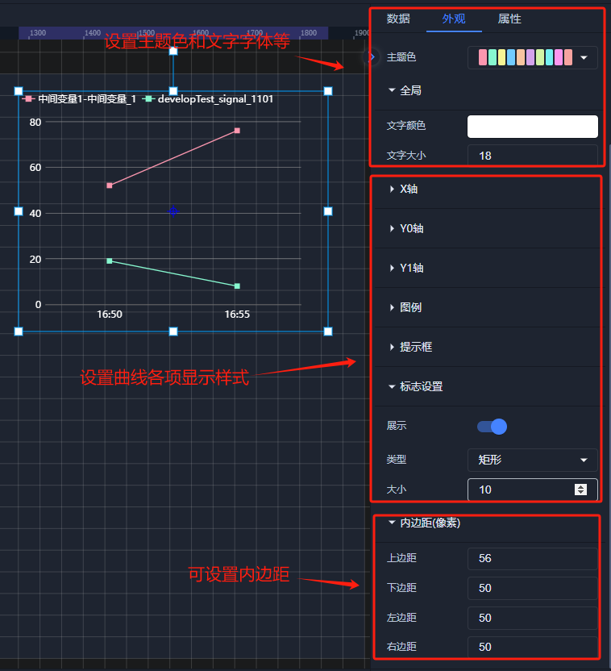
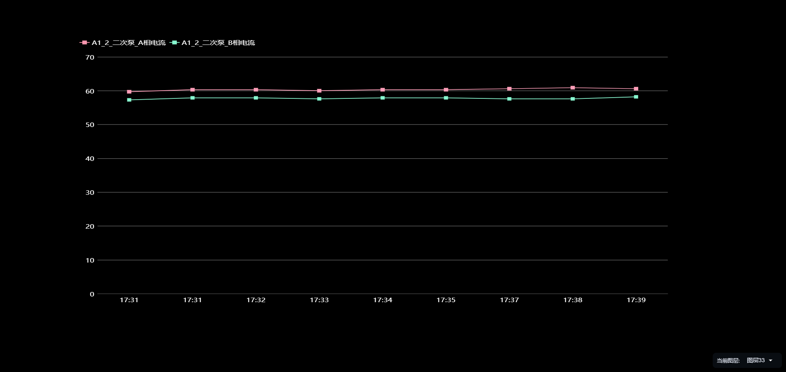

# 时间曲线图

# 1、应用场景
实时曲线图可通过线的升降变化展示出变量的在一段时间内的变化趋势，以及可以展示不同设备相同变量在同一时间的数值对比情况，例如可通过实时曲线图展示一段时间内单个设备温度的变化趋势，也可以绑定多个设备的温度，可通过实时曲线图进行对比，分析哪个设备的热损比较大

# 2、操作示例
## 2.1 绑定数据
时间曲线图可绑定设备变量、历史报表，点击【下拉框箭头】，选择要绑定的变量，弹出绑定变量弹窗进行绑定变量，时间曲线图最多可绑定10个变量

**绑定设备变量**

**绑定历史报表**

绑定完数据后，可点击每个变量前面的填充颜色选择框中，选择对应变量在曲线图中的曲线颜色，也可在外观属性栏中选择主题色，可自动将所有曲线颜色适配为同色系

## 2.2 设置Y轴量程
绑定完数据之后，可按照数据的大小来设置曲线的Y轴量程或者也可选择自适应，即可根据数据大小来自动调整Y轴量程大小

## 2.3 设置动画效果
控件动画效果是控件对于一个或多个数据条件的动画响应功能，当指定数据满足设置的指定条件（支持判断条件组合）时，实时曲线图控件进行显隐，旋转，闪烁

例如为实时曲线图控件设置显隐动画效果，当变量达到判断条件时，曲线图控件进行隐藏

其他动画使用方法和显隐类似

## 2.4 样式设置
在为控件做完数据设置之后，为了适应组态画面，以达到展示的美观性，可为控件进行一些样式设置，可设置曲线图的内边距，曲线图的主题色，和曲线图填充颜色以及x轴y轴和x轴y轴网格线的设置，图例、标注信息的文字样式大小等

## 2.5 效果展示

> 更新: 2024-08-19 18:08:52  
> 原文: <https://www.yuque.com/iot-fast/ksh/cul4nbae560fv1y8>