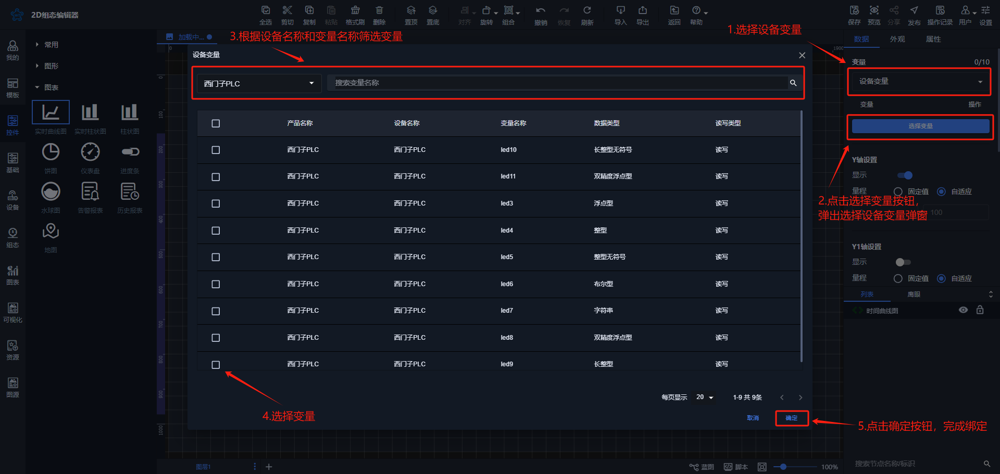
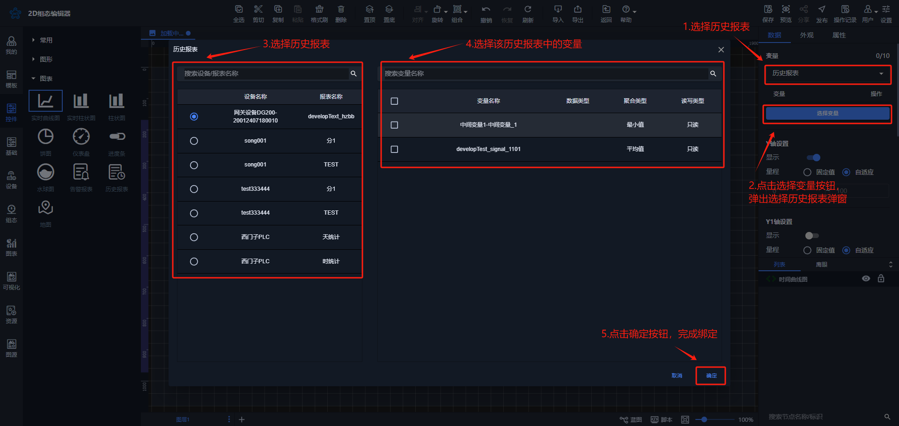
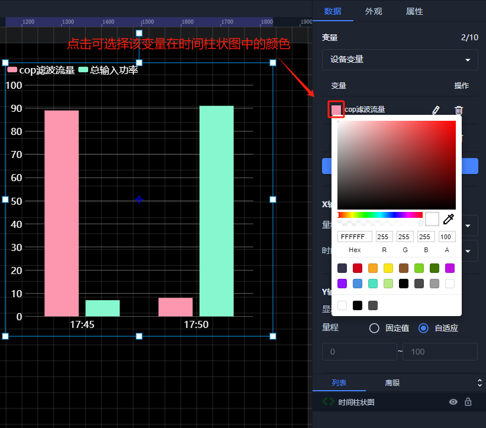
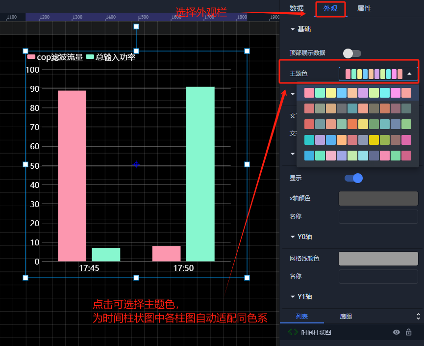
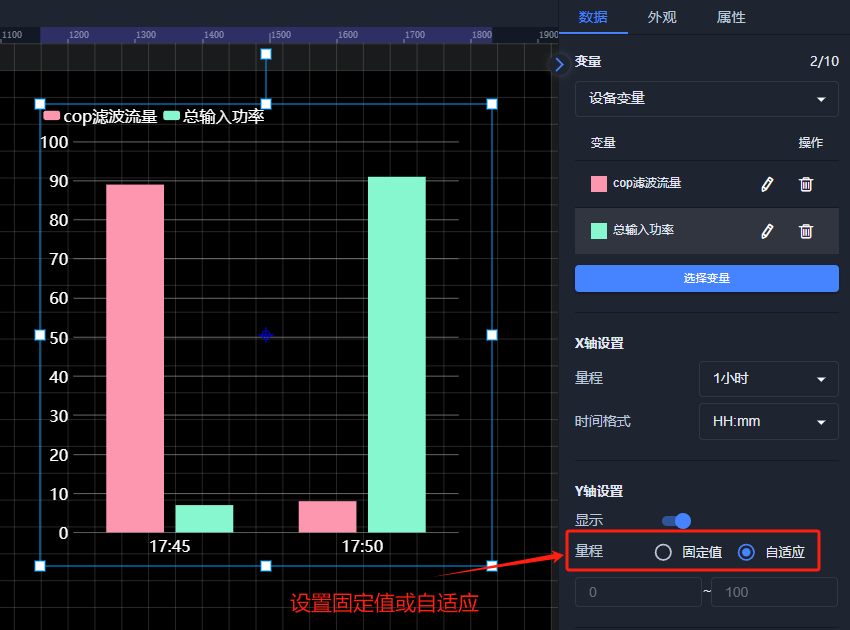
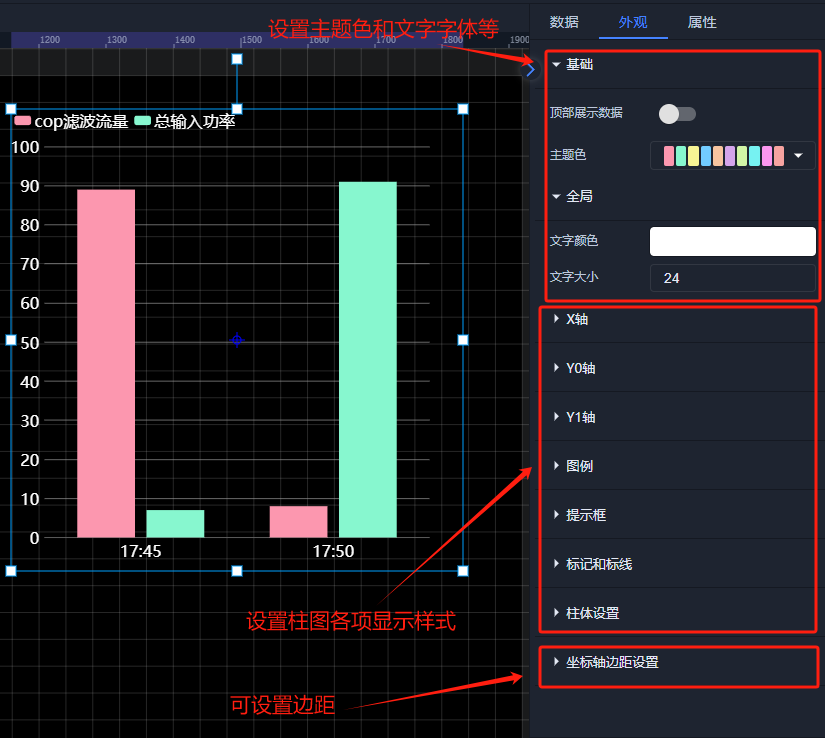
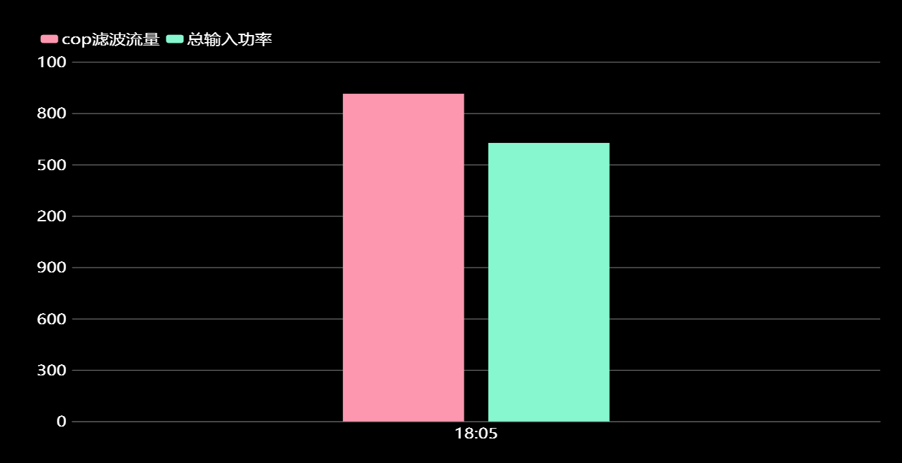

# 时间柱状图

**1、应用场景**  
时间柱状图可通过线的升降变化展示出变量的在一段时间内的变化趋势，以及可以展示不同设备相同变量在同一时间的数值对比情况，例如可通过时间柱状图展示一段时间内单个设备温度的变化趋势，也可以绑定多个设备的温度，可通过时间柱状图进行对比，分析哪个设备的热损比较大  
**2、操作示例**  
**2.1 绑定数据**  
时间柱状图控件可绑定设备变量、历史报表、历史数据，点击【选择变量】按钮，选择要绑定的变量，弹出绑定变量弹窗进行绑定变量，时间柱状图最多可绑定10个变量  
**绑定设备变量**  

**绑定历史报表**  

绑定完数据后，可点击每个变量前面的填充颜色选择框中，选择对应变量在柱状图中的柱形颜色，也可在外观属性栏中选择主题色，可自动将所有柱形颜色适配为同色系  

  
**2.2 设置Y轴量程**  
绑定完数据之后，可按照数据的大小来设置柱状图的Y轴量程或者也可选择自适应，即可根据数据大小来自动调整Y轴量程大小  

  
**2.3 样式设置**  
在为控件做完数据设置之后，为了适应组态画面，以达到展示的美观性，可为控件进行一些样式设置，可设置柱状图的坐标轴边距，主题色以及x轴和y轴网格线的设置，柱体的宽度设置，圆角、标记和标线的文字颜色大小等

  
**2.4 效果展示**  

  

若有收获，就点个赞吧

  
 

> 更新: 2024-08-19 18:05:59  
> 原文: <https://www.yuque.com/iot-fast/ksh/ppgrg5e178yptq7x>