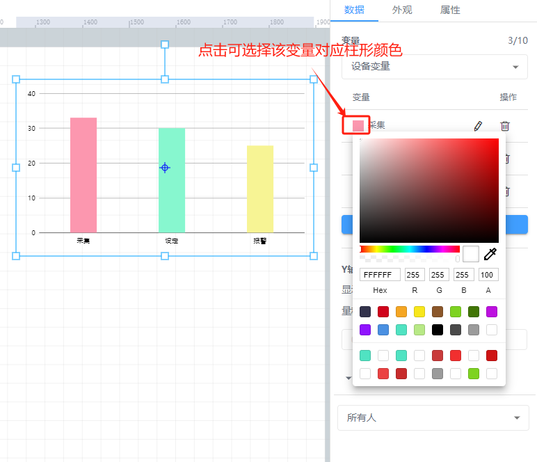

# 柱状图

# 1、应用场景
柱形图可以展示每个变量在一段时间内的变化及变量间的比较情况，例如绑定多个设备的压强，可对比相同时间不同设备的流量大小

# 2、操作示例
## 2.1 绑定数据
柱状图控件可绑定设备变量、历史报表，点击【选择变量】按钮，选择要绑定的变量，弹出绑定变量弹窗进行绑定变量，柱状图最多可绑定10个变量

**绑定设备变量**

**绑定历史报表**

绑定完数据后，可点击每个变量前面的填充颜色选择框中，选择对应变量在柱状图中的柱形颜色，也可在外观属性栏中选择主题色，可自动将所有柱形颜色适配为同色系

## 2.2 设置Y轴量程
绑定完数据之后，可按照数据的大小来设置柱状图的Y轴量程或者也可选择自适应，即可根据数据大小来自动调整Y轴量程大小

## 2.3 样式设置
在为控件做完数据设置之后，为了适应组态画面，以达到展示的美观性，可为控件进行一些样式设置，可设置柱状图的坐标轴边距，主题色以及x轴和y轴网格线的设置，柱体的宽度设置，圆角、标记和标线的文字颜色大小等

## 2.4 效果展示

> 更新: 2024-07-24 18:50:30  
> 原文: <https://www.yuque.com/iot-fast/ksh/ck0e6nsdfszku1p7>