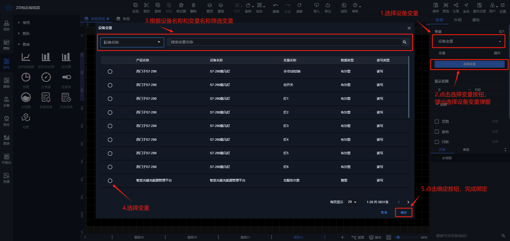
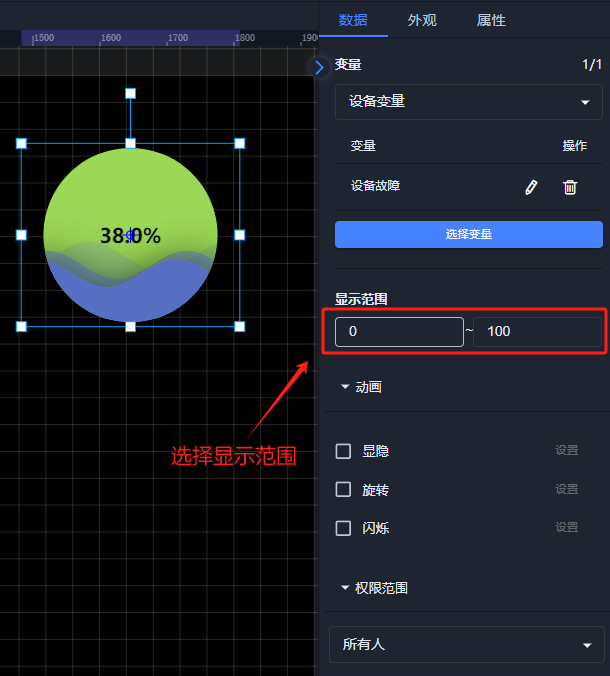
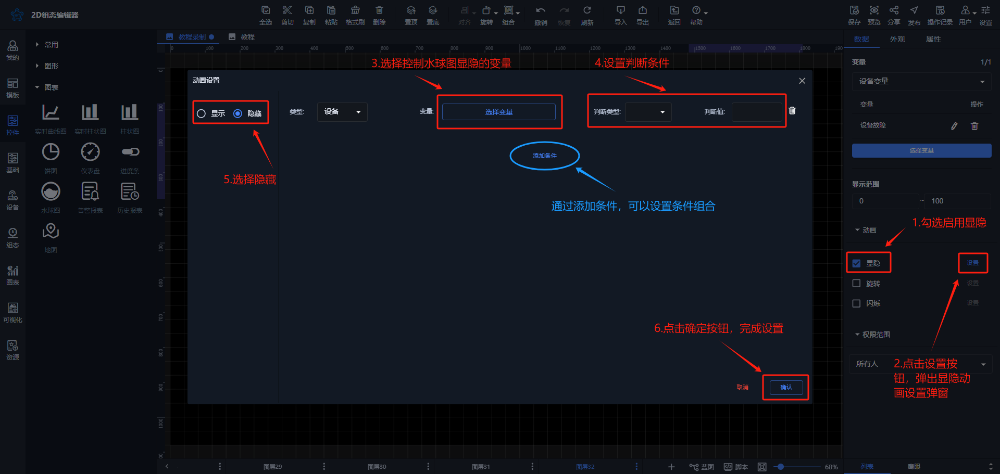
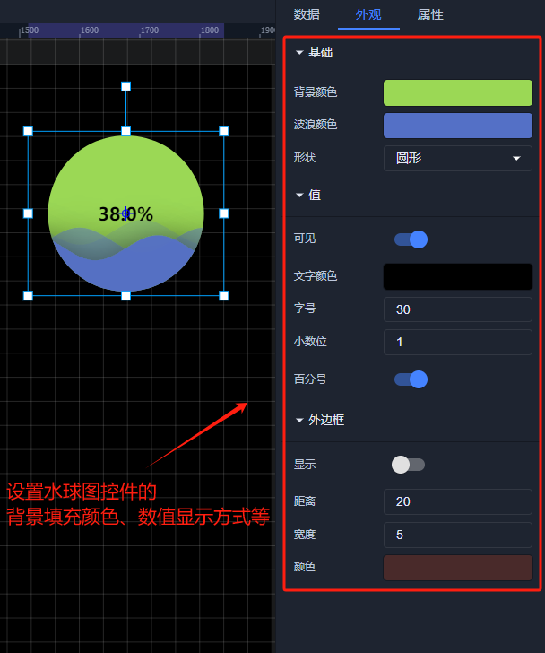
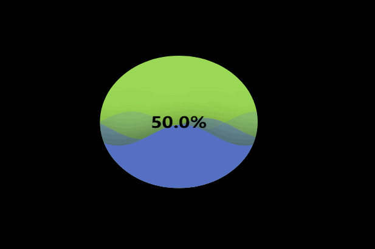

# 水球图

# 1、应用场景
水球图控件可以直观地表现出某一项变量数据占总量的占比，例如展示设备在线率

# 2、操作示例
## 2.1 绑定数据
水球图可绑定设备变量，点击【选择】按钮，选择要绑定变量，当选择设备变量时，弹出绑定设备变量弹窗进行绑定数据

**设备变量**

## 2.2 设置显示范围
选择百分比的显示范围，可根据绑定变量的实际数值进行设置范围，比如最小值设置为0，最大值设置为1000，当实时数据为300时，填充控件的色块就按设置方向填充整个控件的30%。

## 2.3 设置动画效果
控件动画效果是控件对于一个或多个数据条件的动画响应功能，当指定数据满足设置的指定条件时，水球图控件可进行显隐，旋转，闪烁，例如为水球图控件设置显隐动画效果，当变量达到判断条件时，水球图控件进行隐藏

其他动画使用方法和显隐类似

## 2.4 样式设置
在为控件做完数据设置之后，为了适应组态画面，以达到展示的美观性，可为控件进行一些样式设置，可在外观属性栏中选择水球图的样式，设置背景、填充、边框等颜色以及水球图透明度，数值的文字样式大小、显示方式等

## 2.5 效果展示

> 更新: 2024-08-14 11:34:44  
> 原文: <https://www.yuque.com/iot-fast/ksh/iw336g73ldgnzo9f>