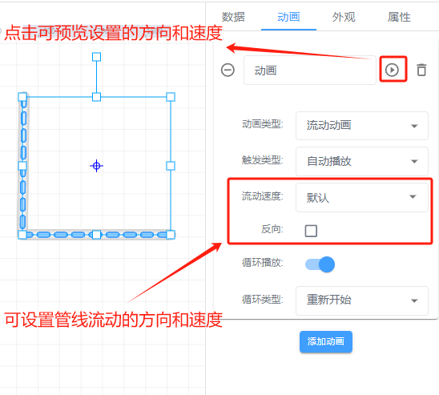
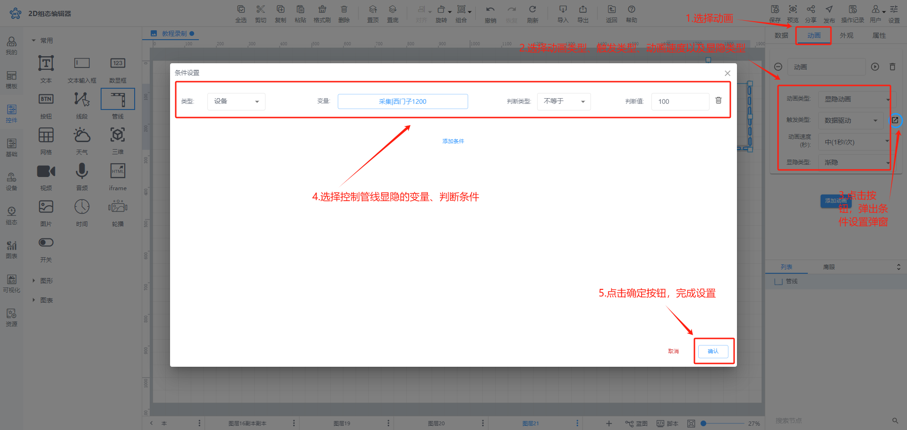
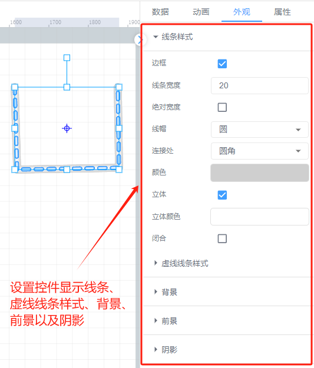
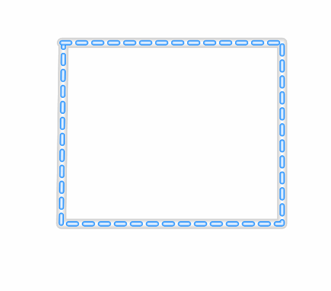

# 管线

# 1、应用场景
管线控件主要用于展示流动等效果，当绑定的变量处于不同的值时触发该控件的不同流向

# 2、操作示例
## 2.1 设置流动方向
对于流动条流动的方向和速度可进行设置，设置完成后可在组态编辑页面进行预览

## 2.2 设置动画效果
控件动画效果是控件对于一个或多个数据条件的动画响应功能，当指定数据满足设置的指定条件时，流动条控件可进行显隐

## 2.3 样式设置
在为控件做完数据设置之后，为了适应组态画面，以达到展示的美观性，可为控件进行一些样式设置，可设置流动条的轮廓宽度，填充与边框颜色等以及色块的颜色、长度、间隔、边距

## 2.4 效果展示

> 更新: 2024-07-24 13:56:46  
> 原文: <https://www.yuque.com/iot-fast/ksh/qkbmpnkapls4csqv>