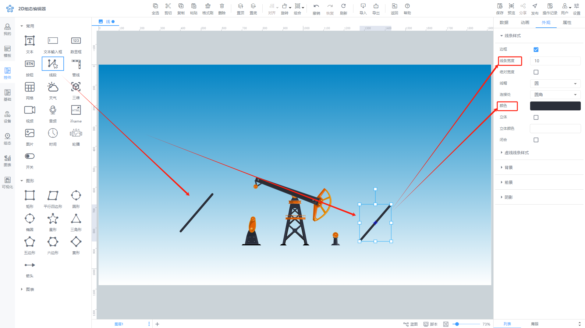

# 线段

# 1、应用场景

线段控件是 2D 组态中用于绘制直线的基本元素，可用于构建各种图形和界面布局。

# 2、操作示例

## 2.1、线的四种状态

线段控件在编辑时具有四种状态和效果：直线、镜像、断开和不对等。接下来详细介绍每种状态。

在绘制一条线段后，双击或右击弹窗点击【开始编辑】进入线段编辑状态。

选择某个线段点，右击选择【切换点】

### 2.1.1、直线

线段初始绘制默认为直线状态，用户可以通过双击点来快速切换直线和镜像状态。

### 2.1.2、镜像

镜像状态下，操作点的一端会带动另一端相对于该点呈现一样的效果。

### 2.1.3、断开

在断开状态下，操作点的一端与另一端独立互不影响。

### 2.1.4、不对等

在不对等状态下，操作点的一端会改变另一端的方向，但是线相对于点的幅度是保持不变的。

## 2.2、线的吸附效果实现

线段上的点具有吸附功能，目前点只能吸附到**单个节点**上。一旦点吸附到节点上，节点会执行相应的动作，而带有点的线段的相应部分也会跟随执行动作。

通过将线上的点吸附节点与动画（如旋转、移动等）结合，可以模拟采油机等运作效果，使得组态页面更加生动。

下面将通过简单案例进行介绍。

1. 绘制线段并调整其样式(必须步骤)

2. 双击编辑线段(必须步骤)

选择线条上的一个点，长按 Alt 键，拖动点到要吸附的位置。当点的颜色从灰色变为绿色时，表示吸附成功，可以释放鼠标和 Alt 键。

3. 锚点设置(非必须步骤)

重新设置采油机轴的锚点，使其在旋转时仿佛固定在采油基底上，效果生动形象。关于锚点的更多信息，请参阅\[《锚点的介绍和使用》]\(https://www.yuque.com/iot-fast/ksh/qzvk2aeqggvd6535?singleDoc# 《锚点介绍和使用》)

4. 蓝图交互配置(非必须步骤)

整个配置过程请参见下方的视频。

[音视频附件: 锚点与旋转动画.mp4](./attachments/B3KmzK5wDPQP_MXe\锚点与旋转动画.mp4)

## 2.3 设置动画效果

控件动画效果是控件对于一个或多个数据条件的动画响应功能，当指定数据满足设置的指定条件（支持判断条件组合）时，实时曲线图控件进行显隐，旋转，闪烁

例如为实时曲线图控件设置显隐动画效果，当变量达到判断条件时，曲线图控件进行隐藏

数据栏设置

动画栏设置

## 2.4、样式设置

在为控件做完数据设置之后，为了适应组态画面，以达到展示的美观性，可为控件进行一些样式设置，可设置线段的线条样式、虚线线条样式、背景、前景以及阴影

> 更新: 2024-08-15 16:43:29  
> 原文: <https://www.yuque.com/iot-fast/ksh/bvxoht5z039ckr0c>