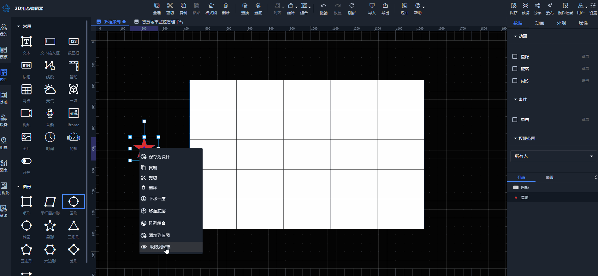
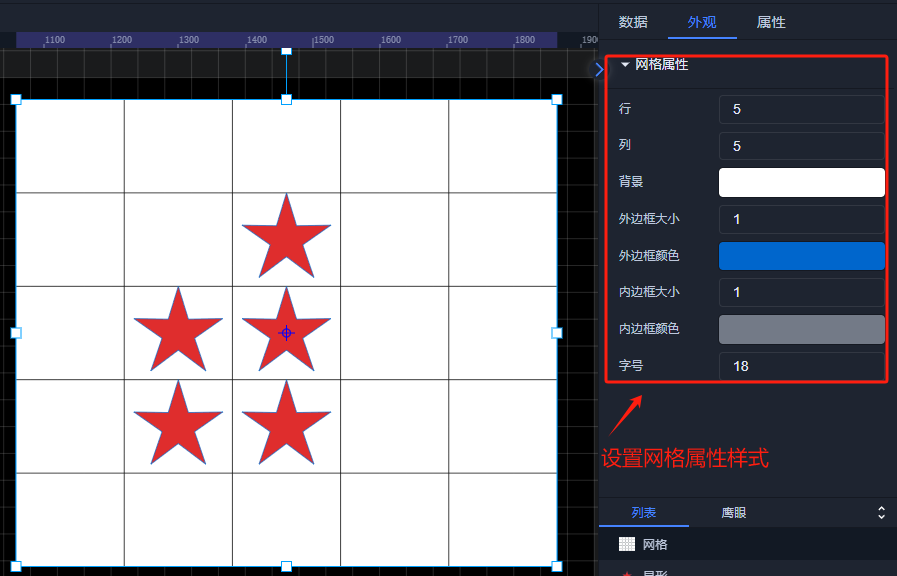
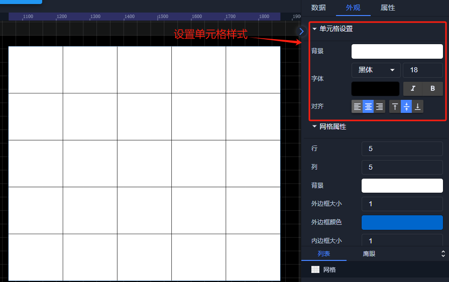

# 网格

# 1.应用场景
网格控件是 2D 组态界面中用于展示和管理数据的重要工具，它以规则的行列形式呈现信息。由边框、行线和列线组成，每个单元格用于显示数据。单元格的大小和样式可以根据组态设置进行调整。

# 2.操作示例
## 2.1.数据录入
先双击进入编辑网格，再双击要输入数据的单元格，进入编辑模式，直接在其中输入文本或数值；

## 2.2.数据编辑
先双击进入编辑网格，再双击要输入数据的单元格，进入编辑模式，修改已有的数据。

## 2.3.行和列操作
2.3.1.先双击进入编辑网格，再鼠标左键单击单元格，后鼠标右键单击单元格，在弹出的菜单中可以选择添加、删除行或列。

2.3.2.鼠标左键单击单元格，再进行拖拽选取多个单元格，可以进行合并单元格，反之可以操作拆分单元格；

2.3.2.鼠标移到行列网格线，可以调整行高和列宽。

## 2.4.吸附到网格操作
支持“吸附到网格”功能操作，为用户在设计和布局界面元素时提供了精确的定位和对齐辅助，有助于创建整齐、规范和易于管理的组态界面，具体操作如下：

2.4.1.先选中需要吸附的控件；

2.4.2.鼠标右键，在弹出的菜单中选择“吸附到网格”；

2.4.3.点击单元格，自动将控件吸附相应的网格上；如此反复操作，即可将同一控件吸附到不同的单元格上；吸附后，控件与网格绑定在一起，会跟随网格移动而移动；

2.4.4.按ESC或点击鼠标右键，即可取消吸附操作；

2.4.5.右击单元格，在弹出的菜单中选择“解除吸附”，可以解除控件吸附；

## 2.5 样式设置
在为控件做完数据设置之后，为了适应组态画面，以达到展示的美观性，可为控件进行一些样式设置，对控件进行颜色填充、边框设置、透明度设置、圆角设置以及数显框中显示的文字字体大小等样式

  

  

    - 

  

  

# 
  

> 更新: 2024-08-13 18:10:37  
> 原文: <https://www.yuque.com/iot-fast/ksh/eqtlqziqd66ugzrg>