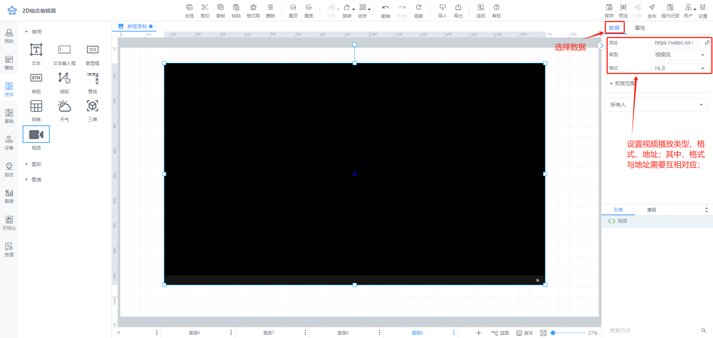

# 视频

# 1、应用场景
视频控件可以展示现场的实时状况，用来实时监控并进行录像回看等

# 2、操作示例
## 2.1 选择视频模式
视频模式有在线视频和视频流模式，推荐您使用IOT-fast视频监控方案，可实现低延迟、视频回放等功能，

**因视频涉及第三方服务，设置内容较多，请参考IOT-FAST云视频监控功能说明**

## 2.2 效果展示

> 更新: 2024-07-28 11:05:58  
> 原文: <https://www.yuque.com/iot-fast/ksh/coiz5lyn1y94suio>