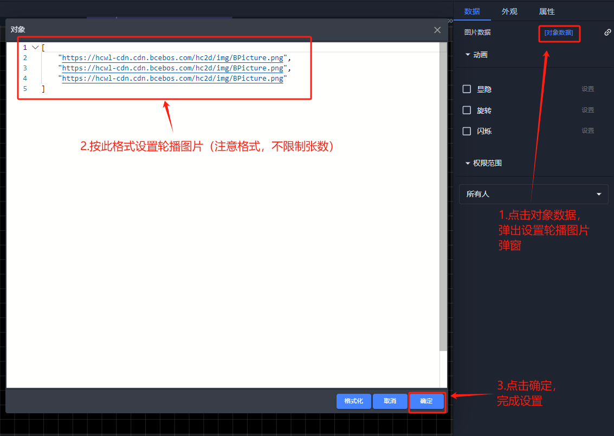
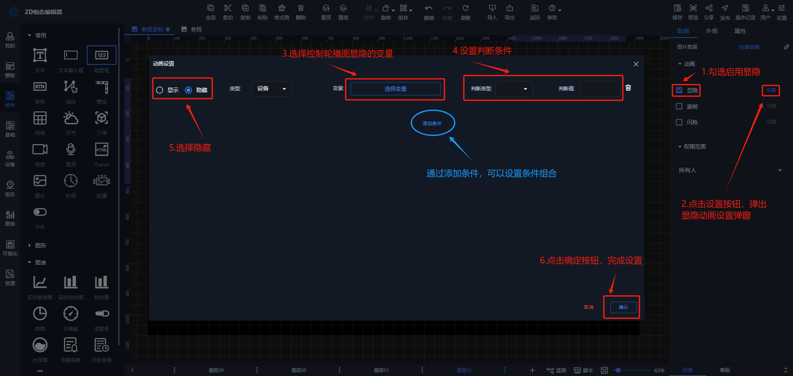
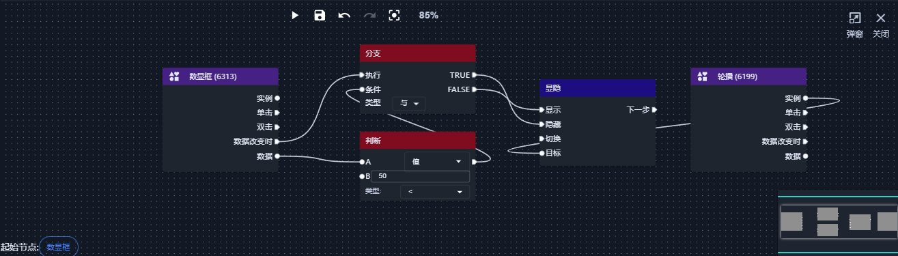
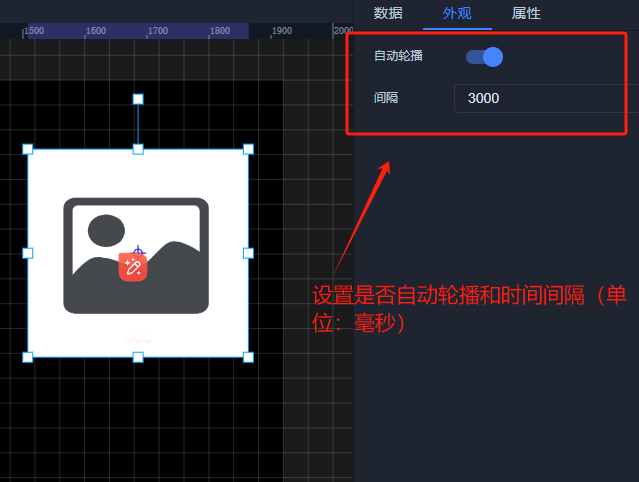
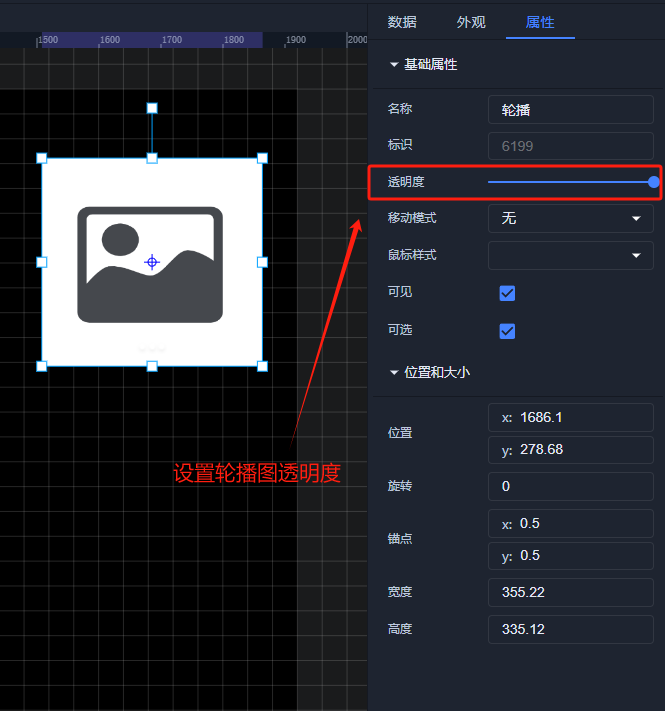
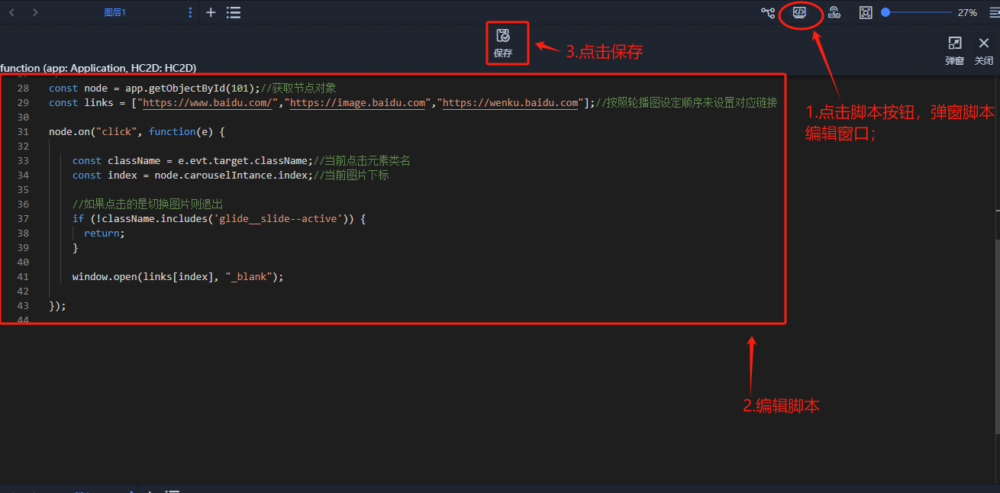

# 轮播

# <font style="color:rgb(51, 51, 51);">1、应用场景</font>
<font style="color:rgb(51, 51, 51);">轮播控件可以用来将网络现场图片或者绘制图片插入组态中，使组态更美观贴切，例如可以使用网络现场图片和其他控件结合模拟现场工作情况，在有限的空间内循环展示多个图片或内容的组件。</font>

# <font style="color:rgb(51, 51, 51);">2、操作示例</font>
## <font style="color:rgb(51, 51, 51);">2.1 绑定图片</font>
<font style="color:rgb(51, 51, 51);">在组态中拉入轮播控件后，在数据属性栏对象数据中设置轮播图片</font>

## 
## <font style="color:rgb(51, 51, 51);">2.2 设置动画效果</font>
<font style="color:rgb(51, 51, 51);">控件动画效果是控件对于一个或多个数据条件的动画响应功能，当指定数据满足设置的指定条件时，轮播控件进行显隐，旋转，移动等动画效果</font>  
<font style="color:rgb(51, 51, 51);">例如为图片控件设置显隐动画效果，当变量达到判断条件时，图片控件进行隐藏</font>

<font style="color:rgb(51, 51, 51);">数据栏设置</font>



<font style="color:rgb(51, 51, 51);">蓝图设置</font>

  
<font style="color:rgb(51, 51, 51);">其他动画使用方法和显隐类似</font>

## <font style="color:rgb(51, 51, 51);">2.3 样式设置</font>
<font style="color:rgb(51, 51, 51);">在为控件做完数据设置之后，为了适应组态画面，以达到展示的美观性，可为控件进行一些样式设置，可设置是否自动轮播、轮播的时间间隔以及轮播的透明度</font>

<font style="color:rgb(51, 51, 51);">在外观栏中设置</font>



在属性栏中设置



## <font style="color:rgb(51, 51, 51);">2.4通过脚本实现轮播图单击事件</font>


```javascript
const node = app.getObjectById(101);//获取节点对象
const links = ["https://www.baidu.com/","https://image.baidu.com","https://wenku.baidu.com"];//按照轮播图设定顺序来设置对应链接

node.on("click", function(e) {

    const className = e.evt.target.className;//当前点击元素类名
    const index = node.carouselIntance.index;//当前图片下标

    //如果点击的是切换图片则退出
    if (!className.includes('glide__slide--active')) {
      return;
    }
   
    window.open(links[index], "_blank");

});
```

  


若有收获，就点个赞吧

  
 


> 更新: 2025-01-16 10:38:21  
> 原文: <https://www.yuque.com/iot-fast/ksh/tpwfilfg20x74evf>