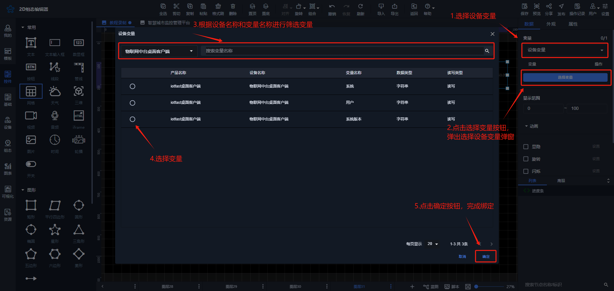
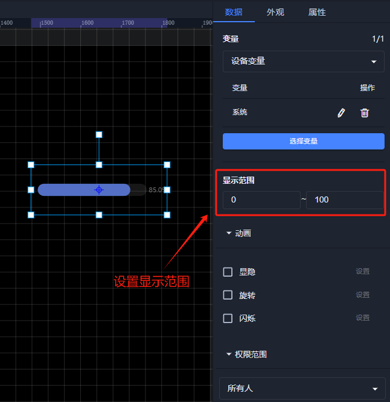
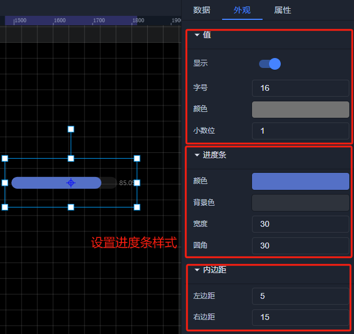

# 进度条

# 1.应用场景
进度条控件用于直观地展示任务或操作的完成进度。以长条形状呈现，包含已完成部分和未完成部分。已完成部分会以特定颜色填充，未完成部分则为另一种颜色或空白。

# 2、操作示例
## 2.1 绑定数据
进度条控件可绑定设备变量，点击【选择变量】按钮，选择要绑定的变量，弹出绑定变量弹窗进行绑定变量，进度条只可绑定1个变量

**绑定设备变量**

## 2.2 设置显示范围
绑定完数据之后，可按照数据的大小来设置进度条的显示范围，调整进度条量程大小

## 2.3 样式设置
在为控件做完数据设置之后，为了适应组态画面，以达到展示的美观性，可为控件进行一些样式设置，可设置进度条值的样式，内边距和进度条颜色、背景色、圆角、宽度等

## 2.4 效果展示

> 更新: 2024-08-13 18:28:41  
> 原文: <https://www.yuque.com/iot-fast/ksh/fzgce6voyl7sbeo4>