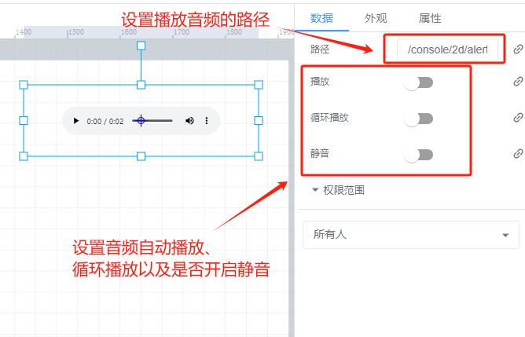
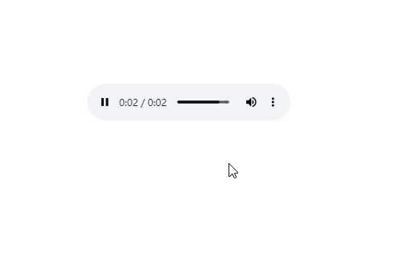

# 音频

# 1、应用场景
音频控件通常用于提供以下类型的信息或增强用户体验；

+ 警报和提示：以独特的声音来警示异常情况，如设备故障、参数超标等。例如，当压力超过安全阈值时，发出尖锐的警报声。
+ 操作反馈：例如在用户执行了某个重要操作后，播放确认音效，让用户知道操作已成功。
+ 环境模拟：创建特定的环境声音效果，增强场景的真实感。比如在模拟工厂车间时，添加机器运转的背景噪音。

#   
2、操作示例
## 2.1 设定音频
音频模式有在线音频和本地音频

##   
2.2 效果展示  

> 更新: 2024-07-24 14:57:38  
> 原文: <https://www.yuque.com/iot-fast/ksh/lyxi9ar66zfstkpp>