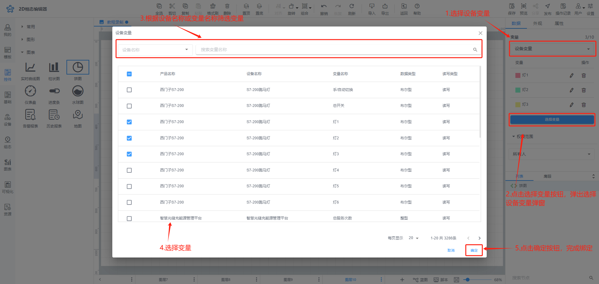
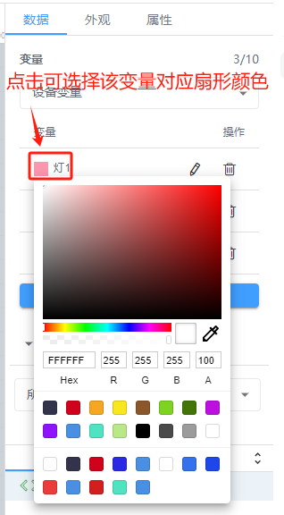
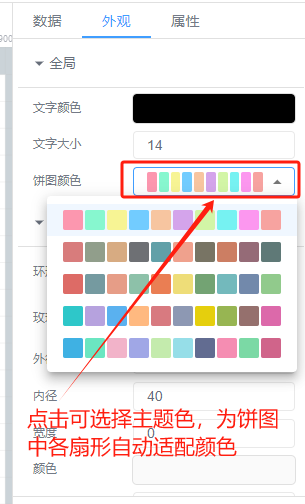
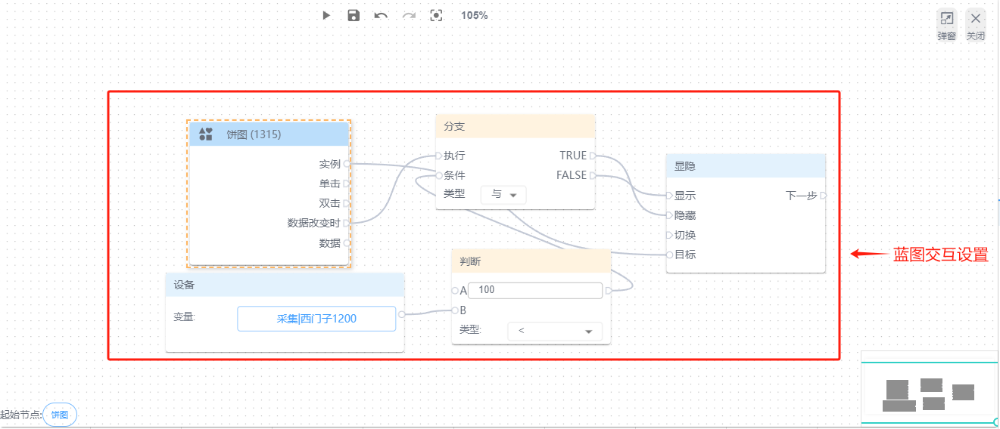
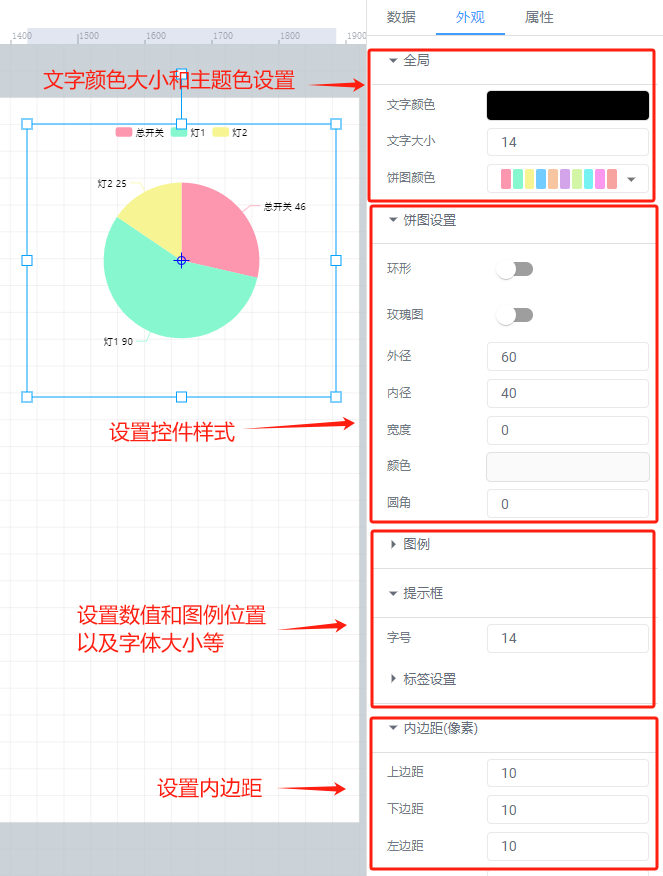
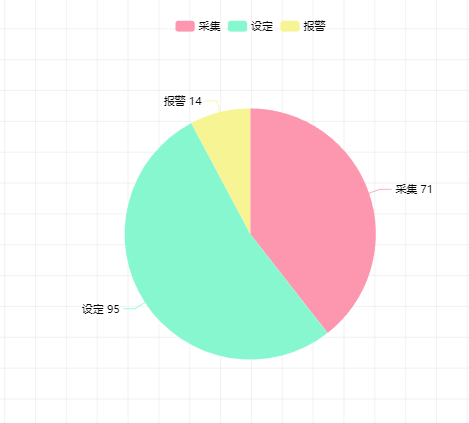

# 饼图

# 1、应用场景
圆形饼图用于分析数据的占比，可通过圆形饼图很直观的看到每一个部分在整体中所占的比例

# 2、操作示例
## 2.1 绑定数据
圆形饼图可绑定设备变量，点击【选择变量】按钮，选择要绑定的变量，可弹出绑定变量弹窗进行绑定变量，圆形饼图最多可以绑定10个变量

**绑定设备变量**

绑定完数据后，可点击每个变量前面的填充颜色选择框中，选择对应变量在圆形饼图中的扇形颜色，也可在外观属性栏中选择主题色，可自动将所有扇形颜色适配为同色系

## 2.2 设置动画效果
控件动画效果是控件对于一个或多个数据条件的动画响应功能，当指定数据满足设置的指定条件时，圆形饼图控件可进行显隐，旋转，移动

例如为圆形饼图控件设置显隐动画效果，当变量达到判断条件时，圆形饼图控件进行隐藏

其他动画使用方法和显隐类似

## 2.3 样式设置
在为控件做完数据设置之后，为了适应组态画面，以达到展示的美观性，可为控件进行一些样式设置，可设置圆形饼图的内边距，主题色，和饼图内外径、边框填充颜色以及数值显示方式、字体大小等，图例信息的布局设置等

## 2.4 效果展示

> 更新: 2024-07-26 21:55:26  
> 原文: <https://www.yuque.com/iot-fast/ksh/tq29ycd2grwgdcho>