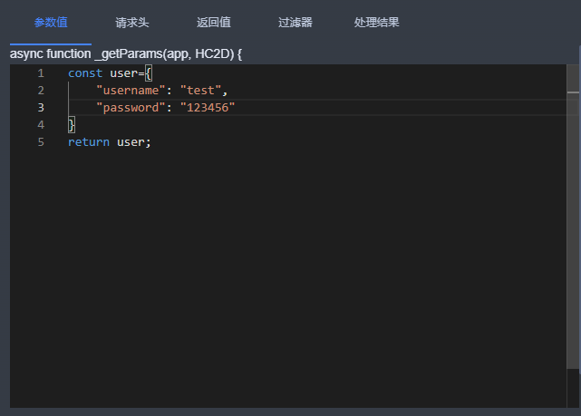

# HTTP通信

### 创建http通信方式
点击画布显示通信属性列，点击“添加”按钮添加通信数据。

以下是配置界面

**名称**：即当前连接名称，用户自定义。

**通信方式**：目前有 HTTP、MQTT、WebSocket、系统平台接口四种方式，当前选择 HTTP。

**URL**：即 HTTP 接口地址。

**请求方式**：有 GET 和 POST 两种方式，默认 GET。

**定时器**：开启后数据可按照设置的时间间隔传递。

**参数值**：用于传递给接口的参数，用户可根据需要设置，支持通过自定义脚本获取。

**请求头**：设置请求时的头部信息，用于传递附加的元数据，支持通过自定义脚本获取。

**返回值**：点击【测试连接】按钮后返回的接口数据，显示接口响应的内容。

**过滤器**：用户可根据需求对返回结果进行整理和过滤输出，提取所需信息。

**处理结果**：即最终处理后的结果，展示经过过滤和整理后的数据。

### 举例说明
| 基础配置 | 参数值 | 请求头 | 返回值 | 过滤器 | 处理结果 |
| --- | --- | --- | --- | --- | --- |
|  |  |  获取token例子如下：  |  |  |  |

> 更新: 2025-02-07 17:57:53  
> 原文: <https://www.yuque.com/iot-fast/ksh/ga24p2zw3gm6zg55>