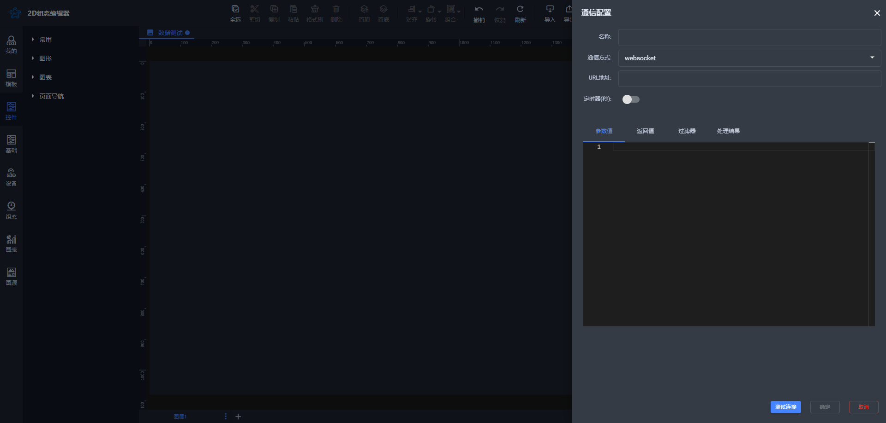
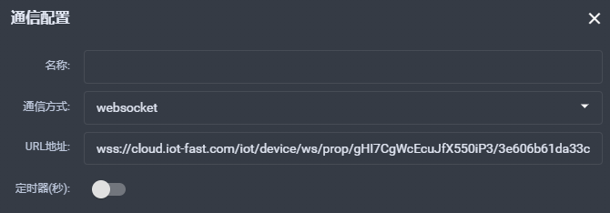
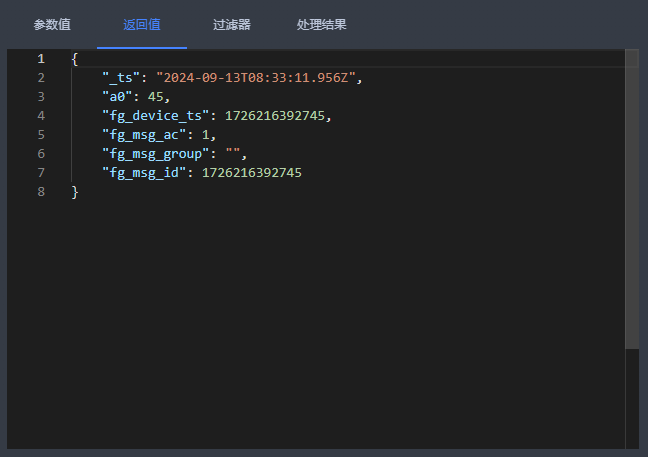
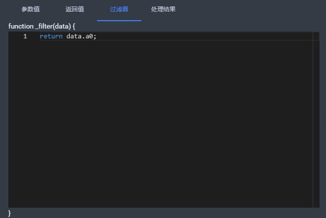
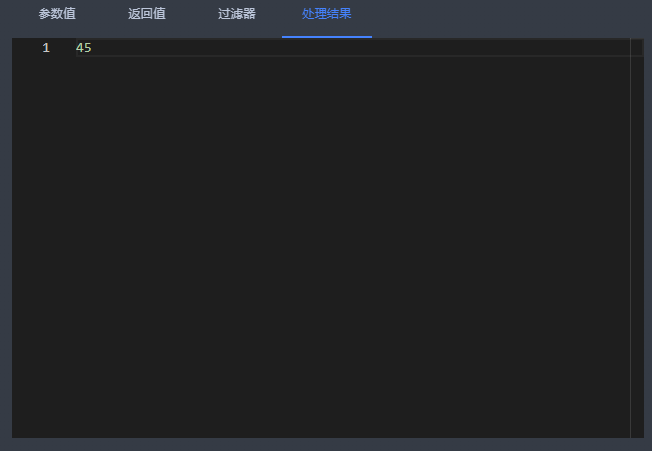

# WebSocket通信

### 创建websocket通信方式
点击画布显示通信属性列，点击“添加”按钮添加通信数据。

以下是配置界面

**名称**：即当前连接名称，用户自定义。

**通信方式**：目前有 HTTP、MQTT、WebSocket、系统平台接口四种方式，当前选择WebSocket。

**URL**：即 WebSocket 接口地址，必须以 `ws://` 或 `wss://` 开头，否则无法保存。

**定时器**：开启后按设定的时间间隔自动发起请求。

**返回值**：点击【测试连接】按钮后返回的接口数据，显示接口响应的内容。

**过滤器**：用户可根据需求对返回结果进行整理和过滤输出，提取所需信息。

**处理结果**：即最终处理后的结果，展示经过过滤和整理后的数据。

### 举例说明
| 基础配置 | 参数值 | 返回值 | 过滤器 | 处理结果 |
| --- | --- | --- | --- | --- |
|  | 无 |  |  |  |

> 更新: 2024-09-18 18:08:48  
> 原文: <https://www.yuque.com/iot-fast/ksh/euo5e0exhbqrntk9>